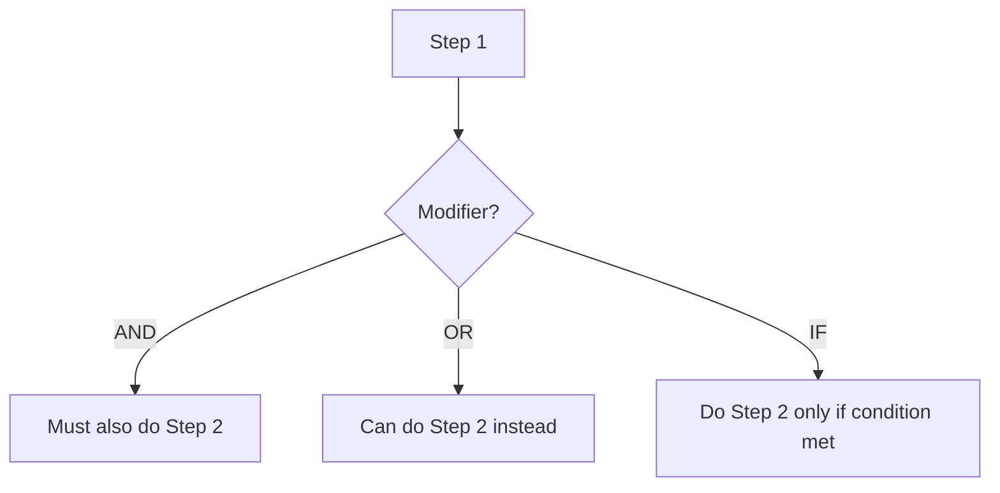

# YourWolf Ability System

> **Reference document for all ability primitives used in role creation**

This document defines the atomic ability primitives that can be composed to create role behaviors. All abilities are described from the perspective of the **active player** (the player whose role is currently being executed).

---

## Table of Contents

1. [Ability Execution Model](#ability-execution-model)
2. [Card Manipulation Abilities](#card-manipulation-abilities)
3. [Information Gathering Abilities](#information-gathering-abilities)
4. [Physical Action Abilities](#physical-action-abilities)
5. [Team & State Change Abilities](#team--state-change-abilities)
6. [Targeting System](#targeting-system)
7. [Conditionals](#conditionals)
8. [Win Conditions](#win-conditions)
9. [Modifiers](#modifiers)

---

## Ability Execution Model

Roles execute abilities in a **sequence of steps**. Each step has:

| Property | Description |
|----------|-------------|
| `order` | Execution order (1, 2, 3, ...) |
| `modifier` | How this step relates to previous (`AND`, `OR`, `IF`) |
| `required` | Whether the step must be executed (vs. optional) |
| `ability` | The primitive ability being performed |
| `target` | What the ability targets |

### Modifier Logic



- **AND**: This step executes in addition to the previous step
- **OR**: This step is an alternative to the previous step (player chooses)
- **IF**: This step only executes if a condition from the previous step is met

---

## Card Manipulation Abilities

### `TAKE_CARD`
**Description**: Take another player's card and give them your card.

| Parameter | Type | Description |
|-----------|------|-------------|
| `target` | CardTarget | The card to take |

**Behavior**:
1. Active player receives the target card
2. Target location receives active player's original card
3. This is a simultaneous swap from the active player's perspective

**Example**: Robber takes another player's card.

---

### `SWAP_CARD`
**Description**: Swap two cards with each other (not involving your own card).

| Parameter | Type | Description |
|-----------|------|-------------|
| `target_a` | CardTarget | First card to swap |
| `target_b` | CardTarget | Second card to swap |

**Behavior**:
1. Card at `target_a` moves to `target_b` location
2. Card at `target_b` moves to `target_a` location
3. Active player does not receive either card

**Example**: Troublemaker swaps two other players' cards.

---

### `VIEW_CARD`
**Description**: Look at a card without moving it.

| Parameter | Type | Description |
|-----------|------|-------------|
| `target` | CardTarget | The card to view |
| `count` | int (optional) | Number of cards to view (default: 1) |

**Behavior**:
1. Active player sees the role on the target card
2. Card remains in its location
3. Other players do not know which card was viewed

**Example**: Seer views one player's card or two center cards.

---

### `FLIP_CARD`
**Description**: Turn a card face-up so all players can see it.

| Parameter | Type | Description |
|-----------|------|-------------|
| `target` | CardTarget | The card to flip |

**Behavior**:
1. Card is turned face-up
2. All players can see the role
3. Card remains face-up for the rest of the game

**Example**: Revealer flips another player's card face-up.

---

### `COPY_ROLE`
**Description**: Change your role to match a viewed card.

| Parameter | Type | Description |
|-----------|------|-------------|
| `target` | CardTarget | The card whose role to copy |

**Behavior**:
1. Active player's role changes to match target card
2. Active player's physical card does NOT change
3. May trigger `perform_as` or `perform_immediately`

**Example**: Doppelganger copies another player's role.

---

## Information Gathering Abilities

### `VIEW_AWAKE`
**Description**: See which players have their eyes open at a specific time.

| Parameter | Type | Description |
|-----------|------|-------------|
| `wake_target` | WakeTarget | Which group is currently awake |

**Behavior**:
1. Active player opens eyes during another role's wake phase
2. Sees all players with eyes open
3. Does not reveal own identity to those players

**Example**: Masons wake together and see each other.

---

### `THUMBS_UP`
**Description**: Put up a thumb to signal identity to awake players.

| Parameter | Type | Description |
|-----------|------|-------------|
| `target` | ThumbsTarget | Who should put thumb up |

**Behavior**:
1. Specified player(s) extend thumb
2. Visible to all players with eyes open
3. Non-specific physical location (under table, etc.)

**Example**: Dream Wolf puts thumb up so werewolves know they exist.

---

### `EXPLICIT_NO_VIEW`
**Description**: The narrator emphasizes that the player does NOT view their changes.

| Parameter | None | |

**Behavior**:
1. Narrator explicitly states player does not view result
2. Used after swaps where player shouldn't see new card

**Example**: Drunk swaps with center but doesn't see new role.

---

## Physical Action Abilities

### `ROTATE_ALL`
**Description**: Move all player cards in a direction.

| Parameter | Type | Description |
|-----------|------|-------------|
| `direction` | `left` \| `right` | Direction to rotate cards |
| `count` | int | Number of positions to rotate |

**Behavior**:
1. All player cards shift in specified direction
2. Cards wrap around (last becomes first)
3. Center cards are not affected

**Example**: Village Idiot rotates all cards one position left or right.

---

### `TOUCH`
**Description**: Physically touch another player to signal.

| Parameter | Type | Description |
|-----------|------|-------------|
| `who` | PlayerTarget | Who does the touching |
| `target` | PlayerTarget | Who gets touched |
| `location` | `adjacent` | Where the touch occurs |

**Behavior**:
1. Specified player touches target player
2. Only works with adjacent seating
3. Non-verbal communication method

**Example**: Thing touches an adjacent player.

---

## Team & State Change Abilities

### `CHANGE_TO_TEAM`
**Description**: Change the active player's team allegiance.

| Parameter | Type | Description |
|-----------|------|-------------|
| `team` | Team | New team to join |

**Behavior**:
1. Active player's team changes
2. Win condition may change accordingly
3. Does not change physical card

**Example**: Viewing a werewolf might change you to werewolf team.

---

### `PERFORM_AS`
**Description**: Perform abilities as your current role (after copying).

| Parameter | None | |

**Behavior**:
1. Executes after `COPY_ROLE`
2. Active player performs copied role's abilities
3. Happens at copied role's normal wake time

**Example**: Doppelganger who copied Seer acts as Seer later.

---

### `PERFORM_IMMEDIATELY`
**Description**: Perform copied role's abilities immediately.

| Parameter | None | |

**Behavior**:
1. Executes immediately after `COPY_ROLE`
2. Does not wait for copied role's normal wake time
3. Used for roles that must act before normal order

**Example**: Doppelganger who copied Werewolf acts immediately.

---

## Targeting System

### Card Targets (`CardTarget`)

| Target | Description |
|--------|-------------|
| `player.Self` | Active player's own card |
| `player.Other` | Another player's card (not self) |
| `player.Adjacent` | Player sitting next to active player |
| `center.Main` | One of the main center cards |
| `center.Bonus` | Special bonus center card (Alpha Wolf) |
| `role.{RoleName}` | Card belonging to a specific role |
| `team.{TeamName}` | Card belonging to a team member |

### Player Targets (`PlayerTarget`)

| Target | Description |
|--------|-------------|
| `player.Self` | Active player |
| `player.Other` | Another player |
| `player.Adjacent` | Adjacent seated player |

### Wake Targets (`WakeTarget`)

| Target | Description |
|--------|-------------|
| `player.Self` | Only active player wakes |
| `team.Werewolf` | All werewolves wake |
| `team.Alien` | All aliens wake |
| `team.Vampire` | All vampires wake |
| `role.{RoleName}` | Specific role wakes |

---

## Conditionals

### `ONLY_IF_OPPONENT`
**Description**: Action is valid only if target is NOT on the same team.

| Parameter | Type | Description |
|-----------|------|-------------|
| `target` | CardTarget | The card to check |

**Behavior**:
1. Check target card's team
2. If same team as active player, action fails/skips
3. If different team, action proceeds

---

### `ONLY_IF_TEAM`
**Description**: Action is valid only if target IS on the same team.

| Parameter | Type | Description |
|-----------|------|-------------|
| `target` | CardTarget | The card to check |

**Behavior**:
1. Check target card's team
2. If same team as active player, action proceeds
3. If different team, action fails/skips

---

### `REPEAT_UNTIL_OPPONENT`
**Description**: Repeat action until finding a target not on the same team.

| Parameter | Type | Description |
|-----------|------|-------------|
| `max_attempts` | int | Maximum repetitions allowed |

**Behavior**:
1. Perform action on target
2. If target is same team, repeat with next target
3. Stop when opponent found or max attempts reached

---

### `REPEAT_UNTIL_TEAM`
**Description**: Repeat action until finding a target on the same team.

| Parameter | Type | Description |
|-----------|------|-------------|
| `max_attempts` | int | Maximum repetitions allowed |

**Behavior**:
1. Perform action on target
2. If target is different team, repeat with next target
3. Stop when teammate found or max attempts reached

---

### `STOP`
**Description**: Stop executing further ability steps when condition fulfilled.

| Parameter | Type | Description |
|-----------|------|-------------|
| `condition` | Condition | When to stop |

**Behavior**:
1. Evaluate condition
2. If true, skip remaining ability steps
3. If false, continue to next step

---

### `NO_OTHER_AWAKE`
**Description**: Triggers a conditional if no other player is awake.

| Parameter | None | |

**Behavior**:
1. Check if any other player has eyes open
2. If alone, condition is true
3. Used for "lone wolf" scenarios

**Example**: Lone Werewolf can view a center card.

---

## Win Conditions

### `SELF_MUST_LIVE`
**Description**: Player must survive to win.

| Parameter | None | |

**Behavior**:
1. Standard win condition check
2. If player is eliminated, they lose
3. Team can still win without this player

---

### `SPECIAL_WIN_DEAD`
**Description**: Player has a special win condition if they are eliminated.

| Parameter | Type | Description |
|-----------|------|-------------|
| `win_type` | WinType | What constitutes winning |

**Behavior**:
1. Player wins if eliminated
2. May be instead of or in addition to team win
3. Often used for "martyr" roles

**Example**: Tanner wins if they are eliminated.

---

### `SPECIAL_WIN_ALIVE`
**Description**: Player has a special win condition if they survive.

| Parameter | Type | Description |
|-----------|------|-------------|
| `win_type` | WinType | What constitutes winning |
| `required_state` | State | Required game state |

**Behavior**:
1. Player wins if alive at end
2. Additional conditions may apply
3. Often used for neutral roles

**Example**: Certain roles win if alive with specific conditions met.

---

## Modifiers

### `RANDOM_NUM_PLAYERS`
**Description**: The app randomly selects a number from a defined array.

| Parameter | Type | Description |
|-----------|------|-------------|
| `options` | int[] | Array of possible values |

**Behavior**:
1. System randomly selects one value from array
2. Used for roles with variable behavior
3. Result affects subsequent ability steps

**Example**: Blob absorbs 2, 3, or 4 adjacent players randomly.

---

## Adding New Abilities

To add a new ability primitive:

1. Add the ability definition to this document
2. Add the database migration in the backend
3. Implement the ability logic in the game engine
4. Add UI support in the role builder wizard
5. Update the narrator script generator

### Ability Definition Template

```markdown
### `ABILITY_NAME`
**Description**: Brief description of what the ability does.

| Parameter | Type | Description |
|-----------|------|-------------|
| `param_name` | Type | What this parameter controls |

**Behavior**:
1. Step-by-step execution logic
2. Edge cases and special rules
3. Interaction with other abilities

**Example**: Role that uses this ability.
```

---

*Last updated: January 31, 2026*
