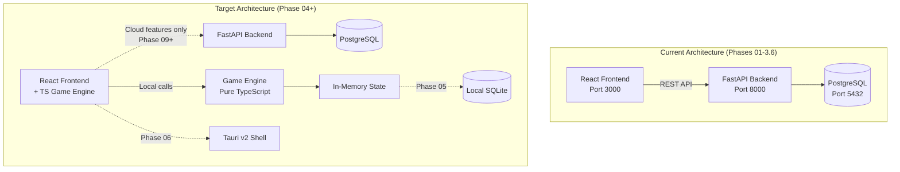
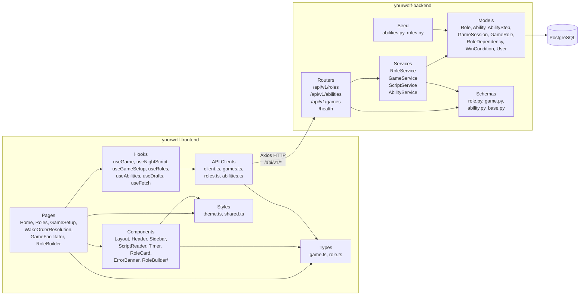
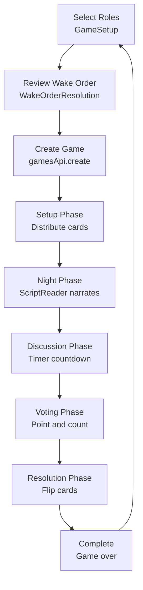

# Architecture

## System Overview

YourWolf is a monorepo containing a React frontend and a FastAPI backend, connected via Docker Compose for local development. The project is transitioning from a server-dependent web app to an offline-first desktop/mobile app.

**Current state (Phases 01–3.6):** The frontend calls the backend for all game logic — creating games, generating night scripts, managing phases, and previewing role scripts.

**Target state (after Phase 04):** Game logic runs entirely client-side in a TypeScript engine. The backend becomes a cloud API used only for community features (Phase 09+).

## Component Diagram

## Backend Architecture

### Layered Structure

| Layer | Directory | Responsibility |
|-------|-----------|----------------|
| Routers | `app/routers/` | HTTP endpoints, request/response handling, dependency injection |
| Services | `app/services/` | Business logic, validation, orchestration |
| Models | `app/models/` | SQLAlchemy ORM models, enums (`Team`, `Visibility`, `GamePhase`, `StepModifier`) |
| Schemas | `app/schemas/` | Pydantic models for request/response serialization |
| Seed | `app/seed/` | Idempotent seed data loader (15 abilities, 30 base roles) |

### Key Services

- **ScriptService** (`script_service.py`, ~540 lines): Night script generation. Takes a game session, resolves wake order, generates `NarratorAction[]` with instructions from 15 ability type templates. Also provides `preview_role_script()` for the Role Builder.
- **GameService** (`game_service.py`): Game session lifecycle — create, start, advance phase, validate card counts and dependencies, shuffle role assignments.
- **RoleService** (`role_service.py`): Role CRUD, validation, duplicate name checking, dependency management.
- **AbilityService** (`ability_service.py`): Ability primitive queries.

### Database

PostgreSQL 16 with SQLAlchemy ORM and Alembic migrations. Core tables:

- `roles` — Custom and official roles with team, wake_order, wake_target
- `abilities` — 15 atomic ability primitives (view_card, swap_card, etc.)
- `ability_steps` — Ordered steps composing a role's behavior, with `StepModifier` (none/and/or/if)
- `game_sessions` — Game state with phase tracking and optional `wake_order_sequence`
- `game_roles` — Role assignments per game (player positions, center cards)
- `role_dependencies` — Requires/recommends relationships between roles
- `win_conditions` — Per-role win conditions with condition type and parameters

## Frontend Architecture

### Routing

React Router v6 with these routes:

| Route | Page | Purpose |
|-------|------|---------|
| `/` | Home | Landing page |
| `/roles` | Roles | Browse and filter all roles |
| `/roles/new` | RoleBuilder | Step-by-step custom role creation wizard |
| `/games/new` | GameSetup | Select roles, set player count, configure timer |
| `/games/new/wake-order` | WakeOrderResolution | Drag-to-reorder roles within wake groups |
| `/games/:gameId` | GameFacilitator | Run a game through all phases |

### Data Flow

1. **API Client** (`api/client.ts`): Axios instance pointing at `VITE_API_URL/api/v1`
2. **Resource Clients** (`api/games.ts`, `api/roles.ts`, `api/abilities.ts`): Typed wrappers around API endpoints
3. **Hooks** (`hooks/`): React hooks that call API clients and manage loading/error state via `useFetch`
4. **Pages**: Consume hooks, render components, handle user actions

### Styling

Inline styles with a centralized theme object (`styles/theme.ts`). Dark theme with team-specific colors (village green, werewolf red, vampire purple, alien teal, neutral gray). Shared style functions in `styles/shared.ts`.

## Game Flow

### Night Script Generation

The script engine (currently Python `ScriptService`, being ported to TypeScript in Phase 04):

1. Filters game roles to those with `wake_order > 0`
2. Sorts by wake order (custom sequence overrides default)
3. For each role: generates wake instruction → ability step instructions → close eyes
4. Wraps with opening ("close your eyes") and closing ("open your eyes") narration
5. Each action has timed duration based on ability type

## Testing

| Area | Framework | Config | Threshold |
|------|-----------|--------|-----------|
| Backend | pytest | `pyproject.toml` | 80% coverage, `--cov-fail-under=80` |
| Frontend | Vitest | `vite.config.ts` | 80% lines/branches/functions/statements |

Backend tests use an **in-memory SQLite** database (set via `conftest.py` overriding `DATABASE_URL`). Frontend tests use **jsdom** with `@testing-library/react` and mock Axios via `vi.mock`.

## Key Design Decisions

- **Offline-first**: Core game runs without internet. Backend is only for cloud features (auth, community, analytics) starting Phase 09.
- **Ability composition**: Roles are built from 15 atomic ability primitives with AND/OR/IF sequencing, not hardcoded behaviors.
- **Monorepo**: Backend and frontend in one repo with shared docs. Docker Compose for local orchestration.
- **Tauri v2** (planned): Single codebase produces desktop (macOS/Windows) and mobile (iOS/Android) apps.
- **Dual data path** (planned): SQLite for local/offline, PostgreSQL via FastAPI for cloud/online.
