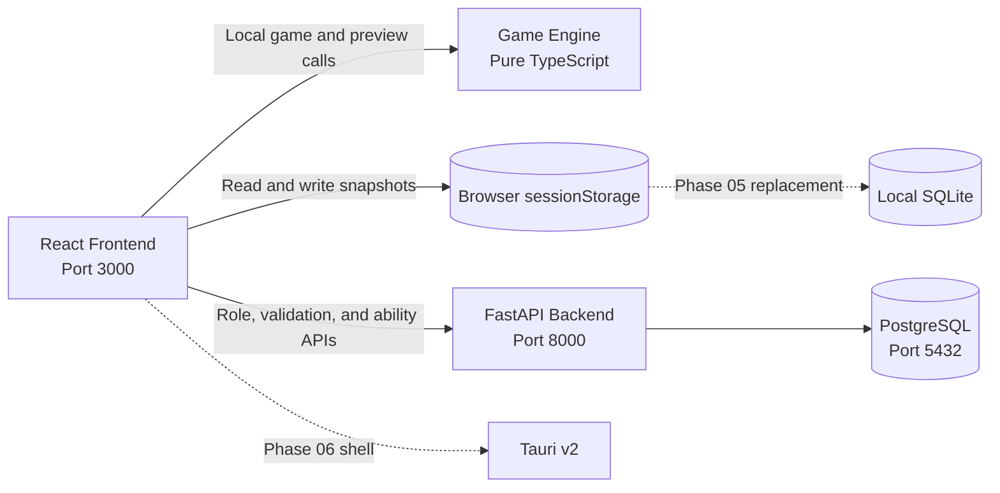
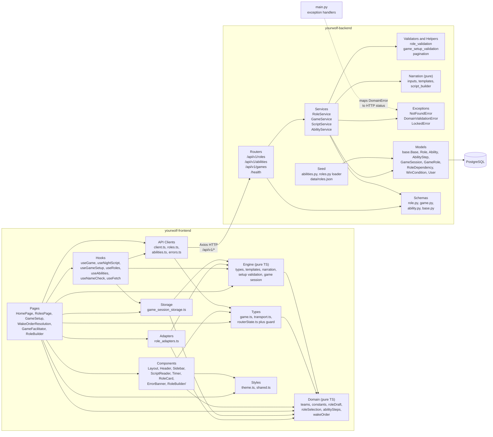
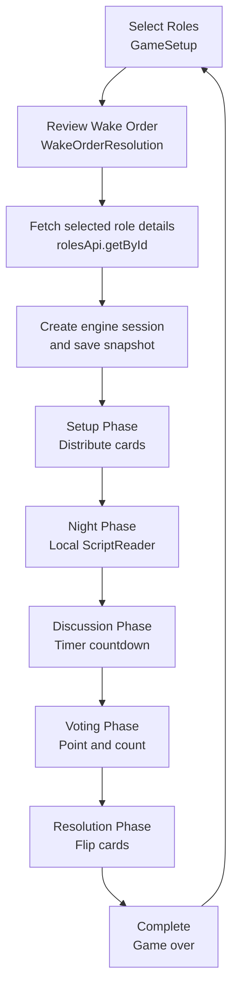

# Architecture

## System Overview

YourWolf is a monorepo containing a React frontend and a FastAPI backend, connected via Docker Compose for local development. The frontend runs game sessions and narrator previews locally. It still uses the backend for the role catalog, selected-role details, draft validation, role persistence, and abilities.

**Current state (Phase 04b):** `src/engine/` creates and advances games, validates setup, generates night scripts, and builds narrator previews. A validated `sessionStorage` snapshot preserves each in-progress game within its browser tab. Phase 04b remains in progress while manual browser QA is pending.

```mermaid
%% Current Phase 04b runtime boundaries.
flowchart LR
    FE[React Frontend<br>Port 3000] -->|Local game and preview calls| ENG[Game Engine<br>Pure TypeScript]
    FE -->|Read and write snapshots| STORE[(Browser sessionStorage)]
    FE -->|Role, validation, and ability APIs| BE[FastAPI Backend<br>Port 8000]
    BE --> DB[(PostgreSQL<br>Port 5432)]
    STORE -.->|Phase 05 replacement| SQLite[(Local SQLite)]
    FE -.->|Phase 06 shell| TAURI[Tauri v2]
```

## Component Diagram

```mermaid
%% Current frontend and backend modules with their dependency direction.
flowchart LR
    subgraph Frontend["yourwolf-frontend"]
        direction TB
        Pages["Pages<br>HomePage, RolesPage, GameSetup,<br>WakeOrderResolution,<br>GameFacilitator, RoleBuilder"]
        Components["Components<br>Layout, Header, Sidebar,<br>ScriptReader, Timer, RoleCard,<br>ErrorBanner, RoleBuilder/"]
        Hooks["Hooks<br>useGame, useNightScript,<br>useGameSetup, useRoles,<br>useAbilities, useNameCheck, useFetch"]
        API["API Clients<br>client.ts, roles.ts,<br>abilities.ts, errors.ts"]
        Adapters["Adapters<br>role_adapters.ts"]
        Storage["Storage<br>game_session_storage.ts"]
        Types["Types<br>game.ts, transport.ts,<br>routerState.ts plus guard"]
        Domain["Domain (pure TS)<br>teams, constants, roleDraft,<br>roleSelection, abilitySteps,<br>wakeOrder"]
        Engine["Engine (pure TS)<br>types, templates, narration,<br>setup validation, game session"]
        Styles["Styles<br>theme.ts, shared.ts"]

        Pages --> Components
        Pages --> Hooks
        Hooks --> API
        Pages --> API
        Pages --> Adapters
        Pages --> Engine
        Pages --> Storage
        Hooks --> Engine
        Hooks --> Storage
        Pages --> Types
        Components --> Types
        API --> Types
        Adapters --> Engine
        Adapters --> Domain
        Storage --> Engine
        Storage --> Domain
        Pages --> Domain
        Components --> Domain
        Types --> Domain
        Engine --> Domain
        Pages --> Styles
        Components --> Styles
    end

    subgraph Backend["yourwolf-backend"]
        direction TB
        Routers["Routers<br>/api/v1/roles<br>/api/v1/abilities<br>/api/v1/games<br>/health"]
        Services["Services<br>RoleService<br>GameService<br>ScriptService<br>AbilityService"]
        Validators["Validators and Helpers<br>role_validation<br>game_setup_validation<br>pagination"]
        Narration["Narration (pure)<br>inputs, templates,<br>script_builder"]
        Exceptions["Exceptions<br>NotFoundError<br>DomainValidationError<br>LockedError"]
        Models["Models<br>base.Base, Role, Ability, AbilityStep,<br>GameSession, GameRole,<br>RoleDependency, WinCondition, User"]
        Schemas["Schemas<br>role.py, game.py,<br>ability.py, base.py"]
        Seed["Seed<br>abilities.py, roles.py loader<br>data/roles.json"]

        Routers --> Services
        Services --> Validators
        Services --> Narration
        Services --> Exceptions
        Services --> Models
        Routers --> Schemas
        Services --> Schemas
        Seed --> Models
    end

    Main["main.py<br>exception handlers"] -.->|"maps DomainError<br>to HTTP status"| Exceptions

    API -->|"Axios HTTP<br>/api/v1/*"| Routers
    Models --> DB[(PostgreSQL)]
```

## Backend Architecture

### Layered Structure

| Layer | Directory | Responsibility |
|-------|-----------|----------------|
| Routers | `app/routers/` | HTTP endpoints, request/response handling, dependency injection |
| Services | `app/services/` | Business logic, validation, orchestration |
| Narration | `app/services/narration/` | Pure narrator copy generation — no DB, ORM, or session |
| Exceptions | `app/exceptions.py` | Domain error vocabulary; no framework imports |
| Models | `app/models/` | SQLAlchemy ORM models, enums (`Team`, `Visibility`, `GamePhase`, `StepModifier`); `base.py` holds `Base` |
| Schemas | `app/schemas/` | Pydantic models for request/response serialization |
| Seed | `app/seed/` | Idempotent seed loader (15 abilities inline, 30 roles from `data/roles.json`) |

### Configuration and Database Access

`app/config.py` and `app/database.py` expose cached accessors rather than module-level globals:

- `get_settings()`, `get_engine()`, `get_session_factory()` — each wrapped in `functools.cache`, constructed on first use.
- `Base` lives in `app/models/base.py` so importing a model never triggers engine creation. It is re-exported from `app.database` for compatibility.

Lazy construction avoids import-order dependencies. Tests set required environment variables in `pytest_configure()` and clear the settings cache.

### Error Handling

Services raise typed exceptions from `app/exceptions.py`. `app/main.py` registers a handler per type, mapping each to a status code and returning the message as `detail`. Routers therefore contain no prose-matching status logic.

| Exception | Status |
|-----------|--------|
| `NotFoundError` | 404 |
| `DomainValidationError` | 400 |
| `LockedError` | 403 |

Unregistered exceptions are left to the framework's 500 path. Schema-level violations (field bounds, enum coercion) are handled by FastAPI and return 422.

### Key Services

- **ScriptService** (`script_service.py`, ~195 lines): Persistence and adaptation only. Loads the game's waking roles, adapts ORM objects and preview payloads into narration input dataclasses, and delegates script assembly to `app/services/narration/`.
- **narration package**: Pure functions over frozen input dataclasses (`RoleScriptInput`, `AbilityStepInput`). `templates.py` holds `STEP_DURATIONS`, the 15 ability-type instruction templates, and wake instructions; `script_builder.py` assembles night scripts and previews. This package is the narration reference for the TypeScript engine.
- **GameService** (`game_service.py`): Game session lifecycle — start, advance phase (`PHASE_ORDER`), shuffle role assignments, get/list/delete. Setup validation delegates to `game_setup_validation.py`.
- **RoleService** (`role_service.py`): Role CRUD and persistence. Rule checking delegates to `role_validation.py`.
- **AbilityService** (`ability_service.py`): Ability primitive queries.
- **pagination.py**: Shared `paginate(query, page, limit)` → `PageMeta`, used by both list endpoints.

### Database

PostgreSQL 16 with SQLAlchemy ORM and Alembic migrations. Core tables:

- `roles` — Custom and official roles with team, wake_order, wake_target
- `abilities` — 15 atomic ability primitives (view_card, swap_card, etc.)
- `ability_steps` — Ordered steps composing a role's behavior, with `StepModifier` (none/and/or/if)
- `game_sessions` — Game state with phase tracking and optional `wake_order_sequence`
- `game_roles` — Role assignments per game (player positions, center cards)
- `role_dependencies` — Requires/recommends relationships between roles
- `win_conditions` — Per-role win conditions with condition type and parameters

## Frontend Architecture

### Routing

React Router v6 with these routes:

| Route | Page Component | Source File | Purpose |
|-------|---------------|-------------|---------|
| `/` | `HomePage` | `pages/HomePage.tsx` | Landing page |
| `/roles` | `RolesPage` | `pages/RolesPage.tsx` | Browse and filter all roles |
| `/roles/new` | `RoleBuilderPage` | `pages/RoleBuilder.tsx` | Step-by-step custom role creation wizard |
| `/games/new` | `GameSetupPage` | `pages/GameSetup.tsx` | Select roles, set player count, configure timer |
| `/games/new/wake-order` | `WakeOrderResolutionPage` | `pages/WakeOrderResolution.tsx` | Drag-to-reorder roles within wake groups |
| `/games/:gameId` | `GameFacilitatorPage` | `pages/GameFacilitator.tsx` | Run a game through all phases |

### Domain Layer

`src/domain/` holds the game's rules as pure TypeScript — role selection and card-count math, ability-step manipulation, wake-order grouping, and draft shapes — extracted out of React components. It has no React, no API, and no transport-DTO dependencies.

Two reasons this layer exists:

1. **Testability**: rules are exercised directly, without rendering a component.
2. **Engine contract**: it supplies shared domain types to the TypeScript engine, so engine rules do not depend on JSX or transport DTOs.

Purity is enforced by ESLint, not convention — see Import Boundaries below.

### Import Boundaries

`eslint.config.js` enforces layer direction with `no-restricted-imports`:

| Layer | Must not import |
|-------|-----------------|
| `src/domain/**`, `src/engine/**` | `react`, `react-dom`; `api`, `hooks`, `components`, `pages`, `styles`; `types` |
| `src/components/**` | `src/api` — data arrives through hooks |

Dependencies point inward: transport types may depend on domain types, never the reverse. The engine imports only domain types and other engine modules. The `react-hooks` plugin is also wired, with `exhaustive-deps` promoted to `error`.

### Client Engine

`src/engine/` contains framework-free game logic used by the application:

- `types.ts` defines immutable role, ability-step, narration, and preview contracts.
- `templates.ts` implements the 15 ability instructions, wake instructions, and step durations.
- `narration.ts` builds role scripts, full night scripts, previews, durations, and deterministic wake ordering.
- `gameSetupValidation.ts` validates card counts, primary teams, dependencies, and custom wake sequences.
- `gameSession.ts` creates immutable sessions and applies `startGame()` and `advancePhase()` transitions.

The narration port reproduces the Python templates and fixture-covered output. It deliberately differs where Python depends on incidental database order: equal wake orders sort by role name. The session engine also rejects `advancePhase()` during setup, while the backend permits that transition.

`src/adapters/role_adapters.ts` isolates wire and draft shapes from engine inputs. The wake-order page merges role-list metadata with per-role details before creating a session. RoleBuilder converts its draft through the same boundary before building a preview.

`src/storage/game_session_storage.ts` stores each engine session with its adapted role snapshot under `yourwolf:game:{id}`. Reads validate the parsed session, roles, and key match. Missing or malformed data produces the facilitator's missing-game state.

### Data Flow

1. **Resource clients** (`api/roles.ts`, `api/abilities.ts`) fetch role metadata, selected-role details, validation, save results, and abilities.
2. **Adapters** (`adapters/role_adapters.ts`) convert role transport data and editable drafts into engine inputs.
3. **Engine** (`engine/`) validates setup, creates sessions, builds scripts and previews, and advances phases.
4. **Snapshot store** (`storage/game_session_storage.ts`) persists the session and adapted roles together in `sessionStorage`.
5. **Hooks** (`hooks/useGame.ts`) read snapshots and rebuild night scripts locally.
6. **Pages** render the local session and write each successful start or advance before re-rendering.

The role catalog and role editor remain server-backed. RoleBuilder builds its preview locally but continues to call `/roles/validate` and `/roles` for validation and save.

### Styling

Inline styles with a centralized theme object (`styles/theme.ts`). Dark theme with team-specific colors (village green, werewolf red, vampire purple, alien teal, neutral gray). Shared style functions in `styles/shared.ts`.

## Game Flow

```mermaid
%% Current local game flow through all persisted phases.
flowchart TD
    A[Select Roles<br>GameSetup] --> B[Review Wake Order<br>WakeOrderResolution]
    B --> C[Fetch selected role details<br>rolesApi.getById]
    C --> D[Create engine session<br>and save snapshot]
    D --> E[Setup Phase<br>Distribute cards]
    E --> F[Night Phase<br>Local ScriptReader]
    F --> G[Discussion Phase<br>Timer countdown]
    G --> H[Voting Phase<br>Point and count]
    H --> I[Resolution Phase<br>Flip cards]
    I --> J[Complete<br>Game over]
    J --> A
```

### Night Script Generation

The active application path uses `src/engine/narration.ts`:

1. `WakeOrderResolution` stores adapted roles and the chosen custom wake sequence with the session.
2. `useNightScript` loads that snapshot and calls `buildNightScript()`.
3. The engine emits each waking role's wake instruction, ordered ability steps, and close-eyes instruction.
4. The engine wraps the role actions with opening and closing narration and assigns durations.

RoleBuilder calls `buildPreview()` over an adapted draft after the same one-second debounce used for server validation. The frontend never calls `/api/v1/roles/preview-script`.

The backend narration package remains the reference implementation and supports backend `/games` routes for future cloud use. Committed TypeScript fixtures cover the 30 seed roles and previews. Default wake-order ties use deterministic role-name ordering instead of Python's incidental database row order.

**Narrator copy is frozen.** Both implementations retain the known pluralization inconsistency where `thumbs_up` renders `team.werewolf` as "Werewolfs" while the wake instruction says "Werewolves". Changing copy requires one deliberate update across both implementations and their tests.

## Testing

| Area | Framework | Config | Threshold |
|------|-----------|--------|-----------|
| Backend | pytest | `pyproject.toml` | 80% coverage, `--cov-fail-under=80` |
| Frontend | Vitest | `vite.config.ts` | 80% lines/branches/functions/statements |

Backend tests use an **in-memory SQLite** database. `conftest.py` sets `DATABASE_URL` and `ENVIRONMENT` in a `pytest_configure()` hook and clears the settings cache; because settings resolve lazily, this no longer depends on running before app imports.

Frontend tests use **jsdom** with `@testing-library/react` and mock Axios via `vi.mock`. `src/test/` mirrors the source tree (`api/`, `hooks/`, `domain/`, `components/`, `pages/`, `utils/`), so a test's location is derivable from the module it covers.

## Key Design Decisions

- **Offline-first target**: A stored game runs without internet. Role discovery and selected-role detail loading remain server-dependent until the local data layer arrives in Phase 05.
- **Ability composition**: Roles are built from 15 atomic ability primitives with AND/OR/IF sequencing, not hardcoded behaviors.
- **Purity at the engine boundary**: `app/services/narration/`, `src/domain/`, and `src/engine/` stay free of framework, ORM, and transport dependencies. Python uses dataclass-only narration inputs. TypeScript uses ESLint import boundaries.
- **Lazy configuration**: Settings, engine, and session factory are cached accessors rather than import-time globals, so importing a module has no side effects and tests need no import-order choreography.
- **Typed domain errors**: Services raise a small exception vocabulary; HTTP mapping is registered once in `app/main.py`. Status codes are a property of the error type, not of message wording.
- **Seed data as data**: Role definitions live in `app/seed/data/roles.json`, not in Python, so the same file can ship with non-server distributions.
- **Monorepo**: Backend and frontend in one repo with shared docs. Docker Compose for local orchestration.
- **Tauri v2** (planned): Single codebase produces desktop (macOS/Windows) and mobile (iOS/Android) apps.
- **Dual data path** (planned): SQLite for local/offline, PostgreSQL via FastAPI for cloud/online.
