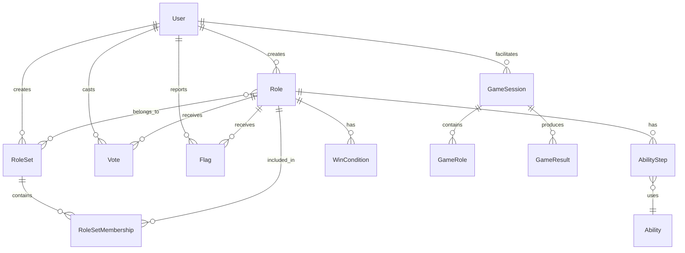

# YourWolf Data Models

> **Entity schemas, relationships, and database structure**

This document defines all data models used across the YourWolf platform. Models are defined in a database-agnostic format but optimized for PostgreSQL.

---

## Table of Contents

1. [Entity Relationship Diagram](#entity-relationship-diagram)
2. [Enumerations](#enumerations)
3. [Core Models](#core-models)
4. [Game Models](#game-models)
5. [Community Models](#community-models)
6. [Analytics Models](#analytics-models)

---

## Entity Relationship Diagram



---

## Enumerations

### Team
```python
class Team(str, Enum):
    VILLAGE = "village"
    WEREWOLF = "werewolf"
    VAMPIRE = "vampire"
    ALIEN = "alien"
    NEUTRAL = "neutral"  # Independent win condition
```

### AbilityType
```python
class AbilityType(str, Enum):
    # Card Manipulation
    TAKE_CARD = "take_card"
    SWAP_CARD = "swap_card"
    VIEW_CARD = "view_card"
    FLIP_CARD = "flip_card"
    COPY_ROLE = "copy_role"
    
    # Information
    VIEW_AWAKE = "view_awake"
    THUMBS_UP = "thumbs_up"
    EXPLICIT_NO_VIEW = "explicit_no_view"
    
    # Physical
    ROTATE_ALL = "rotate_all"
    TOUCH = "touch"
    
    # State Changes
    CHANGE_TO_TEAM = "change_to_team"
    PERFORM_AS = "perform_as"
    PERFORM_IMMEDIATELY = "perform_immediately"
    
    # Control Flow
    STOP = "stop"
```

### StepModifier
```python
class StepModifier(str, Enum):
    NONE = "none"      # First step or independent
    AND = "and"        # Must also do this
    OR = "or"          # Alternative option
    IF = "if"          # Conditional execution
```

### CardTarget
```python
class CardTarget(str, Enum):
    PLAYER_SELF = "player.self"
    PLAYER_OTHER = "player.other"
    PLAYER_ADJACENT = "player.adjacent"
    CENTER_MAIN = "center.main"
    CENTER_BONUS = "center.bonus"
    # Dynamic targets (resolved at runtime)
    # role.{role_name} - specific role
    # team.{team_name} - team member
```

### PlayerTarget
```python
class PlayerTarget(str, Enum):
    SELF = "player.self"
    OTHER = "player.other"
    ADJACENT = "player.adjacent"
```

### WakeTarget
```python
class WakeTarget(str, Enum):
    SELF = "player.self"
    TEAM_WEREWOLF = "team.werewolf"
    TEAM_VAMPIRE = "team.vampire"
    TEAM_ALIEN = "team.alien"
```

### Visibility
```python
class Visibility(str, Enum):
    PRIVATE = "private"    # Only creator can use
    PUBLIC = "public"      # Anyone can use
    OFFICIAL = "official"  # Base game roles
```

### VoteType
```python
class VoteType(str, Enum):
    UPVOTE = "upvote"
    DOWNVOTE = "downvote"
```

### FlagReason
```python
class FlagReason(str, Enum):
    INAPPROPRIATE = "inappropriate"
    OFFENSIVE = "offensive"
    BROKEN = "broken"
    DUPLICATE = "duplicate"
    OTHER = "other"
```

### GamePhase
```python
class GamePhase(str, Enum):
    SETUP = "setup"
    NIGHT = "night"
    DISCUSSION = "discussion"
    VOTING = "voting"
    RESOLUTION = "resolution"
    COMPLETE = "complete"
```

---

## Core Models

### User
```python
class User(BaseModel):
    """User account information"""
    
    id: UUID                          # Primary key
    cognito_id: str | None            # AWS Cognito sub (null for anonymous)
    username: str                     # Display name (unique)
    email: str | None                 # Email (null for anonymous)
    avatar_url: str | None            # Profile picture URL
    is_anonymous: bool                # Whether user is anonymous
    is_admin: bool                    # Admin privileges
    is_banned: bool                   # Account banned
    created_at: datetime
    updated_at: datetime
    last_login_at: datetime | None
```

**Indexes**:
- `cognito_id` (unique, where not null)
- `username` (unique)
- `email` (unique, where not null)

---

### Role
```python
class Role(BaseModel):
    """A game role (character) with abilities"""
    
    id: UUID                          # Primary key
    name: str                         # Role name
    description: str                  # Flavor text / card description
    team: Team                        # Starting team
    wake_order: int | None            # When role wakes (null = doesn't wake)
    wake_target: WakeTarget           # Who wakes with this role
    votes: int                        # Number of votes this role gets (default: 1)
    
    # Ownership & Visibility
    creator_id: UUID | None           # FK to User (null for official)
    visibility: Visibility            # private/public/official
    is_locked: bool                   # Cannot be edited (published)
    
    # Metadata
    created_at: datetime
    updated_at: datetime
    published_at: datetime | None
    
    # Computed fields (denormalized for performance)
    vote_score: int                   # upvotes - downvotes
    use_count: int                    # Times used in games
    
    # Relationships
    ability_steps: list[AbilityStep]
    win_conditions: list[WinCondition]
```

**Indexes**:
- `name` (unique where visibility = 'public' or 'official')
- `creator_id`
- `visibility`
- `team`
- `vote_score` (for sorting)

**Constraints**:
- Official roles have `creator_id = null`
- Public roles must have unique names
- Locked roles cannot be modified

---

### Ability
```python
class Ability(BaseModel):
    """Predefined ability primitive"""
    
    id: UUID                          # Primary key
    type: AbilityType                 # Ability type enum
    name: str                         # Human-readable name
    description: str                  # What this ability does
    
    # Parameters schema (JSON Schema format)
    parameters_schema: dict           # Defines required/optional params
    
    # Metadata
    is_active: bool                   # Available for use
    created_at: datetime
```

**Note**: Abilities are system-defined, not user-created. Users compose abilities into roles via AbilityStep.

---

### AbilityStep
```python
class AbilityStep(BaseModel):
    """One step in a role's ability sequence"""
    
    id: UUID                          # Primary key
    role_id: UUID                     # FK to Role
    ability_id: UUID                  # FK to Ability
    
    # Sequencing
    order: int                        # Execution order (1, 2, 3...)
    modifier: StepModifier            # AND/OR/IF relationship
    is_required: bool                 # Must execute vs optional
    
    # Parameters (matches Ability.parameters_schema)
    parameters: dict                  # e.g., {"target": "player.other", "count": 2}
    
    # Conditionals
    condition_type: str | None        # only_if_opponent, repeat_until_team, etc.
    condition_params: dict | None     # Condition parameters
```

**Indexes**:
- `role_id, order` (unique)

---

### WinCondition
```python
class WinCondition(BaseModel):
    """How a role wins the game"""
    
    id: UUID                          # Primary key
    role_id: UUID                     # FK to Role
    
    # Condition
    condition_type: str               # self_must_live, special_win_dead, etc.
    condition_params: dict | None     # Additional parameters
    
    # Logic
    is_primary: bool                  # Main win condition vs alternative
    overrides_team: bool              # Wins independent of team
```

---

## Game Models

### GameSession
```python
class GameSession(BaseModel):
    """An active or completed game session"""
    
    id: UUID                          # Primary key
    facilitator_id: UUID | None       # FK to User (null for anonymous)
    
    # Configuration
    player_count: int                 # Number of players
    center_card_count: int            # Number of center cards
    discussion_timer_seconds: int     # Discussion phase duration
    
    # State
    phase: GamePhase                  # Current game phase
    current_wake_order: int | None    # Current role waking
    
    # Timing
    started_at: datetime | None
    ended_at: datetime | None
    created_at: datetime
    
    # Relationships
    roles: list[GameRole]             # Roles in this game
```

---

### GameRole
```python
class GameRole(BaseModel):
    """A role instance in a specific game"""
    
    id: UUID                          # Primary key
    game_session_id: UUID             # FK to GameSession
    role_id: UUID                     # FK to Role
    
    # Assignment
    position: int | None              # Player position (0-indexed) or null for center
    is_center: bool                   # Whether this is a center card
    
    # State (changes during game)
    current_team: Team | None         # May change during night
    is_flipped: bool                  # Face up or down
```

---

### GameResult
```python
class GameResult(BaseModel):
    """Outcome of a completed game (Phase 7+)"""
    
    id: UUID                          # Primary key
    game_session_id: UUID             # FK to GameSession
    
    # Outcome
    winning_team: Team | None         # Which team won (null for tie)
    winning_role_ids: list[UUID]      # Roles that won
    eliminated_positions: list[int]   # Player positions eliminated
    
    # Analytics
    recorded_at: datetime
```

---

## Community Models

### RoleSet
```python
class RoleSet(BaseModel):
    """A curated collection of roles for balanced play"""
    
    id: UUID                          # Primary key
    name: str                         # Set name
    description: str                  # Set description
    creator_id: UUID                  # FK to User
    
    # Configuration
    min_players: int                  # Minimum players
    max_players: int                  # Maximum players
    visibility: Visibility            # private/public
    
    # Metadata
    vote_score: int
    use_count: int
    is_locked: bool
    created_at: datetime
    updated_at: datetime
    published_at: datetime | None
    
    # Relationships
    roles: list[Role]                 # Via RoleSetMembership
```

---

### RoleSetMembership
```python
class RoleSetMembership(BaseModel):
    """Junction table for roles in a set"""
    
    id: UUID                          # Primary key
    role_set_id: UUID                 # FK to RoleSet
    role_id: UUID                     # FK to Role
    quantity: int                     # How many of this role (default: 1)
```

**Indexes**:
- `role_set_id, role_id` (unique)

---

### Vote
```python
class Vote(BaseModel):
    """User vote on a role or set"""
    
    id: UUID                          # Primary key
    user_id: UUID                     # FK to User
    role_id: UUID | None              # FK to Role (if voting on role)
    role_set_id: UUID | None          # FK to RoleSet (if voting on set)
    vote_type: VoteType               # upvote/downvote
    created_at: datetime
```

**Constraints**:
- Either `role_id` or `role_set_id` must be set, not both
- One vote per user per item

**Indexes**:
- `user_id, role_id` (unique where role_id not null)
- `user_id, role_set_id` (unique where role_set_id not null)

---

### Flag
```python
class Flag(BaseModel):
    """Content moderation flag"""
    
    id: UUID                          # Primary key
    reporter_id: UUID                 # FK to User
    role_id: UUID | None              # FK to Role (if flagging role)
    role_set_id: UUID | None          # FK to RoleSet (if flagging set)
    
    reason: FlagReason
    details: str | None               # Additional context
    
    # Resolution
    is_resolved: bool
    resolution_notes: str | None
    resolved_by_id: UUID | None       # FK to User (admin)
    resolved_at: datetime | None
    
    created_at: datetime
```

---

## Analytics Models

### RoleBalanceMetrics
```python
class RoleBalanceMetrics(BaseModel):
    """Computed balance metrics for a role (Phase 7+)"""
    
    id: UUID                          # Primary key
    role_id: UUID                     # FK to Role
    
    # Power Metrics
    power_score: float                # Computed ability power (0-10)
    information_score: float          # How much info role gains (0-10)
    disruption_score: float           # How much role disrupts others (0-10)
    
    # Win Rate (from game results)
    games_played: int
    games_won: int
    win_rate: float                   # games_won / games_played
    
    # Team Balance
    helps_village_score: float        # How much this helps village
    helps_wolves_score: float         # How much this helps wolves
    
    computed_at: datetime
```

---

### SetBalanceWarning
```python
class SetBalanceWarning(BaseModel):
    """Balance warnings for a role set (Phase 7+)"""
    
    id: UUID                          # Primary key
    role_set_id: UUID                 # FK to RoleSet
    
    warning_type: str                 # "too_many_wolves", "no_information", etc.
    severity: str                     # "info", "warning", "error"
    message: str                      # Human-readable warning
    
    computed_at: datetime
```

---

## Database Schema (PostgreSQL)

### Phase 1 Tables
```sql
-- Users (simplified for Phase 1)
CREATE TABLE users (
    id UUID PRIMARY KEY DEFAULT gen_random_uuid(),
    username VARCHAR(50) UNIQUE NOT NULL,
    is_anonymous BOOLEAN DEFAULT true,
    created_at TIMESTAMP DEFAULT NOW()
);

-- Abilities (system-defined)
CREATE TABLE abilities (
    id UUID PRIMARY KEY DEFAULT gen_random_uuid(),
    type VARCHAR(50) NOT NULL,
    name VARCHAR(100) NOT NULL,
    description TEXT NOT NULL,
    parameters_schema JSONB,
    is_active BOOLEAN DEFAULT true,
    created_at TIMESTAMP DEFAULT NOW()
);

-- Roles
CREATE TABLE roles (
    id UUID PRIMARY KEY DEFAULT gen_random_uuid(),
    name VARCHAR(100) NOT NULL,
    description TEXT,
    team VARCHAR(20) NOT NULL,
    wake_order INTEGER,
    wake_target VARCHAR(50),
    votes INTEGER DEFAULT 1,
    creator_id UUID REFERENCES users(id),
    visibility VARCHAR(20) DEFAULT 'private',
    is_locked BOOLEAN DEFAULT false,
    vote_score INTEGER DEFAULT 0,
    use_count INTEGER DEFAULT 0,
    created_at TIMESTAMP DEFAULT NOW(),
    updated_at TIMESTAMP DEFAULT NOW()
);

-- Ability Steps
CREATE TABLE ability_steps (
    id UUID PRIMARY KEY DEFAULT gen_random_uuid(),
    role_id UUID REFERENCES roles(id) ON DELETE CASCADE,
    ability_id UUID REFERENCES abilities(id),
    "order" INTEGER NOT NULL,
    modifier VARCHAR(20) DEFAULT 'none',
    is_required BOOLEAN DEFAULT true,
    parameters JSONB,
    condition_type VARCHAR(50),
    condition_params JSONB,
    UNIQUE(role_id, "order")
);

-- Win Conditions
CREATE TABLE win_conditions (
    id UUID PRIMARY KEY DEFAULT gen_random_uuid(),
    role_id UUID REFERENCES roles(id) ON DELETE CASCADE,
    condition_type VARCHAR(50) NOT NULL,
    condition_params JSONB,
    is_primary BOOLEAN DEFAULT true,
    overrides_team BOOLEAN DEFAULT false
);
```

### Indexes
```sql
CREATE INDEX idx_roles_creator ON roles(creator_id);
CREATE INDEX idx_roles_visibility ON roles(visibility);
CREATE INDEX idx_roles_team ON roles(team);
CREATE INDEX idx_roles_vote_score ON roles(vote_score DESC);
CREATE INDEX idx_ability_steps_role ON ability_steps(role_id);
```

---

## Migration Strategy

| Phase | New Tables | Changes |
|-------|------------|---------|
| 1 | users, abilities, roles, ability_steps, win_conditions | Initial schema |
| 2 | game_sessions, game_roles | Game state |
| 4 | Update users with cognito fields | Auth integration |
| 5 | role_sets, role_set_memberships, votes, flags | Community |
| 7 | role_balance_metrics, set_balance_warnings, game_results | Analytics |

---

*Last updated: January 31, 2026*
