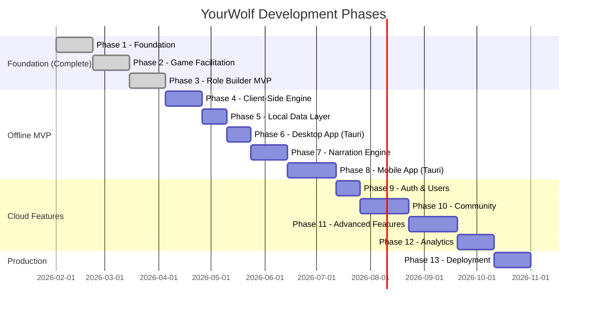
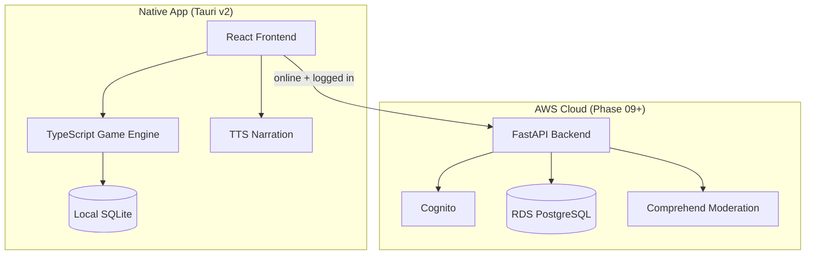

# YourWolf Development Roadmap

> **A standalone, offline-capable One Night Ultimate Werewolf clone with custom role creation and voice narration**

## Project Vision

YourWolf is a self-contained game facilitator for in-person One Night Ultimate Werewolf play. It runs natively on macOS, Windows, iOS, and Android with **no internet connection required**. Users create custom roles, run games with voice narration, and play anywhere. Cloud features (accounts, community role sharing, analytics) layer on top for connected users.

---

## Repository Structure

The project is a monorepo:

| Directory | Tech Stack | Purpose |
|-----------|------------|----------|
| `yourwolf-backend` | Python 3.14, FastAPI, SQLAlchemy, PostgreSQL | Cloud REST API (Phase 09+) |
| `yourwolf-frontend` | React 18, TypeScript, Vite, Tauri v2 | App UI, client-side game engine, native shell |
| `docs/` | Markdown | Planning documents, specifications |

### Development Environment

**Offline app development** (Phases 04–08): Tauri v2 dev server wrapping the Vite frontend.

**Cloud backend development** (Phase 09+): Docker Compose with PostgreSQL, FastAPI, and Vite.

```
┌─────────────────────────────────────────────────────────┐
│              Tauri Dev (Offline App)                     │
├─────────────────────────────────────────────────────────┤
│   Vite Frontend + TypeScript Game Engine + SQLite       │
│   Port: 3000 (dev) / native window (Tauri)              │
└─────────────────────────────────────────────────────────┘

┌─────────────────────────────────────────────────────────┐
│              Docker Compose (Cloud Backend)              │
├─────────────────┬─────────────────┬─────────────────────┤
│   PostgreSQL    │    Backend      │     Frontend        │
│   Port: 5432    │   Port: 8000    │    Port: 3000       │
│                 │   (FastAPI)     │    (Vite dev)       │
└─────────────────┴─────────────────┴─────────────────────┘
```

---

## Phase Overview



---

## Phase Summaries

### Phase 1: Foundation ✅
**Goal**: Establish project infrastructure, data models, and seed 30 base roles.

| Component | Deliverables |
|-----------|--------------|
| Backend | FastAPI app, SQLAlchemy models, Alembic migrations, seed script |
| Frontend | React + Vite setup, routing, layout, dark theme |
| Infrastructure | Docker Compose (PostgreSQL, backend, frontend) |
| Data | Role, Ability, AbilityStep models; 30 seeded roles |

**Milestone**: API returns list of seeded roles; frontend displays them.

---

### Phase 2: Game Facilitation ✅
**Goal**: Run a complete game with facilitator prompts and timer.

| Component | Deliverables |
|-----------|--------------|
| Backend | Game session API, night script generator, wake order engine |
| Frontend | Game setup, role selection, facilitator script view, timer |
| Logic | Ability sequencing with AND/OR/IF conditionals |

**Milestone**: Facilitator can run a full game with 5+ players using base roles.

---

### Phase 2.5: Named Exports Migration ✅
**Goal**: Refactor frontend to use named exports per TypeScript style guide.

| Component | Deliverables |
|-----------|----------|
| Frontend | Migrate 8 files from default to named exports |
| Imports | Update all import statements to named syntax |
| Validation | Build, test suite, manual verification |

**Milestone**: No `export default` in codebase; all tests pass.

---

### Phase 3: Role Builder MVP ✅
**Goal**: Create custom roles by selecting from predefined abilities.

| Component | Deliverables |
|-----------|--------------|
| Backend | Role CRUD API, ability validation, duplicate detection |
| Frontend | Ability wizard, role form, live preview, local draft storage |
| Validation | Team rules, required fields, ability compatibility |

**Milestone**: User creates a custom role that works in a game session.

---

### Phase 4: Client-Side Game Engine
**Goal**: Port game logic from Python backend to TypeScript for offline play.

| Component | Deliverables |
|-----------|--------------|
| Engine | Night script generator, wake order resolver, instruction templates |
| State | Game state machine (setup → night → discussion → voting → resolution → complete) |
| Integration | Replace backend API calls with local engine in frontend hooks |

**Milestone**: Full game runs in the browser with no backend server.

---

### Phase 5: Local Data Layer
**Goal**: SQLite-based local storage for offline role and game persistence.

| Component | Deliverables |
|-----------|--------------|
| Storage | SQLite schema, sql.js for browser, repository pattern |
| Data | Bundled seed data (30 roles), custom role persistence, draft migration |
| Preferences | User settings (timer defaults, theme) in SQLite |

**Milestone**: All data persists locally; app works without any backend.

---

### Phase 6: Desktop App (Tauri v2)
**Goal**: Native macOS and Windows desktop application.

| Component | Deliverables |
|-----------|--------------|
| Shell | Tauri v2 wrapping React frontend, native SQLite via plugin |
| Builds | macOS (.dmg), Windows (.msi/.exe), Linux (.AppImage) best-effort |
| CI | GitHub Actions builds on release tag |

**Milestone**: Installable desktop app runs full game offline.

---

### Phase 7: Narration Engine
**Goal**: Text-to-speech voice narration for the night phase (offline).

| Component | Deliverables |
|-----------|--------------|
| Research | TTS technology evaluation (OS-native vs. bundled model) |
| Engine | TTS service, narration playback controller, pre-generation |
| UI | Audio controls (play/pause, skip, volume, speed), narration toggle |

**Milestone**: Night phase plays aloud with voice narration, no internet needed.

---

### Phase 8: Mobile App (Tauri v2)
**Goal**: iOS and Android builds from the existing Tauri project.

| Component | Deliverables |
|-----------|--------------|
| Builds | iOS (.ipa) and Android (.apk/.aab) via Tauri v2 mobile |
| UI | Responsive layout, touch-optimized interactions |
| Verification | TTS narration working on mobile, SQLite persistence |

**Milestone**: Full game with narration runs on phone, fully offline.

---

### Phase 9: Authentication & Users
**Goal**: User accounts with local-to-cloud role sync.

| Component | Deliverables |
|-----------|--------------|
| Backend | Cognito integration, user model, profile API, role ownership |
| Frontend | Login/signup, profile page, connectivity detection |
| Sync | Upload local roles to cloud on login, download cloud roles for offline |

**Milestone**: User logs in, local roles sync to cloud; app still works fully offline.

---

### Phase 10: Community Features
**Goal**: Share roles publicly, vote, browse, and download for offline.

| Component | Deliverables |
|-----------|--------------|
| Backend | Publishing workflow, voting API, role sets, search/filter |
| Frontend | Browse page, role detail, vote buttons, role set builder |
| Offline | Download community roles for offline play |

**Milestone**: User publishes role; another user finds it, downloads it, plays offline.

---

### Phase 11: Advanced Features
**Goal**: Conditional abilities, content moderation, game history.

| Component | Deliverables |
|-----------|--------------|
| Abilities | IF/THEN/ELSE conditional builder, condition validator |
| Moderation | AWS Comprehend auto-filter, community flagging |
| History | Local + cloud game history with sync |

**Milestone**: User creates conditional role; moderation catches inappropriate content.

---

### Phase 12: Analytics & Balance Metrics
**Goal**: Balance metrics, smart set suggestions, win rate tracking.

| Component | Deliverables |
|-----------|--------------|
| Analytics | Balance scoring, recommendation engine, stats aggregation |
| UI | Facilitator dashboard (local + cloud stats) |
| Backend | Background aggregation jobs |

**Milestone**: System suggests balanced role set; warns about broken combos.

---

### Phase 13: Production Deployment
**Goal**: AWS infrastructure, CI/CD, app store submissions.

| Component | Deliverables |
|-----------|--------------|
| Infrastructure | Terraform (RDS, ECS Fargate, CloudFront, Route 53) |
| CI/CD | GitHub Actions for backend, desktop, and mobile releases |
| Distribution | App Store, Play Store, signed desktop installers |

**Milestone**: App live on all platforms and stores with cloud backend deployed.

---

## Architecture Diagram



---

## Key Design Decisions

### 1. Offline-First Architecture
The app is a standalone native application. All core features (role browsing, role creation, game facilitation, narration) work with zero internet connectivity. Cloud features (auth, community, sync) are additive layers.

### 2. Dual Data Path
SQLite handles local/offline storage. PostgreSQL via FastAPI handles cloud/online storage. The repository pattern abstracts storage behind interfaces so the app doesn't care where data comes from.

### 3. TypeScript Game Engine
Night script generation, wake order resolution, and ability step logic run client-side in TypeScript. The Python backend is not bundled — it exists only as the cloud API for connected features.

### 4. Tauri v2 for All Platforms
One codebase produces native apps for macOS, Windows, Linux, iOS, and Android. Tauri wraps the existing React frontend using OS webviews (no bundled Chromium).

### 5. Ability System Architecture
Abilities are composed of **atomic primitives** (View, Swap, Copy, etc.) with **sequencing** (order) and **conditionals** (AND/OR/IF). This enables complex role behaviors while keeping the builder UI manageable.

### 6. Wake Order Engine
The night phase is deterministic: roles wake in order, execute ability steps sequentially, and conditionals resolve based on game state. No randomness except where explicitly defined.

### 7. Community Moderation (Phase 10+)
Three-layer approach:
1. **Automated**: AWS Comprehend flags inappropriate content
2. **Community**: Users flag roles; highly-flagged roles enter review queue
3. **Manual**: Admin reviews flagged content

### 8. Role Uniqueness
Public roles must have unique names. Users cannot publish a role with the same name as an existing public role (including base game roles).

---

## Success Metrics

| Phase | Key Metric |
|-------|------------|
| 1 | All 30 base roles seeded and retrievable via API |
| 2 | Complete game session runs without errors |
| 3 | Custom role created and used in game |
| 4 | Game runs in browser with no backend server |
| 5 | All data persists locally across restarts |
| 6 | Installable desktop app runs full game offline |
| 7 | Night phase narrates aloud with no internet |
| 8 | Full game with narration runs on phone offline |
| 9 | Local roles sync to cloud on login |
| 10 | Roles shared, voted on, downloaded for offline |
| 11 | Conditional roles working; moderation catches bad content |
| 12 | Balance warnings prevent broken role sets |
| 13 | All platforms deployed; app stores live |

---

## Document Index

| Document | Description |
|----------|-------------|
| [ABILITIES.md](ABILITIES.md) | Ability primitive definitions |
| [DATA_MODELS.md](DATA_MODELS.md) | Entity schemas and relationships |
| [SEED_ROLES.md](SEED_ROLES.md) | 30 base role definitions |
| [phases/PHASES_OVERVIEW.md](phases/PHASES_OVERVIEW.md) | Project roadmap overview |
| [phases/PHASE_01/PHASE_01_SUMMARY.md](phases/PHASE_01/PHASE_01_SUMMARY.md) | Foundation (Complete) |
| [phases/PHASE_02/PHASE_02_SUMMARY.md](phases/PHASE_02/PHASE_02_SUMMARY.md) | Game Facilitation (Complete) |
| [phases/PHASE_2.5/PHASE_2.5_SUMMARY.md](phases/PHASE_2.5/PHASE_2.5_SUMMARY.md) | Named Exports Migration (Complete) |
| [phases/PHASE_3.5/PHASE_3.5_SUMMARY.md](phases/PHASE_3.5/PHASE_3.5_SUMMARY.md) | Narrator Preview Fixes (Complete) |
| [phases/PHASE_3.6/PHASE_3.6_SUMMARY.md](phases/PHASE_3.6/PHASE_3.6_SUMMARY.md) | Wake Order Resolution (Complete) |
| [phases/PHASE_04/PHASE_04_SUMMARY.md](phases/PHASE_04/PHASE_04_SUMMARY.md) | Client-Side Game Engine |
| [phases/PHASE_05/PHASE_05_SUMMARY.md](phases/PHASE_05/PHASE_05_SUMMARY.md) | Local Data Layer |
| [phases/PHASE_06/PHASE_06_SUMMARY.md](phases/PHASE_06/PHASE_06_SUMMARY.md) | Desktop App (Tauri v2) |
| [phases/PHASE_07/PHASE_07_SUMMARY.md](phases/PHASE_07/PHASE_07_SUMMARY.md) | Narration Engine |
| [phases/PHASE_08/PHASE_08_SUMMARY.md](phases/PHASE_08/PHASE_08_SUMMARY.md) | Mobile App (Tauri v2) |
| [phases/PHASE_09/PHASE_09_SUMMARY.md](phases/PHASE_09/PHASE_09_SUMMARY.md) | Authentication & Users |
| [phases/PHASE_10/PHASE_10_SUMMARY.md](phases/PHASE_10/PHASE_10_SUMMARY.md) | Community Features |
| [phases/PHASE_11/PHASE_11_SUMMARY.md](phases/PHASE_11/PHASE_11_SUMMARY.md) | Advanced Features |
| [phases/PHASE_12/PHASE_12_SUMMARY.md](phases/PHASE_12/PHASE_12_SUMMARY.md) | Analytics & Balance Metrics |
| [phases/PHASE_13/PHASE_13_SUMMARY.md](phases/PHASE_13/PHASE_13_SUMMARY.md) | Production Deployment |

---

## Getting Started

```bash
# Clone the monorepo
git clone https://github.com/threnjen/yourwolf-monorepo
cd yourwolf-monorepo

# Cloud backend development (Docker Compose)
cd yourwolf-backend
docker-compose up -d
# Backend: http://localhost:8000
# Frontend: http://localhost:3000
# API Docs: http://localhost:8000/docs

# Desktop app development (Phase 06+)
cd yourwolf-frontend
cargo tauri dev
```

---

*Last updated: March 29, 2026*
