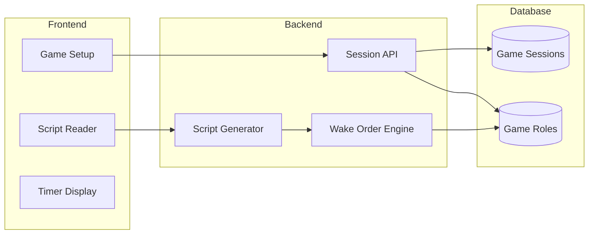

# Phase 2: Game Facilitation

> **Game sessions, night script generation, timer, and facilitator UI**

## Overview

**Goal**: Enable a facilitator to run a complete One Night Ultimate Werewolf game using the app, with generated narration scripts and a configurable timer.

**Duration**: ~3 weeks

**Prerequisites**: Phase 1 (Foundation) complete

**Deliverables**:
- Game session management API
- Night script generator based on selected roles
- Wake order engine with AND/OR/IF logic
- Discussion timer with configurable duration
- Facilitator UI for running games

---

## Architecture



---

## Backend Components

### 1. New Models

#### GameSession Model (`app/models/game_session.py`)

```python
from sqlalchemy import Column, String, Integer, Boolean, DateTime, ForeignKey, Enum
from sqlalchemy.dialects.postgresql import UUID
from sqlalchemy.orm import relationship
from datetime import datetime
import uuid
import enum

from app.database import Base

class GamePhase(str, enum.Enum):
    SETUP = "setup"
    NIGHT = "night"
    DISCUSSION = "discussion"
    VOTING = "voting"
    RESOLUTION = "resolution"
    COMPLETE = "complete"

class GameSession(Base):
    __tablename__ = "game_sessions"

    id = Column(UUID(as_uuid=True), primary_key=True, default=uuid.uuid4)
    facilitator_id = Column(UUID(as_uuid=True), ForeignKey("users.id"), nullable=True)
    
    # Configuration
    player_count = Column(Integer, nullable=False)
    center_card_count = Column(Integer, default=3)
    discussion_timer_seconds = Column(Integer, default=300)  # 5 minutes default
    
    # State
    phase = Column(Enum(GamePhase), default=GamePhase.SETUP)
    current_wake_order = Column(Integer, nullable=True)
    
    # Timing
    created_at = Column(DateTime, default=datetime.utcnow)
    started_at = Column(DateTime, nullable=True)
    ended_at = Column(DateTime, nullable=True)
    
    # Relationships
    game_roles = relationship("GameRole", back_populates="game_session", cascade="all, delete-orphan")
    facilitator = relationship("User")
```

#### GameRole Model (`app/models/game_role.py`)

```python
from sqlalchemy import Column, Integer, Boolean, ForeignKey, Enum
from sqlalchemy.dialects.postgresql import UUID
from sqlalchemy.orm import relationship
import uuid

from app.database import Base
from app.models.role import Team

class GameRole(Base):
    __tablename__ = "game_roles"

    id = Column(UUID(as_uuid=True), primary_key=True, default=uuid.uuid4)
    game_session_id = Column(UUID(as_uuid=True), ForeignKey("game_sessions.id", ondelete="CASCADE"), nullable=False)
    role_id = Column(UUID(as_uuid=True), ForeignKey("roles.id"), nullable=False)
    
    # Assignment
    position = Column(Integer, nullable=True)  # Player position (0-indexed), null for center
    is_center = Column(Boolean, default=False)
    
    # State (can change during game)
    current_team = Column(Enum(Team), nullable=True)
    is_flipped = Column(Boolean, default=False)
    
    # Relationships
    game_session = relationship("GameSession", back_populates="game_roles")
    role = relationship("Role")
```

### 2. Database Migration

```sql
-- Create game_sessions table
CREATE TABLE game_sessions (
    id UUID PRIMARY KEY DEFAULT gen_random_uuid(),
    facilitator_id UUID REFERENCES users(id),
    player_count INTEGER NOT NULL,
    center_card_count INTEGER DEFAULT 3,
    discussion_timer_seconds INTEGER DEFAULT 300,
    phase VARCHAR(20) DEFAULT 'setup',
    current_wake_order INTEGER,
    created_at TIMESTAMP DEFAULT NOW(),
    started_at TIMESTAMP,
    ended_at TIMESTAMP
);

-- Create game_roles table
CREATE TABLE game_roles (
    id UUID PRIMARY KEY DEFAULT gen_random_uuid(),
    game_session_id UUID REFERENCES game_sessions(id) ON DELETE CASCADE NOT NULL,
    role_id UUID REFERENCES roles(id) NOT NULL,
    position INTEGER,
    is_center BOOLEAN DEFAULT false,
    current_team VARCHAR(20),
    is_flipped BOOLEAN DEFAULT false
);

-- Indexes
CREATE INDEX idx_game_sessions_facilitator ON game_sessions(facilitator_id);
CREATE INDEX idx_game_sessions_phase ON game_sessions(phase);
CREATE INDEX idx_game_roles_session ON game_roles(game_session_id);
```

### 3. Pydantic Schemas

#### Game Schemas (`app/schemas/game.py`)

```python
from pydantic import BaseModel, Field
from typing import Optional
from datetime import datetime
from uuid import UUID
from enum import Enum

class GamePhase(str, Enum):
    SETUP = "setup"
    NIGHT = "night"
    DISCUSSION = "discussion"
    VOTING = "voting"
    RESOLUTION = "resolution"
    COMPLETE = "complete"

# Request schemas
class GameSessionCreate(BaseModel):
    player_count: int = Field(..., ge=3, le=20)
    center_card_count: int = Field(default=3, ge=0, le=5)
    discussion_timer_seconds: int = Field(default=300, ge=60, le=1800)
    role_ids: list[UUID]  # Roles to include in game

class GameRoleAssignment(BaseModel):
    role_id: UUID
    position: Optional[int] = None  # null = center card
    is_center: bool = False

# Response schemas
class GameRoleResponse(BaseModel):
    id: UUID
    role_id: UUID
    role_name: str
    role_team: str
    position: Optional[int]
    is_center: bool
    is_flipped: bool

    class Config:
        from_attributes = True

class GameSessionResponse(BaseModel):
    id: UUID
    player_count: int
    center_card_count: int
    discussion_timer_seconds: int
    phase: GamePhase
    current_wake_order: Optional[int]
    created_at: datetime
    started_at: Optional[datetime]
    ended_at: Optional[datetime]
    game_roles: list[GameRoleResponse]

    class Config:
        from_attributes = True

class GameSessionListResponse(BaseModel):
    id: UUID
    player_count: int
    phase: GamePhase
    created_at: datetime

    class Config:
        from_attributes = True

# Script schemas
class NarratorAction(BaseModel):
    order: int
    role_name: str
    instruction: str
    duration_seconds: int = 10
    requires_player_action: bool = True

class NightScript(BaseModel):
    game_session_id: UUID
    actions: list[NarratorAction]
    total_duration_seconds: int
```

### 4. API Endpoints

#### Game Sessions Router (`app/routers/games.py`)

| Method | Path | Description | Request | Response |
|--------|------|-------------|---------|----------|
| POST | `/api/games` | Create new game session | `GameSessionCreate` | `GameSessionResponse` |
| GET | `/api/games` | List game sessions | Query: `phase`, `page`, `limit` | `GameSessionListResponse[]` |
| GET | `/api/games/{id}` | Get game session | - | `GameSessionResponse` |
| POST | `/api/games/{id}/start` | Start game (generate assignments) | - | `GameSessionResponse` |
| POST | `/api/games/{id}/advance` | Advance to next phase | - | `GameSessionResponse` |
| GET | `/api/games/{id}/script` | Get night script | - | `NightScript` |
| DELETE | `/api/games/{id}` | Delete game session | - | `204 No Content` |

```python
from fastapi import APIRouter, Depends, HTTPException, Query
from sqlalchemy.orm import Session
from typing import Optional
from uuid import UUID

from app.database import get_db
from app.schemas.game import (
    GameSessionCreate, GameSessionResponse, GameSessionListResponse,
    NightScript, GamePhase
)
from app.services.game_service import GameService
from app.services.script_service import ScriptService

router = APIRouter()

@router.post("", response_model=GameSessionResponse, status_code=201)
def create_game(game: GameSessionCreate, db: Session = Depends(get_db)):
    """Create a new game session with selected roles."""
    service = GameService(db)
    
    # Validate role count
    total_cards = game.player_count + game.center_card_count
    if len(game.role_ids) != total_cards:
        raise HTTPException(
            status_code=400,
            detail=f"Must select exactly {total_cards} roles ({game.player_count} players + {game.center_card_count} center)"
        )
    
    return service.create_game(game)

@router.get("", response_model=list[GameSessionListResponse])
def list_games(
    phase: Optional[GamePhase] = None,
    page: int = Query(1, ge=1),
    limit: int = Query(20, ge=1, le=100),
    db: Session = Depends(get_db)
):
    service = GameService(db)
    return service.list_games(phase=phase, page=page, limit=limit)

@router.get("/{game_id}", response_model=GameSessionResponse)
def get_game(game_id: UUID, db: Session = Depends(get_db)):
    service = GameService(db)
    game = service.get_game(game_id)
    if not game:
        raise HTTPException(status_code=404, detail="Game not found")
    return game

@router.post("/{game_id}/start", response_model=GameSessionResponse)
def start_game(game_id: UUID, db: Session = Depends(get_db)):
    """Randomly assign roles to players and center, advance to night phase."""
    service = GameService(db)
    game = service.start_game(game_id)
    if not game:
        raise HTTPException(status_code=404, detail="Game not found")
    return game

@router.post("/{game_id}/advance", response_model=GameSessionResponse)
def advance_phase(game_id: UUID, db: Session = Depends(get_db)):
    """Advance game to next phase."""
    service = GameService(db)
    game = service.advance_phase(game_id)
    if not game:
        raise HTTPException(status_code=404, detail="Game not found")
    return game

@router.get("/{game_id}/script", response_model=NightScript)
def get_night_script(game_id: UUID, db: Session = Depends(get_db)):
    """Generate narration script for the night phase."""
    game_service = GameService(db)
    game = game_service.get_game(game_id)
    if not game:
        raise HTTPException(status_code=404, detail="Game not found")
    
    script_service = ScriptService(db)
    return script_service.generate_night_script(game)

@router.delete("/{game_id}", status_code=204)
def delete_game(game_id: UUID, db: Session = Depends(get_db)):
    service = GameService(db)
    if not service.delete_game(game_id):
        raise HTTPException(status_code=404, detail="Game not found")
```

### 5. Game Service (`app/services/game_service.py`)

```python
from sqlalchemy.orm import Session
from uuid import UUID
from datetime import datetime
import random

from app.models.game_session import GameSession, GamePhase
from app.models.game_role import GameRole
from app.models.role import Role
from app.schemas.game import GameSessionCreate

class GameService:
    def __init__(self, db: Session):
        self.db = db
    
    def create_game(self, data: GameSessionCreate) -> GameSession:
        """Create a new game session with selected roles."""
        game = GameSession(
            player_count=data.player_count,
            center_card_count=data.center_card_count,
            discussion_timer_seconds=data.discussion_timer_seconds,
            phase=GamePhase.SETUP
        )
        self.db.add(game)
        self.db.flush()
        
        # Add roles (not yet assigned to positions)
        for role_id in data.role_ids:
            game_role = GameRole(
                game_session_id=game.id,
                role_id=role_id
            )
            self.db.add(game_role)
        
        self.db.commit()
        self.db.refresh(game)
        return game
    
    def start_game(self, game_id: UUID) -> GameSession:
        """Randomly assign roles to players and center cards."""
        game = self.db.query(GameSession).filter(GameSession.id == game_id).first()
        if not game or game.phase != GamePhase.SETUP:
            return None
        
        # Get all game roles
        game_roles = list(game.game_roles)
        random.shuffle(game_roles)
        
        # Assign to players (0 to player_count-1)
        for i in range(game.player_count):
            game_roles[i].position = i
            game_roles[i].is_center = False
            # Set initial team from role
            role = self.db.query(Role).filter(Role.id == game_roles[i].role_id).first()
            game_roles[i].current_team = role.team
        
        # Assign to center
        for i in range(game.player_count, len(game_roles)):
            game_roles[i].position = i - game.player_count
            game_roles[i].is_center = True
        
        # Advance to night phase
        game.phase = GamePhase.NIGHT
        game.started_at = datetime.utcnow()
        game.current_wake_order = 0
        
        self.db.commit()
        self.db.refresh(game)
        return game
    
    def advance_phase(self, game_id: UUID) -> GameSession:
        """Advance to the next game phase."""
        game = self.db.query(GameSession).filter(GameSession.id == game_id).first()
        if not game:
            return None
        
        phase_order = [
            GamePhase.SETUP,
            GamePhase.NIGHT,
            GamePhase.DISCUSSION,
            GamePhase.VOTING,
            GamePhase.RESOLUTION,
            GamePhase.COMPLETE
        ]
        
        current_index = phase_order.index(game.phase)
        if current_index < len(phase_order) - 1:
            game.phase = phase_order[current_index + 1]
            if game.phase == GamePhase.COMPLETE:
                game.ended_at = datetime.utcnow()
        
        self.db.commit()
        self.db.refresh(game)
        return game
    
    def get_game(self, game_id: UUID) -> GameSession:
        return self.db.query(GameSession).filter(GameSession.id == game_id).first()
    
    def list_games(self, phase=None, page=1, limit=20):
        query = self.db.query(GameSession)
        if phase:
            query = query.filter(GameSession.phase == phase)
        return query.order_by(GameSession.created_at.desc()).offset((page - 1) * limit).limit(limit).all()
    
    def delete_game(self, game_id: UUID) -> bool:
        game = self.db.query(GameSession).filter(GameSession.id == game_id).first()
        if not game:
            return False
        self.db.delete(game)
        self.db.commit()
        return True
```

### 6. Script Generator Service (`app/services/script_service.py`)

```python
from sqlalchemy.orm import Session
from typing import Optional

from app.models.game_session import GameSession
from app.models.game_role import GameRole
from app.models.role import Role
from app.models.ability_step import AbilityStep, StepModifier
from app.schemas.game import NightScript, NarratorAction

class ScriptService:
    def __init__(self, db: Session):
        self.db = db
    
    def generate_night_script(self, game: GameSession) -> NightScript:
        """Generate the narrator script for the night phase."""
        
        # Get all roles with wake_order, sorted
        game_roles = self.db.query(GameRole).filter(
            GameRole.game_session_id == game.id,
            GameRole.is_center == False
        ).all()
        
        # Get unique roles that wake (have wake_order)
        role_ids = list(set(gr.role_id for gr in game_roles))
        roles = self.db.query(Role).filter(
            Role.id.in_(role_ids),
            Role.wake_order.isnot(None)
        ).order_by(Role.wake_order).all()
        
        actions = []
        order = 1
        
        # Opening narration
        actions.append(NarratorAction(
            order=order,
            role_name="Narrator",
            instruction="Everyone, close your eyes.",
            duration_seconds=5,
            requires_player_action=False
        ))
        order += 1
        
        # Generate script for each waking role
        for role in roles:
            role_actions = self._generate_role_script(role, order)
            for action in role_actions:
                actions.append(action)
                order += 1
        
        # Closing narration
        actions.append(NarratorAction(
            order=order,
            role_name="Narrator",
            instruction="Everyone, wake up!",
            duration_seconds=3,
            requires_player_action=False
        ))
        
        total_duration = sum(a.duration_seconds for a in actions)
        
        return NightScript(
            game_session_id=game.id,
            actions=actions,
            total_duration_seconds=total_duration
        )
    
    def _generate_role_script(self, role: Role, start_order: int) -> list[NarratorAction]:
        """Generate narration for a single role's turn."""
        actions = []
        order = start_order
        
        # Wake instruction
        wake_instruction = self._get_wake_instruction(role)
        actions.append(NarratorAction(
            order=order,
            role_name=role.name,
            instruction=wake_instruction,
            duration_seconds=3,
            requires_player_action=False
        ))
        order += 1
        
        # Generate instructions for ability steps
        ability_steps = sorted(role.ability_steps, key=lambda s: s.order)
        for step in ability_steps:
            instruction = self._generate_step_instruction(role, step)
            if instruction:
                actions.append(NarratorAction(
                    order=order,
                    role_name=role.name,
                    instruction=instruction,
                    duration_seconds=self._get_step_duration(step),
                    requires_player_action=step.is_required or step.modifier == StepModifier.OR
                ))
                order += 1
        
        # Close eyes
        actions.append(NarratorAction(
            order=order,
            role_name=role.name,
            instruction=f"{role.name}, close your eyes.",
            duration_seconds=3,
            requires_player_action=False
        ))
        
        return actions
    
    def _get_wake_instruction(self, role: Role) -> str:
        """Get the wake-up instruction for a role."""
        wake_target = role.wake_target or "player.self"
        
        if wake_target == "player.self":
            return f"{role.name}, wake up."
        elif wake_target == "team.werewolf":
            return "Werewolves, wake up and look for other werewolves."
        elif wake_target == "team.alien":
            return "Aliens, wake up and look for other aliens."
        elif wake_target == "team.vampire":
            return "Vampires, wake up and look for other vampires."
        elif wake_target.startswith("role."):
            target_role = wake_target.replace("role.", "").replace("_", " ")
            return f"{role.name} and {target_role}, wake up."
        else:
            return f"{role.name}, wake up."
    
    def _generate_step_instruction(self, role: Role, step: AbilityStep) -> Optional[str]:
        """Generate narrator instruction for an ability step."""
        ability = step.ability
        params = step.parameters or {}
        
        templates = {
            "view_card": self._view_card_instruction,
            "swap_card": self._swap_card_instruction,
            "take_card": self._take_card_instruction,
            "view_awake": self._view_awake_instruction,
            "thumbs_up": self._thumbs_up_instruction,
            "explicit_no_view": self._no_view_instruction,
            "rotate_all": self._rotate_instruction,
            "touch": self._touch_instruction,
            "flip_card": self._flip_card_instruction,
            "copy_role": self._copy_role_instruction,
        }
        
        generator = templates.get(ability.type)
        if generator:
            instruction = generator(role, params, step.modifier)
            
            # Add OR prefix if alternative
            if step.modifier == StepModifier.OR:
                instruction = f"OR {instruction}"
            
            return instruction
        
        return None
    
    def _view_card_instruction(self, role: Role, params: dict, modifier: StepModifier) -> str:
        target = params.get("target", "player.other")
        count = params.get("count", 1)
        
        if target == "player.self":
            return "You may look at your own card."
        elif target == "player.other":
            if count == 1:
                return "You may look at one other player's card."
            else:
                return f"You may look at up to {count} other players' cards."
        elif target == "center.main":
            if count == 1:
                return "You may look at one card from the center."
            else:
                return f"You may look at {count} cards from the center."
        return "You may look at a card."
    
    def _swap_card_instruction(self, role: Role, params: dict, modifier: StepModifier) -> str:
        target_a = params.get("target_a", "")
        target_b = params.get("target_b", "")
        
        if "player.self" in [target_a, target_b]:
            other = target_b if target_a == "player.self" else target_a
            if "center" in other:
                return "Exchange your card with one from the center."
            else:
                return "Exchange your card with another player's card."
        elif "center" in target_a:
            return "You may swap that center card with any player's card."
        else:
            return "You may swap two other players' cards."
    
    def _take_card_instruction(self, role: Role, params: dict, modifier: StepModifier) -> str:
        target = params.get("target", "player.other")
        if "center" in target:
            return "Take a card from the center."
        return "Take another player's card."
    
    def _view_awake_instruction(self, role: Role, params: dict, modifier: StepModifier) -> str:
        return "Look around and see who else is awake."
    
    def _thumbs_up_instruction(self, role: Role, params: dict, modifier: StepModifier) -> str:
        target = params.get("target", "")
        
        if target == "player.self":
            return "Put your thumb out so others can see it."
        elif target.startswith("team."):
            team = target.replace("team.", "")
            return f"{team.title()}s, put your thumbs out."
        elif target.startswith("role."):
            target_role = target.replace("role.", "").replace("_", " ")
            return f"{target_role.title()}, put your thumb out."
        elif target == "players.actions":
            return "Everyone who viewed or moved a card tonight, put your thumb out."
        return "Put your thumb out."
    
    def _no_view_instruction(self, role: Role, params: dict, modifier: StepModifier) -> str:
        return "Do not look at your new card."
    
    def _rotate_instruction(self, role: Role, params: dict, modifier: StepModifier) -> str:
        direction = params.get("direction", "left")
        return f"You may move all player cards one position to the {direction}."
    
    def _touch_instruction(self, role: Role, params: dict, modifier: StepModifier) -> str:
        return "Reach out and tap the player next to you."
    
    def _flip_card_instruction(self, role: Role, params: dict, modifier: StepModifier) -> str:
        return "You may flip that player's card face up."
    
    def _copy_role_instruction(self, role: Role, params: dict, modifier: StepModifier) -> str:
        return "You are now that role for the rest of the game."
    
    def _get_step_duration(self, step: AbilityStep) -> int:
        """Get appropriate duration for an ability step."""
        ability_type = step.ability.type
        
        durations = {
            "view_card": 8,
            "swap_card": 6,
            "take_card": 6,
            "view_awake": 5,
            "thumbs_up": 5,
            "explicit_no_view": 2,
            "rotate_all": 8,
            "touch": 5,
            "flip_card": 5,
            "copy_role": 3,
            "change_to_team": 2,
            "perform_as": 2,
            "perform_immediately": 2,
            "stop": 0,
        }
        
        return durations.get(ability_type, 5)
```

---

## Frontend Components

### 1. New Pages

#### Game Setup Page (`src/pages/GameSetup.tsx`)

```typescript
import React, { useState } from 'react';
import { useNavigate } from 'react-router-dom';
import { useRoles } from '../hooks/useRoles';
import { RoleCard } from '../components/RoleCard';
import { createGame } from '../api/games';
import { theme } from '../styles/theme';

export const GameSetupPage: React.FC = () => {
  const navigate = useNavigate();
  const { roles, loading } = useRoles({ visibility: 'official' });
  
  const [playerCount, setPlayerCount] = useState(5);
  const [centerCount, setCenterCount] = useState(3);
  const [timerSeconds, setTimerSeconds] = useState(300);
  const [selectedRoleIds, setSelectedRoleIds] = useState<string[]>([]);
  
  const totalCardsNeeded = playerCount + centerCount;
  const canStart = selectedRoleIds.length === totalCardsNeeded;
  
  const toggleRole = (roleId: string) => {
    setSelectedRoleIds(prev => 
      prev.includes(roleId)
        ? prev.filter(id => id !== roleId)
        : [...prev, roleId]
    );
  };
  
  const handleStartGame = async () => {
    if (!canStart) return;
    
    const game = await createGame({
      player_count: playerCount,
      center_card_count: centerCount,
      discussion_timer_seconds: timerSeconds,
      role_ids: selectedRoleIds,
    });
    
    navigate(`/games/${game.id}`);
  };
  
  if (loading) return <div>Loading roles...</div>;
  
  return (
    <div style={{ padding: theme.spacing.lg }}>
      <h1 style={{ color: theme.colors.text }}>New Game Setup</h1>
      
      {/* Configuration */}
      <div style={{ 
        display: 'grid', 
        gridTemplateColumns: 'repeat(3, 1fr)', 
        gap: theme.spacing.md,
        marginBottom: theme.spacing.xl 
      }}>
        <div>
          <label style={{ color: theme.colors.text }}>Players</label>
          <input
            type="number"
            min={3}
            max={20}
            value={playerCount}
            onChange={e => setPlayerCount(parseInt(e.target.value))}
            style={inputStyle}
          />
        </div>
        <div>
          <label style={{ color: theme.colors.text }}>Center Cards</label>
          <input
            type="number"
            min={0}
            max={5}
            value={centerCount}
            onChange={e => setCenterCount(parseInt(e.target.value))}
            style={inputStyle}
          />
        </div>
        <div>
          <label style={{ color: theme.colors.text }}>Discussion Timer (seconds)</label>
          <input
            type="number"
            min={60}
            max={1800}
            step={30}
            value={timerSeconds}
            onChange={e => setTimerSeconds(parseInt(e.target.value))}
            style={inputStyle}
          />
        </div>
      </div>
      
      {/* Role Selection */}
      <div style={{ marginBottom: theme.spacing.md }}>
        <h2 style={{ color: theme.colors.text }}>
          Select Roles ({selectedRoleIds.length} / {totalCardsNeeded})
        </h2>
        <p style={{ color: theme.colors.textMuted }}>
          You need exactly {totalCardsNeeded} roles ({playerCount} players + {centerCount} center)
        </p>
      </div>
      
      <div style={{ 
        display: 'grid', 
        gridTemplateColumns: 'repeat(auto-fill, minmax(250px, 1fr))',
        gap: theme.spacing.md,
        marginBottom: theme.spacing.xl
      }}>
        {roles.map(role => (
          <div
            key={role.id}
            onClick={() => toggleRole(role.id)}
            style={{
              opacity: selectedRoleIds.includes(role.id) ? 1 : 0.5,
              border: selectedRoleIds.includes(role.id) 
                ? `2px solid ${theme.colors.primary}` 
                : '2px solid transparent',
              borderRadius: theme.borderRadius.md,
              cursor: 'pointer'
            }}
          >
            <RoleCard role={role} />
          </div>
        ))}
      </div>
      
      {/* Start Button */}
      <button
        onClick={handleStartGame}
        disabled={!canStart}
        style={{
          ...buttonStyle,
          opacity: canStart ? 1 : 0.5,
          cursor: canStart ? 'pointer' : 'not-allowed'
        }}
      >
        Start Game
      </button>
    </div>
  );
};

const inputStyle: React.CSSProperties = {
  width: '100%',
  padding: theme.spacing.sm,
  backgroundColor: theme.colors.surface,
  border: `1px solid ${theme.colors.secondary}`,
  borderRadius: theme.borderRadius.sm,
  color: theme.colors.text,
  fontSize: '16px'
};

const buttonStyle: React.CSSProperties = {
  padding: `${theme.spacing.md} ${theme.spacing.xl}`,
  backgroundColor: theme.colors.primary,
  color: theme.colors.text,
  border: 'none',
  borderRadius: theme.borderRadius.md,
  fontSize: '18px',
  fontWeight: 'bold'
};
```

#### Game Facilitator Page (`src/pages/GameFacilitator.tsx`)

```typescript
import React, { useState, useEffect } from 'react';
import { useParams, useNavigate } from 'react-router-dom';
import { useGame, useNightScript } from '../hooks/useGame';
import { advancePhase } from '../api/games';
import { Timer } from '../components/Timer';
import { ScriptReader } from '../components/ScriptReader';
import { theme } from '../styles/theme';

export const GameFacilitatorPage: React.FC = () => {
  const { gameId } = useParams<{ gameId: string }>();
  const navigate = useNavigate();
  const { game, loading, refetch } = useGame(gameId!);
  const { script } = useNightScript(gameId!, game?.phase === 'night');
  
  if (loading || !game) return <div>Loading game...</div>;
  
  const handleAdvancePhase = async () => {
    await advancePhase(gameId!);
    refetch();
  };
  
  return (
    <div style={{ 
      padding: theme.spacing.lg,
      minHeight: '100vh',
      backgroundColor: theme.colors.background
    }}>
      {/* Phase Header */}
      <div style={{ 
        display: 'flex', 
        justifyContent: 'space-between', 
        alignItems: 'center',
        marginBottom: theme.spacing.xl
      }}>
        <h1 style={{ color: theme.colors.text, textTransform: 'uppercase' }}>
          {game.phase} Phase
        </h1>
        <div style={{ color: theme.colors.textMuted }}>
          {game.player_count} Players
        </div>
      </div>
      
      {/* Phase-specific content */}
      {game.phase === 'setup' && (
        <SetupPhaseView game={game} onStart={handleAdvancePhase} />
      )}
      
      {game.phase === 'night' && script && (
        <NightPhaseView script={script} onComplete={handleAdvancePhase} />
      )}
      
      {game.phase === 'discussion' && (
        <DiscussionPhaseView 
          timerSeconds={game.discussion_timer_seconds} 
          onComplete={handleAdvancePhase} 
        />
      )}
      
      {game.phase === 'voting' && (
        <VotingPhaseView onComplete={handleAdvancePhase} />
      )}
      
      {game.phase === 'resolution' && (
        <ResolutionPhaseView game={game} onComplete={handleAdvancePhase} />
      )}
      
      {game.phase === 'complete' && (
        <CompletePhaseView onNewGame={() => navigate('/games/new')} />
      )}
    </div>
  );
};

// Sub-components for each phase...
const SetupPhaseView: React.FC<{ game: Game; onStart: () => void }> = ({ game, onStart }) => (
  <div style={{ textAlign: 'center' }}>
    <p style={{ color: theme.colors.text, fontSize: '20px', marginBottom: theme.spacing.xl }}>
      Distribute the role cards face-down to all players.
      <br />
      Place {game.center_card_count} cards in the center.
    </p>
    <button onClick={onStart} style={primaryButtonStyle}>
      Begin Night Phase
    </button>
  </div>
);

const NightPhaseView: React.FC<{ script: NightScript; onComplete: () => void }> = ({ script, onComplete }) => (
  <ScriptReader script={script} onComplete={onComplete} />
);

const DiscussionPhaseView: React.FC<{ timerSeconds: number; onComplete: () => void }> = ({ timerSeconds, onComplete }) => (
  <div style={{ textAlign: 'center' }}>
    <h2 style={{ color: theme.colors.text }}>Discussion Time</h2>
    <Timer seconds={timerSeconds} onComplete={onComplete} />
    <p style={{ color: theme.colors.textMuted, marginTop: theme.spacing.xl }}>
      Discuss who you think the werewolves are!
    </p>
  </div>
);

// ... additional phase views

const primaryButtonStyle: React.CSSProperties = {
  padding: `${theme.spacing.md} ${theme.spacing.xl}`,
  backgroundColor: theme.colors.primary,
  color: theme.colors.text,
  border: 'none',
  borderRadius: theme.borderRadius.md,
  fontSize: '18px',
  fontWeight: 'bold',
  cursor: 'pointer'
};
```

### 2. New Components

#### Timer Component (`src/components/Timer.tsx`)

```typescript
import React, { useState, useEffect, useCallback } from 'react';
import { theme } from '../styles/theme';

interface TimerProps {
  seconds: number;
  onComplete: () => void;
  autoStart?: boolean;
}

export const Timer: React.FC<TimerProps> = ({ seconds, onComplete, autoStart = true }) => {
  const [remaining, setRemaining] = useState(seconds);
  const [isRunning, setIsRunning] = useState(autoStart);
  
  useEffect(() => {
    if (!isRunning || remaining <= 0) return;
    
    const timer = setInterval(() => {
      setRemaining(prev => {
        if (prev <= 1) {
          clearInterval(timer);
          onComplete();
          return 0;
        }
        return prev - 1;
      });
    }, 1000);
    
    return () => clearInterval(timer);
  }, [isRunning, remaining, onComplete]);
  
  const formatTime = (s: number) => {
    const mins = Math.floor(s / 60);
    const secs = s % 60;
    return `${mins}:${secs.toString().padStart(2, '0')}`;
  };
  
  const progress = (seconds - remaining) / seconds;
  
  return (
    <div style={{ textAlign: 'center' }}>
      {/* Circular progress */}
      <div style={{ 
        position: 'relative', 
        width: '200px', 
        height: '200px', 
        margin: '0 auto' 
      }}>
        <svg viewBox="0 0 100 100" style={{ transform: 'rotate(-90deg)' }}>
          {/* Background circle */}
          <circle
            cx="50" cy="50" r="45"
            fill="none"
            stroke={theme.colors.surface}
            strokeWidth="8"
          />
          {/* Progress circle */}
          <circle
            cx="50" cy="50" r="45"
            fill="none"
            stroke={remaining < 30 ? theme.colors.error : theme.colors.primary}
            strokeWidth="8"
            strokeDasharray={`${progress * 283} 283`}
            strokeLinecap="round"
          />
        </svg>
        <div style={{
          position: 'absolute',
          top: '50%',
          left: '50%',
          transform: 'translate(-50%, -50%)',
          fontSize: '48px',
          fontWeight: 'bold',
          color: remaining < 30 ? theme.colors.error : theme.colors.text
        }}>
          {formatTime(remaining)}
        </div>
      </div>
      
      {/* Controls */}
      <div style={{ marginTop: theme.spacing.lg }}>
        <button
          onClick={() => setIsRunning(!isRunning)}
          style={{
            padding: `${theme.spacing.sm} ${theme.spacing.lg}`,
            backgroundColor: theme.colors.surface,
            color: theme.colors.text,
            border: `1px solid ${theme.colors.secondary}`,
            borderRadius: theme.borderRadius.sm,
            marginRight: theme.spacing.sm,
            cursor: 'pointer'
          }}
        >
          {isRunning ? 'Pause' : 'Resume'}
        </button>
        <button
          onClick={onComplete}
          style={{
            padding: `${theme.spacing.sm} ${theme.spacing.lg}`,
            backgroundColor: theme.colors.primary,
            color: theme.colors.text,
            border: 'none',
            borderRadius: theme.borderRadius.sm,
            cursor: 'pointer'
          }}
        >
          Skip to Voting
        </button>
      </div>
    </div>
  );
};
```

#### Script Reader Component (`src/components/ScriptReader.tsx`)

```typescript
import React, { useState } from 'react';
import { NightScript, NarratorAction } from '../types/game';
import { theme } from '../styles/theme';

interface ScriptReaderProps {
  script: NightScript;
  onComplete: () => void;
}

export const ScriptReader: React.FC<ScriptReaderProps> = ({ script, onComplete }) => {
  const [currentIndex, setCurrentIndex] = useState(0);
  const currentAction = script.actions[currentIndex];
  const isLastAction = currentIndex === script.actions.length - 1;
  
  const handleNext = () => {
    if (isLastAction) {
      onComplete();
    } else {
      setCurrentIndex(prev => prev + 1);
    }
  };
  
  const handlePrevious = () => {
    if (currentIndex > 0) {
      setCurrentIndex(prev => prev - 1);
    }
  };
  
  return (
    <div style={{ maxWidth: '800px', margin: '0 auto' }}>
      {/* Progress bar */}
      <div style={{
        height: '4px',
        backgroundColor: theme.colors.surface,
        borderRadius: '2px',
        marginBottom: theme.spacing.xl
      }}>
        <div style={{
          height: '100%',
          width: `${((currentIndex + 1) / script.actions.length) * 100}%`,
          backgroundColor: theme.colors.primary,
          borderRadius: '2px',
          transition: 'width 0.3s ease'
        }} />
      </div>
      
      {/* Current action */}
      <div style={{
        backgroundColor: theme.colors.surface,
        borderRadius: theme.borderRadius.lg,
        padding: theme.spacing.xl,
        textAlign: 'center',
        minHeight: '200px',
        display: 'flex',
        flexDirection: 'column',
        justifyContent: 'center'
      }}>
        <div style={{
          color: theme.colors.primary,
          fontSize: '14px',
          textTransform: 'uppercase',
          marginBottom: theme.spacing.sm
        }}>
          {currentAction.role_name}
        </div>
        <div style={{
          color: theme.colors.text,
          fontSize: '28px',
          lineHeight: 1.4
        }}>
          {currentAction.instruction}
        </div>
      </div>
      
      {/* Navigation */}
      <div style={{
        display: 'flex',
        justifyContent: 'space-between',
        marginTop: theme.spacing.xl
      }}>
        <button
          onClick={handlePrevious}
          disabled={currentIndex === 0}
          style={{
            ...navButtonStyle,
            opacity: currentIndex === 0 ? 0.3 : 1
          }}
        >
          ← Previous
        </button>
        
        <span style={{ color: theme.colors.textMuted }}>
          {currentIndex + 1} / {script.actions.length}
        </span>
        
        <button
          onClick={handleNext}
          style={navButtonStyle}
        >
          {isLastAction ? 'Start Discussion' : 'Next →'}
        </button>
      </div>
      
      {/* Action list preview */}
      <div style={{ marginTop: theme.spacing.xl }}>
        <h3 style={{ color: theme.colors.textMuted, fontSize: '14px' }}>
          Coming Up:
        </h3>
        <div style={{ display: 'flex', flexWrap: 'wrap', gap: theme.spacing.xs }}>
          {script.actions.slice(currentIndex + 1, currentIndex + 6).map((action, i) => (
            <span
              key={i}
              style={{
                padding: `2px ${theme.spacing.sm}`,
                backgroundColor: theme.colors.surfaceLight,
                borderRadius: theme.borderRadius.sm,
                fontSize: '12px',
                color: theme.colors.textMuted
              }}
            >
              {action.role_name}
            </span>
          ))}
        </div>
      </div>
    </div>
  );
};

const navButtonStyle: React.CSSProperties = {
  padding: `${theme.spacing.sm} ${theme.spacing.lg}`,
  backgroundColor: theme.colors.surface,
  color: theme.colors.text,
  border: `1px solid ${theme.colors.secondary}`,
  borderRadius: theme.borderRadius.sm,
  cursor: 'pointer',
  fontSize: '16px'
};
```

### 3. API Functions (`src/api/games.ts`)

```typescript
import { apiClient } from './client';
import { GameSession, GameSessionCreate, NightScript } from '../types/game';

export const createGame = async (data: GameSessionCreate): Promise<GameSession> => {
  const response = await apiClient.post('/games', data);
  return response.data;
};

export const getGame = async (gameId: string): Promise<GameSession> => {
  const response = await apiClient.get(`/games/${gameId}`);
  return response.data;
};

export const startGame = async (gameId: string): Promise<GameSession> => {
  const response = await apiClient.post(`/games/${gameId}/start`);
  return response.data;
};

export const advancePhase = async (gameId: string): Promise<GameSession> => {
  const response = await apiClient.post(`/games/${gameId}/advance`);
  return response.data;
};

export const getNightScript = async (gameId: string): Promise<NightScript> => {
  const response = await apiClient.get(`/games/${gameId}/script`);
  return response.data;
};
```

### 4. Custom Hooks (`src/hooks/useGame.ts`)

```typescript
import { useState, useEffect, useCallback } from 'react';
import { getGame, getNightScript } from '../api/games';
import { GameSession, NightScript } from '../types/game';

export const useGame = (gameId: string) => {
  const [game, setGame] = useState<GameSession | null>(null);
  const [loading, setLoading] = useState(true);
  const [error, setError] = useState<string | null>(null);
  
  const fetchGame = useCallback(async () => {
    try {
      setLoading(true);
      const data = await getGame(gameId);
      setGame(data);
      setError(null);
    } catch (err) {
      setError('Failed to load game');
    } finally {
      setLoading(false);
    }
  }, [gameId]);
  
  useEffect(() => {
    fetchGame();
  }, [fetchGame]);
  
  return { game, loading, error, refetch: fetchGame };
};

export const useNightScript = (gameId: string, enabled: boolean = true) => {
  const [script, setScript] = useState<NightScript | null>(null);
  const [loading, setLoading] = useState(false);
  
  useEffect(() => {
    if (!enabled) return;
    
    const fetchScript = async () => {
      setLoading(true);
      try {
        const data = await getNightScript(gameId);
        setScript(data);
      } catch (err) {
        console.error('Failed to load script', err);
      } finally {
        setLoading(false);
      }
    };
    
    fetchScript();
  }, [gameId, enabled]);
  
  return { script, loading };
};
```

---

## Tests

### Backend Tests

#### test_game_service.py

```python
import pytest
from uuid import uuid4

from app.services.game_service import GameService
from app.schemas.game import GameSessionCreate, GamePhase

class TestGameService:
    def test_create_game(self, db, seeded_roles):
        service = GameService(db)
        role_ids = [r.id for r in seeded_roles[:8]]  # 5 players + 3 center
        
        game = service.create_game(GameSessionCreate(
            player_count=5,
            center_card_count=3,
            discussion_timer_seconds=300,
            role_ids=role_ids
        ))
        
        assert game.id is not None
        assert game.phase == GamePhase.SETUP
        assert len(game.game_roles) == 8
    
    def test_start_game_assigns_roles(self, db, seeded_roles):
        service = GameService(db)
        role_ids = [r.id for r in seeded_roles[:8]]
        
        game = service.create_game(GameSessionCreate(
            player_count=5,
            center_card_count=3,
            discussion_timer_seconds=300,
            role_ids=role_ids
        ))
        
        started_game = service.start_game(game.id)
        
        assert started_game.phase == GamePhase.NIGHT
        assert started_game.started_at is not None
        
        player_roles = [gr for gr in started_game.game_roles if not gr.is_center]
        center_roles = [gr for gr in started_game.game_roles if gr.is_center]
        
        assert len(player_roles) == 5
        assert len(center_roles) == 3
        assert all(gr.position is not None for gr in started_game.game_roles)
    
    def test_advance_phase(self, db, seeded_roles):
        service = GameService(db)
        role_ids = [r.id for r in seeded_roles[:8]]
        
        game = service.create_game(GameSessionCreate(
            player_count=5,
            center_card_count=3,
            discussion_timer_seconds=300,
            role_ids=role_ids
        ))
        service.start_game(game.id)
        
        game = service.advance_phase(game.id)
        assert game.phase == GamePhase.DISCUSSION
        
        game = service.advance_phase(game.id)
        assert game.phase == GamePhase.VOTING
        
        game = service.advance_phase(game.id)
        assert game.phase == GamePhase.RESOLUTION
        
        game = service.advance_phase(game.id)
        assert game.phase == GamePhase.COMPLETE
        assert game.ended_at is not None
```

#### test_script_service.py

```python
import pytest

from app.services.script_service import ScriptService
from app.services.game_service import GameService
from app.schemas.game import GameSessionCreate

class TestScriptService:
    def test_generate_night_script(self, db, seeded_roles):
        game_service = GameService(db)
        script_service = ScriptService(db)
        
        # Create game with werewolf and seer
        werewolf = next(r for r in seeded_roles if r.name == "Werewolf")
        seer = next(r for r in seeded_roles if r.name == "Seer")
        villager = next(r for r in seeded_roles if r.name == "Villager")
        
        role_ids = [werewolf.id, seer.id, villager.id, villager.id, villager.id,
                   villager.id, villager.id, villager.id]
        
        game = game_service.create_game(GameSessionCreate(
            player_count=5,
            center_card_count=3,
            discussion_timer_seconds=300,
            role_ids=role_ids
        ))
        game_service.start_game(game.id)
        game = game_service.get_game(game.id)
        
        script = script_service.generate_night_script(game)
        
        assert script.game_session_id == game.id
        assert len(script.actions) > 0
        assert script.total_duration_seconds > 0
        
        # Should have opening and closing
        assert script.actions[0].instruction == "Everyone, close your eyes."
        assert "wake up" in script.actions[-1].instruction.lower()
    
    def test_script_follows_wake_order(self, db, seeded_roles):
        game_service = GameService(db)
        script_service = ScriptService(db)
        
        # Roles with different wake orders
        werewolf = next(r for r in seeded_roles if r.name == "Werewolf")  # order 1
        seer = next(r for r in seeded_roles if r.name == "Seer")  # order 4
        insomniac = next(r for r in seeded_roles if r.name == "Insomniac")  # order 9
        villager = next(r for r in seeded_roles if r.name == "Villager")
        
        role_ids = [werewolf.id, seer.id, insomniac.id, villager.id, villager.id,
                   villager.id, villager.id, villager.id]
        
        game = game_service.create_game(GameSessionCreate(
            player_count=5,
            center_card_count=3,
            role_ids=role_ids
        ))
        game_service.start_game(game.id)
        game = game_service.get_game(game.id)
        
        script = script_service.generate_night_script(game)
        
        # Find role mentions in order
        role_order = []
        for action in script.actions:
            if action.role_name in ["Werewolf", "Seer", "Insomniac"]:
                if action.role_name not in role_order:
                    role_order.append(action.role_name)
        
        assert role_order == ["Werewolf", "Seer", "Insomniac"]
```

### Frontend Tests

#### Timer.test.tsx

```typescript
import { render, screen, act } from '@testing-library/react';
import { Timer } from './Timer';

jest.useFakeTimers();

describe('Timer', () => {
  it('displays initial time correctly', () => {
    render(<Timer seconds={300} onComplete={jest.fn()} />);
    expect(screen.getByText('5:00')).toBeInTheDocument();
  });
  
  it('counts down', () => {
    render(<Timer seconds={10} onComplete={jest.fn()} />);
    
    act(() => {
      jest.advanceTimersByTime(5000);
    });
    
    expect(screen.getByText('0:05')).toBeInTheDocument();
  });
  
  it('calls onComplete when timer ends', () => {
    const onComplete = jest.fn();
    render(<Timer seconds={3} onComplete={onComplete} />);
    
    act(() => {
      jest.advanceTimersByTime(3000);
    });
    
    expect(onComplete).toHaveBeenCalled();
  });
  
  it('can be paused and resumed', () => {
    render(<Timer seconds={60} onComplete={jest.fn()} />);
    
    act(() => {
      jest.advanceTimersByTime(5000);
    });
    expect(screen.getByText('0:55')).toBeInTheDocument();
    
    // Pause
    screen.getByText('Pause').click();
    
    act(() => {
      jest.advanceTimersByTime(5000);
    });
    
    // Should still be 55 seconds
    expect(screen.getByText('0:55')).toBeInTheDocument();
  });
});
```

#### ScriptReader.test.tsx

```typescript
import { render, screen, fireEvent } from '@testing-library/react';
import { ScriptReader } from './ScriptReader';

const mockScript = {
  game_session_id: '123',
  actions: [
    { order: 1, role_name: 'Narrator', instruction: 'Close your eyes', duration_seconds: 5, requires_player_action: false },
    { order: 2, role_name: 'Werewolf', instruction: 'Wake up', duration_seconds: 5, requires_player_action: true },
    { order: 3, role_name: 'Narrator', instruction: 'Everyone wake up', duration_seconds: 3, requires_player_action: false },
  ],
  total_duration_seconds: 13
};

describe('ScriptReader', () => {
  it('shows first action initially', () => {
    render(<ScriptReader script={mockScript} onComplete={jest.fn()} />);
    expect(screen.getByText('Close your eyes')).toBeInTheDocument();
  });
  
  it('advances to next action on Next click', () => {
    render(<ScriptReader script={mockScript} onComplete={jest.fn()} />);
    
    fireEvent.click(screen.getByText('Next →'));
    
    expect(screen.getByText('Wake up')).toBeInTheDocument();
  });
  
  it('goes back on Previous click', () => {
    render(<ScriptReader script={mockScript} onComplete={jest.fn()} />);
    
    fireEvent.click(screen.getByText('Next →'));
    fireEvent.click(screen.getByText('← Previous'));
    
    expect(screen.getByText('Close your eyes')).toBeInTheDocument();
  });
  
  it('calls onComplete on last action', () => {
    const onComplete = jest.fn();
    render(<ScriptReader script={mockScript} onComplete={onComplete} />);
    
    fireEvent.click(screen.getByText('Next →'));
    fireEvent.click(screen.getByText('Next →'));
    fireEvent.click(screen.getByText('Start Discussion'));
    
    expect(onComplete).toHaveBeenCalled();
  });
  
  it('shows progress indicator', () => {
    render(<ScriptReader script={mockScript} onComplete={jest.fn()} />);
    expect(screen.getByText('1 / 3')).toBeInTheDocument();
  });
});
```

---

## Acceptance Criteria

| Criteria | Verification |
|----------|--------------|
| Create game with selected roles | POST `/api/games` succeeds with role_ids |
| Validate role count matches player + center | 400 error if mismatch |
| Start game assigns roles randomly | Role positions are randomized |
| Night script generated correctly | GET `/api/games/{id}/script` returns actions |
| Wake order is respected | Roles appear in correct order |
| Timer counts down | Visual timer decrements |
| Timer triggers next phase | Discussion ends automatically |
| Script reader navigates | Next/Previous buttons work |
| Phase transitions work | Game progresses through all phases |
| Game completes successfully | Phase reaches "complete" |

---

## Definition of Done

- [ ] GameSession and GameRole models created
- [ ] Database migration applied
- [ ] Game CRUD API endpoints working
- [ ] Game start randomizes role assignments
- [ ] Night script generator produces correct output
- [ ] Script respects role wake order
- [ ] Script includes AND/OR step instructions
- [ ] Game setup page with role selection
- [ ] Timer component with pause/resume
- [ ] Script reader with navigation
- [ ] Facilitator UI for all game phases
- [ ] Phase auto-advances on timer complete
- [ ] Backend tests for game service (80%+ coverage)
- [ ] Backend tests for script service
- [ ] Frontend tests for Timer component
- [ ] Frontend tests for ScriptReader component
- [ ] E2E test: complete game flow

---

*Last updated: January 31, 2026*
