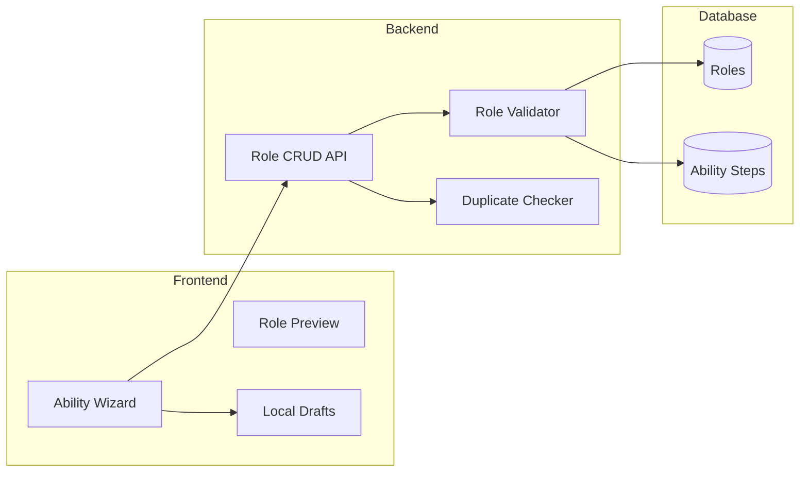

# Phase 3: Role Builder MVP

> **Create custom roles by selecting from predefined abilities**

## Overview

**Goal**: Enable users to create custom roles by composing abilities from a predefined list, with validation and local draft storage.

**Duration**: ~3 weeks

**Prerequisites**: Phase 2 (Game Facilitation) complete

**Deliverables**:
- Role CRUD API with validation
- Ability wizard UI for step-by-step role creation
- Duplicate role name detection
- Local draft storage for work-in-progress roles
- Role preview and testing in games

---

## Architecture



---

## Backend Components

### 1. Enhanced Role Service (`app/services/role_service.py`)

```python
from sqlalchemy.orm import Session
from sqlalchemy import func
from uuid import UUID
from typing import Optional

from app.models.role import Role, Visibility, Team
from app.models.ability_step import AbilityStep, StepModifier
from app.models.win_condition import WinCondition
from app.models.ability import Ability
from app.schemas.role import RoleCreate, RoleUpdate

class RoleValidationError(Exception):
    def __init__(self, errors: list[str]):
        self.errors = errors
        super().__init__(", ".join(errors))

class RoleService:
    def __init__(self, db: Session):
        self.db = db
    
    def create_role(self, data: RoleCreate, creator_id: Optional[UUID] = None) -> Role:
        """Create a new custom role with validation."""
        # Validate role
        errors = self._validate_role(data)
        if errors:
            raise RoleValidationError(errors)
        
        # Create role
        role = Role(
            name=data.name,
            description=data.description,
            team=data.team,
            wake_order=data.wake_order,
            wake_target=data.wake_target,
            votes=data.votes,
            creator_id=creator_id,
            visibility=Visibility.PRIVATE,
            is_locked=False
        )
        self.db.add(role)
        self.db.flush()
        
        # Add ability steps
        for step_data in data.ability_steps:
            step = AbilityStep(
                role_id=role.id,
                ability_id=step_data.ability_id,
                order=step_data.order,
                modifier=step_data.modifier,
                is_required=step_data.is_required,
                parameters=step_data.parameters,
                condition_type=step_data.condition_type,
                condition_params=step_data.condition_params
            )
            self.db.add(step)
        
        # Add win conditions
        for wc_data in data.win_conditions:
            wc = WinCondition(
                role_id=role.id,
                condition_type=wc_data.condition_type,
                condition_params=wc_data.condition_params,
                is_primary=wc_data.is_primary,
                overrides_team=wc_data.overrides_team
            )
            self.db.add(wc)
        
        self.db.commit()
        self.db.refresh(role)
        return role
    
    def update_role(self, role_id: UUID, data: RoleUpdate, user_id: UUID) -> Optional[Role]:
        """Update an existing role (if not locked)."""
        role = self.db.query(Role).filter(Role.id == role_id).first()
        if not role:
            return None
        
        # Check ownership and lock status
        if role.creator_id != user_id:
            raise PermissionError("Cannot edit role you don't own")
        if role.is_locked:
            raise PermissionError("Cannot edit locked role")
        
        # Validate changes
        errors = self._validate_role(data, exclude_role_id=role_id)
        if errors:
            raise RoleValidationError(errors)
        
        # Update basic fields
        role.name = data.name
        role.description = data.description
        role.team = data.team
        role.wake_order = data.wake_order
        role.wake_target = data.wake_target
        role.votes = data.votes
        
        # Replace ability steps
        self.db.query(AbilityStep).filter(AbilityStep.role_id == role_id).delete()
        for step_data in data.ability_steps:
            step = AbilityStep(
                role_id=role.id,
                ability_id=step_data.ability_id,
                order=step_data.order,
                modifier=step_data.modifier,
                is_required=step_data.is_required,
                parameters=step_data.parameters,
                condition_type=step_data.condition_type,
                condition_params=step_data.condition_params
            )
            self.db.add(step)
        
        # Replace win conditions
        self.db.query(WinCondition).filter(WinCondition.role_id == role_id).delete()
        for wc_data in data.win_conditions:
            wc = WinCondition(
                role_id=role.id,
                condition_type=wc_data.condition_type,
                condition_params=wc_data.condition_params,
                is_primary=wc_data.is_primary,
                overrides_team=wc_data.overrides_team
            )
            self.db.add(wc)
        
        self.db.commit()
        self.db.refresh(role)
        return role
    
    def delete_role(self, role_id: UUID, user_id: UUID) -> bool:
        """Delete a role (owner only)."""
        role = self.db.query(Role).filter(Role.id == role_id).first()
        if not role:
            return False
        
        # Check ownership
        if role.creator_id != user_id:
            raise PermissionError("Cannot delete role you don't own")
        
        # Cannot delete official roles
        if role.visibility == Visibility.OFFICIAL:
            raise PermissionError("Cannot delete official roles")
        
        self.db.delete(role)
        self.db.commit()
        return True
    
    def check_duplicate_name(self, name: str, exclude_role_id: Optional[UUID] = None) -> bool:
        """Check if a role name already exists in public/official roles."""
        query = self.db.query(Role).filter(
            func.lower(Role.name) == name.lower(),
            Role.visibility.in_([Visibility.PUBLIC, Visibility.OFFICIAL])
        )
        if exclude_role_id:
            query = query.filter(Role.id != exclude_role_id)
        return query.first() is not None
    
    def _validate_role(self, data: RoleCreate, exclude_role_id: Optional[UUID] = None) -> list[str]:
        """Validate role data and return list of errors."""
        errors = []
        
        # Name validation
        if not data.name or len(data.name.strip()) < 2:
            errors.append("Role name must be at least 2 characters")
        if len(data.name) > 50:
            errors.append("Role name must be 50 characters or less")
        
        # Check for duplicate name (only matters if publishing, but warn anyway)
        if self.check_duplicate_name(data.name, exclude_role_id):
            errors.append(f"A public role named '{data.name}' already exists")
        
        # Team validation
        if data.team not in [t.value for t in Team]:
            errors.append(f"Invalid team: {data.team}")
        
        # Wake order validation
        if data.wake_order is not None:
            if data.wake_order < 0 or data.wake_order > 20:
                errors.append("Wake order must be between 0 and 20")
        
        # Ability steps validation
        if data.ability_steps:
            orders = [s.order for s in data.ability_steps]
            if len(orders) != len(set(orders)):
                errors.append("Ability step orders must be unique")
            
            # Validate each step
            for step in data.ability_steps:
                ability = self.db.query(Ability).filter(Ability.id == step.ability_id).first()
                if not ability:
                    errors.append(f"Invalid ability ID: {step.ability_id}")
                elif not ability.is_active:
                    errors.append(f"Ability '{ability.name}' is not available")
                
                # Validate modifier usage
                if step.order == 1 and step.modifier != StepModifier.NONE:
                    errors.append("First ability step cannot have AND/OR/IF modifier")
        
        # Win conditions validation
        if not data.win_conditions:
            errors.append("Role must have at least one win condition")
        else:
            primary_count = sum(1 for wc in data.win_conditions if wc.is_primary)
            if primary_count == 0:
                errors.append("Role must have at least one primary win condition")
        
        return errors
```

### 2. Validation Endpoint (`app/routers/roles.py`)

```python
from fastapi import APIRouter, Depends, HTTPException
from sqlalchemy.orm import Session

from app.database import get_db
from app.schemas.role import RoleCreate, RoleValidationResponse
from app.services.role_service import RoleService, RoleValidationError

router = APIRouter()

@router.post("/validate", response_model=RoleValidationResponse)
def validate_role(role: RoleCreate, db: Session = Depends(get_db)):
    """Validate role data without saving."""
    service = RoleService(db)
    errors = service._validate_role(role)
    
    return RoleValidationResponse(
        is_valid=len(errors) == 0,
        errors=errors,
        warnings=_get_warnings(role, service)
    )

@router.get("/check-name")
def check_name(name: str, db: Session = Depends(get_db)):
    """Check if role name is available."""
    service = RoleService(db)
    is_taken = service.check_duplicate_name(name)
    
    return {
        "name": name,
        "is_available": not is_taken,
        "message": "Name is already taken by a public role" if is_taken else "Name is available"
    }

def _get_warnings(role: RoleCreate, service: RoleService) -> list[str]:
    """Generate warnings (non-blocking issues)."""
    warnings = []
    
    # Warn about complex roles
    if len(role.ability_steps) > 5:
        warnings.append("Roles with many ability steps can be confusing for players")
    
    # Warn about conflicting abilities
    ability_types = []
    for step in role.ability_steps:
        ability = service.db.query(Ability).filter(Ability.id == step.ability_id).first()
        if ability:
            ability_types.append(ability.type)
    
    if "copy_role" in ability_types and "change_to_team" in ability_types:
        warnings.append("Using both copy_role and change_to_team may cause confusion")
    
    # Warn about missing wake order
    if role.ability_steps and role.wake_order is None:
        warnings.append("Role has abilities but no wake order - it won't wake during night phase")
    
    return warnings
```

### 3. New Schemas

#### Validation Schemas (`app/schemas/role.py`)

```python
# Add to existing schemas

class RoleValidationResponse(BaseModel):
    is_valid: bool
    errors: list[str]
    warnings: list[str]

class AbilityResponse(BaseModel):
    id: UUID
    type: str
    name: str
    description: str
    parameters_schema: Optional[dict]
    
    class Config:
        from_attributes = True

class AbilityWithCategory(AbilityResponse):
    category: str  # Derived from type
    
class RoleDraft(BaseModel):
    """For local storage of work-in-progress roles"""
    id: str  # Local UUID
    name: str
    description: Optional[str]
    team: Team
    wake_order: Optional[int]
    wake_target: Optional[str]
    votes: int = 1
    ability_steps: list[AbilityStepCreate]
    win_conditions: list[WinConditionCreate]
    created_at: str  # ISO timestamp
    updated_at: str
```

---

## Frontend Components

### 1. Ability Wizard Page (`src/pages/RoleBuilder.tsx`)

```typescript
import React, { useState, useEffect } from 'react';
import { useNavigate, useParams } from 'react-router-dom';
import { RoleBuilderWizard } from '../components/RoleBuilder/Wizard';
import { RolePreview } from '../components/RoleBuilder/Preview';
import { useDrafts } from '../hooks/useDrafts';
import { createRole, updateRole, validateRole } from '../api/roles';
import { RoleDraft, ValidationResult } from '../types/role';
import { theme } from '../styles/theme';

export const RoleBuilderPage: React.FC = () => {
  const navigate = useNavigate();
  const { draftId } = useParams<{ draftId?: string }>();
  const { drafts, saveDraft, deleteDraft, getDraft } = useDrafts();
  
  const [currentDraft, setCurrentDraft] = useState<RoleDraft | null>(null);
  const [validation, setValidation] = useState<ValidationResult | null>(null);
  const [saving, setSaving] = useState(false);
  const [showPreview, setShowPreview] = useState(false);
  
  // Load draft if editing
  useEffect(() => {
    if (draftId) {
      const draft = getDraft(draftId);
      if (draft) {
        setCurrentDraft(draft);
      }
    } else {
      // New role - create empty draft
      setCurrentDraft(createEmptyDraft());
    }
  }, [draftId]);
  
  const handleDraftChange = async (draft: RoleDraft) => {
    setCurrentDraft(draft);
    saveDraft(draft);
    
    // Validate on change (debounced)
    const result = await validateRole(draft);
    setValidation(result);
  };
  
  const handleSave = async () => {
    if (!currentDraft || !validation?.is_valid) return;
    
    setSaving(true);
    try {
      const role = await createRole(currentDraft);
      deleteDraft(currentDraft.id);
      navigate(`/roles/${role.id}`);
    } catch (error) {
      console.error('Failed to save role', error);
    } finally {
      setSaving(false);
    }
  };
  
  if (!currentDraft) return <div>Loading...</div>;
  
  return (
    <div style={{ 
      display: 'grid', 
      gridTemplateColumns: showPreview ? '1fr 400px' : '1fr',
      minHeight: '100vh'
    }}>
      <div style={{ padding: theme.spacing.lg }}>
        <div style={{ 
          display: 'flex', 
          justifyContent: 'space-between',
          marginBottom: theme.spacing.xl 
        }}>
          <h1 style={{ color: theme.colors.text }}>
            {draftId ? 'Edit Role' : 'Create New Role'}
          </h1>
          <button
            onClick={() => setShowPreview(!showPreview)}
            style={secondaryButtonStyle}
          >
            {showPreview ? 'Hide Preview' : 'Show Preview'}
          </button>
        </div>
        
        <RoleBuilderWizard
          draft={currentDraft}
          validation={validation}
          onChange={handleDraftChange}
          onSave={handleSave}
          saving={saving}
        />
      </div>
      
      {showPreview && (
        <div style={{ 
          backgroundColor: theme.colors.surface,
          padding: theme.spacing.lg,
          borderLeft: `1px solid ${theme.colors.secondary}`
        }}>
          <RolePreview draft={currentDraft} />
        </div>
      )}
    </div>
  );
};

const createEmptyDraft = (): RoleDraft => ({
  id: crypto.randomUUID(),
  name: '',
  description: '',
  team: 'village',
  wake_order: null,
  wake_target: 'player.self',
  votes: 1,
  ability_steps: [],
  win_conditions: [{
    condition_type: 'team_wins',
    condition_params: { team: 'village' },
    is_primary: true,
    overrides_team: false
  }],
  created_at: new Date().toISOString(),
  updated_at: new Date().toISOString()
});

const secondaryButtonStyle: React.CSSProperties = {
  padding: `${theme.spacing.sm} ${theme.spacing.md}`,
  backgroundColor: 'transparent',
  color: theme.colors.text,
  border: `1px solid ${theme.colors.secondary}`,
  borderRadius: theme.borderRadius.sm,
  cursor: 'pointer'
};
```

### 2. Wizard Component (`src/components/RoleBuilder/Wizard.tsx`)

```typescript
import React, { useState } from 'react';
import { RoleDraft, ValidationResult, Team } from '../../types/role';
import { BasicInfoStep } from './steps/BasicInfoStep';
import { AbilitiesStep } from './steps/AbilitiesStep';
import { WinConditionsStep } from './steps/WinConditionsStep';
import { ReviewStep } from './steps/ReviewStep';
import { theme } from '../../styles/theme';

interface WizardProps {
  draft: RoleDraft;
  validation: ValidationResult | null;
  onChange: (draft: RoleDraft) => void;
  onSave: () => void;
  saving: boolean;
}

type WizardStep = 'basic' | 'abilities' | 'win' | 'review';

const STEPS: { id: WizardStep; label: string }[] = [
  { id: 'basic', label: 'Basic Info' },
  { id: 'abilities', label: 'Abilities' },
  { id: 'win', label: 'Win Conditions' },
  { id: 'review', label: 'Review' }
];

export const RoleBuilderWizard: React.FC<WizardProps> = ({
  draft,
  validation,
  onChange,
  onSave,
  saving
}) => {
  const [currentStep, setCurrentStep] = useState<WizardStep>('basic');
  
  const currentStepIndex = STEPS.findIndex(s => s.id === currentStep);
  
  const canProceed = () => {
    switch (currentStep) {
      case 'basic':
        return draft.name.length >= 2 && draft.team;
      case 'abilities':
        return true; // Abilities are optional
      case 'win':
        return draft.win_conditions.length > 0;
      case 'review':
        return validation?.is_valid ?? false;
      default:
        return false;
    }
  };
  
  const handleNext = () => {
    if (currentStepIndex < STEPS.length - 1) {
      setCurrentStep(STEPS[currentStepIndex + 1].id);
    }
  };
  
  const handleBack = () => {
    if (currentStepIndex > 0) {
      setCurrentStep(STEPS[currentStepIndex - 1].id);
    }
  };
  
  return (
    <div>
      {/* Progress Steps */}
      <div style={{ 
        display: 'flex', 
        marginBottom: theme.spacing.xl,
        borderBottom: `1px solid ${theme.colors.secondary}`,
        paddingBottom: theme.spacing.md
      }}>
        {STEPS.map((step, index) => (
          <div
            key={step.id}
            onClick={() => index <= currentStepIndex && setCurrentStep(step.id)}
            style={{
              flex: 1,
              textAlign: 'center',
              color: index <= currentStepIndex ? theme.colors.text : theme.colors.textMuted,
              cursor: index <= currentStepIndex ? 'pointer' : 'default',
              fontWeight: step.id === currentStep ? 'bold' : 'normal'
            }}
          >
            <div style={{
              width: '32px',
              height: '32px',
              borderRadius: '50%',
              backgroundColor: index < currentStepIndex 
                ? theme.colors.success 
                : index === currentStepIndex 
                  ? theme.colors.primary 
                  : theme.colors.surface,
              display: 'flex',
              alignItems: 'center',
              justifyContent: 'center',
              margin: '0 auto 8px'
            }}>
              {index < currentStepIndex ? '✓' : index + 1}
            </div>
            {step.label}
          </div>
        ))}
      </div>
      
      {/* Step Content */}
      <div style={{ minHeight: '400px' }}>
        {currentStep === 'basic' && (
          <BasicInfoStep draft={draft} onChange={onChange} />
        )}
        {currentStep === 'abilities' && (
          <AbilitiesStep draft={draft} onChange={onChange} />
        )}
        {currentStep === 'win' && (
          <WinConditionsStep draft={draft} onChange={onChange} />
        )}
        {currentStep === 'review' && (
          <ReviewStep draft={draft} validation={validation} />
        )}
      </div>
      
      {/* Navigation */}
      <div style={{ 
        display: 'flex', 
        justifyContent: 'space-between',
        marginTop: theme.spacing.xl,
        paddingTop: theme.spacing.md,
        borderTop: `1px solid ${theme.colors.secondary}`
      }}>
        <button
          onClick={handleBack}
          disabled={currentStepIndex === 0}
          style={{
            ...navButtonStyle,
            opacity: currentStepIndex === 0 ? 0.5 : 1
          }}
        >
          ← Back
        </button>
        
        {currentStep === 'review' ? (
          <button
            onClick={onSave}
            disabled={!validation?.is_valid || saving}
            style={{
              ...primaryButtonStyle,
              opacity: validation?.is_valid && !saving ? 1 : 0.5
            }}
          >
            {saving ? 'Saving...' : 'Create Role'}
          </button>
        ) : (
          <button
            onClick={handleNext}
            disabled={!canProceed()}
            style={{
              ...navButtonStyle,
              opacity: canProceed() ? 1 : 0.5
            }}
          >
            Next →
          </button>
        )}
      </div>
    </div>
  );
};

const navButtonStyle: React.CSSProperties = {
  padding: `${theme.spacing.sm} ${theme.spacing.lg}`,
  backgroundColor: theme.colors.surface,
  color: theme.colors.text,
  border: `1px solid ${theme.colors.secondary}`,
  borderRadius: theme.borderRadius.sm,
  cursor: 'pointer'
};

const primaryButtonStyle: React.CSSProperties = {
  padding: `${theme.spacing.sm} ${theme.spacing.lg}`,
  backgroundColor: theme.colors.primary,
  color: theme.colors.text,
  border: 'none',
  borderRadius: theme.borderRadius.sm,
  cursor: 'pointer',
  fontWeight: 'bold'
};
```

### 3. Basic Info Step (`src/components/RoleBuilder/steps/BasicInfoStep.tsx`)

```typescript
import React, { useState, useEffect } from 'react';
import { RoleDraft, Team } from '../../../types/role';
import { checkRoleName } from '../../../api/roles';
import { theme } from '../../../styles/theme';

interface BasicInfoStepProps {
  draft: RoleDraft;
  onChange: (draft: RoleDraft) => void;
}

const TEAMS: { value: Team; label: string; color: string }[] = [
  { value: 'village', label: 'Village', color: theme.colors.village },
  { value: 'werewolf', label: 'Werewolf', color: theme.colors.werewolf },
  { value: 'vampire', label: 'Vampire', color: theme.colors.vampire },
  { value: 'alien', label: 'Alien', color: theme.colors.alien },
  { value: 'neutral', label: 'Neutral', color: theme.colors.neutral }
];

export const BasicInfoStep: React.FC<BasicInfoStepProps> = ({ draft, onChange }) => {
  const [nameStatus, setNameStatus] = useState<'checking' | 'available' | 'taken' | null>(null);
  
  // Check name availability on change
  useEffect(() => {
    if (draft.name.length < 2) {
      setNameStatus(null);
      return;
    }
    
    setNameStatus('checking');
    const timeout = setTimeout(async () => {
      const result = await checkRoleName(draft.name);
      setNameStatus(result.is_available ? 'available' : 'taken');
    }, 500);
    
    return () => clearTimeout(timeout);
  }, [draft.name]);
  
  const updateField = <K extends keyof RoleDraft>(field: K, value: RoleDraft[K]) => {
    onChange({
      ...draft,
      [field]: value,
      updated_at: new Date().toISOString()
    });
  };
  
  return (
    <div>
      <h2 style={{ color: theme.colors.text, marginBottom: theme.spacing.lg }}>
        Basic Information
      </h2>
      
      {/* Role Name */}
      <div style={{ marginBottom: theme.spacing.lg }}>
        <label style={labelStyle}>Role Name *</label>
        <div style={{ position: 'relative' }}>
          <input
            type="text"
            value={draft.name}
            onChange={e => updateField('name', e.target.value)}
            placeholder="Enter role name..."
            maxLength={50}
            style={{
              ...inputStyle,
              borderColor: nameStatus === 'taken' ? theme.colors.error : theme.colors.secondary
            }}
          />
          {nameStatus && (
            <span style={{
              position: 'absolute',
              right: '12px',
              top: '50%',
              transform: 'translateY(-50%)',
              fontSize: '14px',
              color: nameStatus === 'available' 
                ? theme.colors.success 
                : nameStatus === 'taken'
                  ? theme.colors.error
                  : theme.colors.textMuted
            }}>
              {nameStatus === 'checking' && '...'}
              {nameStatus === 'available' && '✓ Available'}
              {nameStatus === 'taken' && '✗ Name taken'}
            </span>
          )}
        </div>
      </div>
      
      {/* Description */}
      <div style={{ marginBottom: theme.spacing.lg }}>
        <label style={labelStyle}>Description</label>
        <textarea
          value={draft.description || ''}
          onChange={e => updateField('description', e.target.value)}
          placeholder="Describe what this role does..."
          rows={3}
          style={{ ...inputStyle, resize: 'vertical' }}
        />
      </div>
      
      {/* Team Selection */}
      <div style={{ marginBottom: theme.spacing.lg }}>
        <label style={labelStyle}>Team *</label>
        <div style={{ display: 'flex', gap: theme.spacing.sm }}>
          {TEAMS.map(team => (
            <button
              key={team.value}
              onClick={() => updateField('team', team.value)}
              style={{
                flex: 1,
                padding: theme.spacing.md,
                backgroundColor: draft.team === team.value 
                  ? team.color 
                  : theme.colors.surface,
                color: theme.colors.text,
                border: `2px solid ${draft.team === team.value ? team.color : theme.colors.secondary}`,
                borderRadius: theme.borderRadius.sm,
                cursor: 'pointer',
                fontWeight: draft.team === team.value ? 'bold' : 'normal'
              }}
            >
              {team.label}
            </button>
          ))}
        </div>
      </div>
      
      {/* Wake Order */}
      <div style={{ marginBottom: theme.spacing.lg }}>
        <label style={labelStyle}>
          Wake Order
          <span style={{ color: theme.colors.textMuted, fontWeight: 'normal', marginLeft: '8px' }}>
            (Leave empty if role doesn't wake)
          </span>
        </label>
        <input
          type="number"
          value={draft.wake_order ?? ''}
          onChange={e => updateField('wake_order', e.target.value ? parseInt(e.target.value) : null)}
          placeholder="e.g., 4"
          min={0}
          max={20}
          style={{ ...inputStyle, width: '100px' }}
        />
        <p style={{ color: theme.colors.textMuted, fontSize: '12px', marginTop: '4px' }}>
          Lower numbers wake earlier. Werewolves wake at 1, Seer at 4, Insomniac at 9.
        </p>
      </div>
      
      {/* Votes */}
      <div style={{ marginBottom: theme.spacing.lg }}>
        <label style={labelStyle}>Vote Count</label>
        <input
          type="number"
          value={draft.votes}
          onChange={e => updateField('votes', parseInt(e.target.value) || 1)}
          min={0}
          max={5}
          style={{ ...inputStyle, width: '100px' }}
        />
        <p style={{ color: theme.colors.textMuted, fontSize: '12px', marginTop: '4px' }}>
          Most roles have 1 vote. Set to 0 for roles that can't vote.
        </p>
      </div>
    </div>
  );
};

const labelStyle: React.CSSProperties = {
  display: 'block',
  color: theme.colors.text,
  fontWeight: 'bold',
  marginBottom: theme.spacing.xs
};

const inputStyle: React.CSSProperties = {
  width: '100%',
  padding: theme.spacing.sm,
  backgroundColor: theme.colors.surface,
  border: `1px solid ${theme.colors.secondary}`,
  borderRadius: theme.borderRadius.sm,
  color: theme.colors.text,
  fontSize: '16px'
};
```

### 4. Abilities Step (`src/components/RoleBuilder/steps/AbilitiesStep.tsx`)

```typescript
import React, { useState } from 'react';
import { RoleDraft, AbilityStep, Ability, StepModifier } from '../../../types/role';
import { useAbilities } from '../../../hooks/useAbilities';
import { AbilityCard } from '../AbilityCard';
import { AbilityStepEditor } from '../AbilityStepEditor';
import { theme } from '../../../styles/theme';

interface AbilitiesStepProps {
  draft: RoleDraft;
  onChange: (draft: RoleDraft) => void;
}

const ABILITY_CATEGORIES = [
  { id: 'card', label: 'Card Actions', types: ['view_card', 'swap_card', 'take_card', 'flip_card', 'copy_role'] },
  { id: 'info', label: 'Information', types: ['view_awake', 'thumbs_up', 'explicit_no_view'] },
  { id: 'physical', label: 'Physical', types: ['rotate_all', 'touch'] },
  { id: 'state', label: 'State Changes', types: ['change_to_team', 'perform_as', 'perform_immediately', 'stop'] },
  { id: 'other', label: 'Other', types: ['random_num_players'] }
];

export const AbilitiesStep: React.FC<AbilitiesStepProps> = ({ draft, onChange }) => {
  const { abilities, loading } = useAbilities();
  const [selectedCategory, setSelectedCategory] = useState('card');
  const [editingStep, setEditingStep] = useState<AbilityStep | null>(null);
  
  const addAbilityStep = (ability: Ability) => {
    const newStep: AbilityStep = {
      ability_id: ability.id,
      order: draft.ability_steps.length + 1,
      modifier: draft.ability_steps.length === 0 ? 'none' : 'and',
      is_required: true,
      parameters: {},
      condition_type: null,
      condition_params: null,
      // For display
      ability_type: ability.type,
      ability_name: ability.name
    };
    
    onChange({
      ...draft,
      ability_steps: [...draft.ability_steps, newStep],
      updated_at: new Date().toISOString()
    });
  };
  
  const updateStep = (index: number, updates: Partial<AbilityStep>) => {
    const newSteps = [...draft.ability_steps];
    newSteps[index] = { ...newSteps[index], ...updates };
    
    onChange({
      ...draft,
      ability_steps: newSteps,
      updated_at: new Date().toISOString()
    });
  };
  
  const removeStep = (index: number) => {
    const newSteps = draft.ability_steps.filter((_, i) => i !== index);
    // Reorder remaining steps
    newSteps.forEach((step, i) => {
      step.order = i + 1;
      if (i === 0) step.modifier = 'none';
    });
    
    onChange({
      ...draft,
      ability_steps: newSteps,
      updated_at: new Date().toISOString()
    });
  };
  
  const moveStep = (index: number, direction: 'up' | 'down') => {
    const newIndex = direction === 'up' ? index - 1 : index + 1;
    if (newIndex < 0 || newIndex >= draft.ability_steps.length) return;
    
    const newSteps = [...draft.ability_steps];
    [newSteps[index], newSteps[newIndex]] = [newSteps[newIndex], newSteps[index]];
    
    // Fix orders and first modifier
    newSteps.forEach((step, i) => {
      step.order = i + 1;
      if (i === 0) step.modifier = 'none';
    });
    
    onChange({
      ...draft,
      ability_steps: newSteps,
      updated_at: new Date().toISOString()
    });
  };
  
  if (loading) return <div>Loading abilities...</div>;
  
  const categoryAbilities = abilities.filter(a => 
    ABILITY_CATEGORIES.find(c => c.id === selectedCategory)?.types.includes(a.type)
  );
  
  return (
    <div>
      <h2 style={{ color: theme.colors.text, marginBottom: theme.spacing.lg }}>
        Abilities
      </h2>
      
      <div style={{ display: 'grid', gridTemplateColumns: '1fr 1fr', gap: theme.spacing.xl }}>
        {/* Ability Palette */}
        <div>
          <h3 style={{ color: theme.colors.text, marginBottom: theme.spacing.md }}>
            Available Abilities
          </h3>
          
          {/* Category Tabs */}
          <div style={{ display: 'flex', gap: theme.spacing.xs, marginBottom: theme.spacing.md, flexWrap: 'wrap' }}>
            {ABILITY_CATEGORIES.map(cat => (
              <button
                key={cat.id}
                onClick={() => setSelectedCategory(cat.id)}
                style={{
                  padding: `${theme.spacing.xs} ${theme.spacing.sm}`,
                  backgroundColor: selectedCategory === cat.id ? theme.colors.primary : theme.colors.surface,
                  color: theme.colors.text,
                  border: 'none',
                  borderRadius: theme.borderRadius.sm,
                  cursor: 'pointer',
                  fontSize: '12px'
                }}
              >
                {cat.label}
              </button>
            ))}
          </div>
          
          {/* Ability Cards */}
          <div style={{ display: 'flex', flexDirection: 'column', gap: theme.spacing.sm }}>
            {categoryAbilities.map(ability => (
              <AbilityCard
                key={ability.id}
                ability={ability}
                onClick={() => addAbilityStep(ability)}
              />
            ))}
          </div>
        </div>
        
        {/* Selected Abilities */}
        <div>
          <h3 style={{ color: theme.colors.text, marginBottom: theme.spacing.md }}>
            Role Abilities ({draft.ability_steps.length})
          </h3>
          
          {draft.ability_steps.length === 0 ? (
            <p style={{ color: theme.colors.textMuted }}>
              Click abilities on the left to add them to your role.
            </p>
          ) : (
            <div style={{ display: 'flex', flexDirection: 'column', gap: theme.spacing.sm }}>
              {draft.ability_steps.map((step, index) => (
                <AbilityStepEditor
                  key={index}
                  step={step}
                  index={index}
                  isFirst={index === 0}
                  isLast={index === draft.ability_steps.length - 1}
                  onUpdate={(updates) => updateStep(index, updates)}
                  onRemove={() => removeStep(index)}
                  onMoveUp={() => moveStep(index, 'up')}
                  onMoveDown={() => moveStep(index, 'down')}
                />
              ))}
            </div>
          )}
        </div>
      </div>
    </div>
  );
};
```

### 5. Ability Step Editor (`src/components/RoleBuilder/AbilityStepEditor.tsx`)

```typescript
import React, { useState } from 'react';
import { AbilityStep, StepModifier } from '../../types/role';
import { theme } from '../../styles/theme';

interface AbilityStepEditorProps {
  step: AbilityStep;
  index: number;
  isFirst: boolean;
  isLast: boolean;
  onUpdate: (updates: Partial<AbilityStep>) => void;
  onRemove: () => void;
  onMoveUp: () => void;
  onMoveDown: () => void;
}

const MODIFIERS: { value: StepModifier; label: string; description: string }[] = [
  { value: 'and', label: 'AND', description: 'Also do this' },
  { value: 'or', label: 'OR', description: 'Or do this instead' },
  { value: 'if', label: 'IF', description: 'Only if condition met' }
];

export const AbilityStepEditor: React.FC<AbilityStepEditorProps> = ({
  step,
  index,
  isFirst,
  isLast,
  onUpdate,
  onRemove,
  onMoveUp,
  onMoveDown
}) => {
  const [expanded, setExpanded] = useState(false);
  
  return (
    <div style={{
      backgroundColor: theme.colors.surface,
      borderRadius: theme.borderRadius.sm,
      border: `1px solid ${theme.colors.secondary}`,
      overflow: 'hidden'
    }}>
      {/* Header */}
      <div style={{
        display: 'flex',
        alignItems: 'center',
        padding: theme.spacing.sm,
        gap: theme.spacing.sm
      }}>
        {/* Order & Modifier */}
        <div style={{ display: 'flex', alignItems: 'center', gap: theme.spacing.xs }}>
          <span style={{ 
            color: theme.colors.textMuted,
            fontSize: '12px',
            width: '24px'
          }}>
            {step.order}.
          </span>
          
          {!isFirst && (
            <select
              value={step.modifier}
              onChange={e => onUpdate({ modifier: e.target.value as StepModifier })}
              style={{
                padding: '2px 4px',
                backgroundColor: theme.colors.surfaceLight,
                border: `1px solid ${theme.colors.secondary}`,
                borderRadius: '4px',
                color: theme.colors.text,
                fontSize: '12px'
              }}
            >
              {MODIFIERS.map(m => (
                <option key={m.value} value={m.value}>{m.label}</option>
              ))}
            </select>
          )}
        </div>
        
        {/* Ability Name */}
        <div style={{ flex: 1, color: theme.colors.text }}>
          {step.ability_name}
        </div>
        
        {/* Required Toggle */}
        <label style={{ 
          display: 'flex', 
          alignItems: 'center', 
          gap: '4px',
          fontSize: '12px',
          color: theme.colors.textMuted 
        }}>
          <input
            type="checkbox"
            checked={step.is_required}
            onChange={e => onUpdate({ is_required: e.target.checked })}
          />
          Required
        </label>
        
        {/* Actions */}
        <div style={{ display: 'flex', gap: '4px' }}>
          <button
            onClick={onMoveUp}
            disabled={isFirst}
            style={{ ...iconButtonStyle, opacity: isFirst ? 0.3 : 1 }}
          >
            ↑
          </button>
          <button
            onClick={onMoveDown}
            disabled={isLast}
            style={{ ...iconButtonStyle, opacity: isLast ? 0.3 : 1 }}
          >
            ↓
          </button>
          <button
            onClick={() => setExpanded(!expanded)}
            style={iconButtonStyle}
          >
            {expanded ? '−' : '+'}
          </button>
          <button
            onClick={onRemove}
            style={{ ...iconButtonStyle, color: theme.colors.error }}
          >
            ×
          </button>
        </div>
      </div>
      
      {/* Expanded Parameters */}
      {expanded && (
        <div style={{
          padding: theme.spacing.sm,
          borderTop: `1px solid ${theme.colors.secondary}`,
          backgroundColor: theme.colors.surfaceLight
        }}>
          <ParameterEditor
            step={step}
            onUpdate={onUpdate}
          />
        </div>
      )}
    </div>
  );
};

// Parameter editor based on ability type
const ParameterEditor: React.FC<{
  step: AbilityStep;
  onUpdate: (updates: Partial<AbilityStep>) => void;
}> = ({ step, onUpdate }) => {
  const updateParam = (key: string, value: any) => {
    onUpdate({
      parameters: {
        ...step.parameters,
        [key]: value
      }
    });
  };
  
  // Target-based abilities
  if (['view_card', 'swap_card', 'take_card', 'flip_card'].includes(step.ability_type)) {
    return (
      <div>
        <label style={paramLabelStyle}>Target</label>
        <select
          value={step.parameters?.target || 'player.other'}
          onChange={e => updateParam('target', e.target.value)}
          style={paramSelectStyle}
        >
          <option value="player.self">Your own card</option>
          <option value="player.other">Another player's card</option>
          <option value="player.adjacent">Adjacent player's card</option>
          <option value="center.main">Center card</option>
          <option value="center.bonus">Bonus center card</option>
        </select>
        
        {step.ability_type === 'view_card' && (
          <>
            <label style={paramLabelStyle}>Count</label>
            <input
              type="number"
              value={step.parameters?.count || 1}
              onChange={e => updateParam('count', parseInt(e.target.value))}
              min={1}
              max={3}
              style={paramInputStyle}
            />
          </>
        )}
      </div>
    );
  }
  
  // Thumbs up
  if (step.ability_type === 'thumbs_up') {
    return (
      <div>
        <label style={paramLabelStyle}>Who puts thumb up?</label>
        <select
          value={step.parameters?.target || 'player.self'}
          onChange={e => updateParam('target', e.target.value)}
          style={paramSelectStyle}
        >
          <option value="player.self">You</option>
          <option value="team.werewolf">Werewolves</option>
          <option value="team.vampire">Vampires</option>
          <option value="team.alien">Aliens</option>
          <option value="players.actions">Players who took actions</option>
        </select>
      </div>
    );
  }
  
  // Rotate
  if (step.ability_type === 'rotate_all') {
    return (
      <div>
        <label style={paramLabelStyle}>Direction</label>
        <select
          value={step.parameters?.direction || 'left'}
          onChange={e => updateParam('direction', e.target.value)}
          style={paramSelectStyle}
        >
          <option value="left">Left</option>
          <option value="right">Right</option>
        </select>
      </div>
    );
  }
  
  // Change team
  if (step.ability_type === 'change_to_team') {
    return (
      <div>
        <label style={paramLabelStyle}>New Team</label>
        <select
          value={step.parameters?.team || 'werewolf'}
          onChange={e => updateParam('team', e.target.value)}
          style={paramSelectStyle}
        >
          <option value="village">Village</option>
          <option value="werewolf">Werewolf</option>
          <option value="vampire">Vampire</option>
          <option value="alien">Alien</option>
          <option value="neutral">Neutral</option>
        </select>
      </div>
    );
  }
  
  return (
    <p style={{ color: theme.colors.textMuted, fontSize: '12px' }}>
      This ability has no configurable parameters.
    </p>
  );
};

const iconButtonStyle: React.CSSProperties = {
  width: '24px',
  height: '24px',
  backgroundColor: 'transparent',
  border: `1px solid ${theme.colors.secondary}`,
  borderRadius: '4px',
  color: theme.colors.text,
  cursor: 'pointer',
  display: 'flex',
  alignItems: 'center',
  justifyContent: 'center'
};

const paramLabelStyle: React.CSSProperties = {
  display: 'block',
  color: theme.colors.text,
  fontSize: '12px',
  marginBottom: '4px',
  marginTop: '8px'
};

const paramSelectStyle: React.CSSProperties = {
  width: '100%',
  padding: '6px',
  backgroundColor: theme.colors.surface,
  border: `1px solid ${theme.colors.secondary}`,
  borderRadius: '4px',
  color: theme.colors.text
};

const paramInputStyle: React.CSSProperties = {
  width: '80px',
  padding: '6px',
  backgroundColor: theme.colors.surface,
  border: `1px solid ${theme.colors.secondary}`,
  borderRadius: '4px',
  color: theme.colors.text
};
```

### 6. Local Draft Storage (`src/hooks/useDrafts.ts`)

```typescript
import { useState, useEffect, useCallback } from 'react';
import { RoleDraft } from '../types/role';

const STORAGE_KEY = 'yourwolf_drafts';

export const useDrafts = () => {
  const [drafts, setDrafts] = useState<RoleDraft[]>([]);
  
  // Load drafts from localStorage on mount
  useEffect(() => {
    const stored = localStorage.getItem(STORAGE_KEY);
    if (stored) {
      try {
        setDrafts(JSON.parse(stored));
      } catch (e) {
        console.error('Failed to parse drafts', e);
      }
    }
  }, []);
  
  // Save to localStorage whenever drafts change
  useEffect(() => {
    localStorage.setItem(STORAGE_KEY, JSON.stringify(drafts));
  }, [drafts]);
  
  const saveDraft = useCallback((draft: RoleDraft) => {
    setDrafts(prev => {
      const index = prev.findIndex(d => d.id === draft.id);
      if (index >= 0) {
        const updated = [...prev];
        updated[index] = draft;
        return updated;
      }
      return [...prev, draft];
    });
  }, []);
  
  const deleteDraft = useCallback((id: string) => {
    setDrafts(prev => prev.filter(d => d.id !== id));
  }, []);
  
  const getDraft = useCallback((id: string) => {
    return drafts.find(d => d.id === id) || null;
  }, [drafts]);
  
  const clearAllDrafts = useCallback(() => {
    setDrafts([]);
  }, []);
  
  return {
    drafts,
    saveDraft,
    deleteDraft,
    getDraft,
    clearAllDrafts
  };
};
```

---

## Tests

### Backend Tests

#### test_role_validation.py

```python
import pytest
from uuid import uuid4

from app.services.role_service import RoleService, RoleValidationError
from app.schemas.role import RoleCreate, AbilityStepCreate, WinConditionCreate

class TestRoleValidation:
    def test_valid_role_passes(self, db, seeded_abilities):
        service = RoleService(db)
        view_card = next(a for a in seeded_abilities if a.type == 'view_card')
        
        role = RoleCreate(
            name="Test Role",
            description="A test role",
            team="village",
            wake_order=5,
            ability_steps=[
                AbilityStepCreate(
                    ability_id=view_card.id,
                    order=1,
                    modifier="none",
                    is_required=True,
                    parameters={"target": "player.other"}
                )
            ],
            win_conditions=[
                WinConditionCreate(
                    condition_type="team_wins",
                    condition_params={"team": "village"},
                    is_primary=True
                )
            ]
        )
        
        errors = service._validate_role(role)
        assert errors == []
    
    def test_missing_name_fails(self, db):
        service = RoleService(db)
        
        role = RoleCreate(
            name="",
            team="village",
            win_conditions=[
                WinConditionCreate(condition_type="team_wins", is_primary=True)
            ]
        )
        
        errors = service._validate_role(role)
        assert any("name" in e.lower() for e in errors)
    
    def test_duplicate_name_detected(self, db, seeded_roles):
        service = RoleService(db)
        
        # Try to use existing role name
        role = RoleCreate(
            name="Werewolf",  # Already exists as official
            team="village",
            win_conditions=[
                WinConditionCreate(condition_type="team_wins", is_primary=True)
            ]
        )
        
        errors = service._validate_role(role)
        assert any("already exists" in e for e in errors)
    
    def test_invalid_ability_id_fails(self, db):
        service = RoleService(db)
        
        role = RoleCreate(
            name="Test Role",
            team="village",
            ability_steps=[
                AbilityStepCreate(
                    ability_id=uuid4(),  # Non-existent
                    order=1,
                    modifier="none"
                )
            ],
            win_conditions=[
                WinConditionCreate(condition_type="team_wins", is_primary=True)
            ]
        )
        
        errors = service._validate_role(role)
        assert any("Invalid ability" in e for e in errors)
    
    def test_first_step_cannot_have_modifier(self, db, seeded_abilities):
        service = RoleService(db)
        view_card = next(a for a in seeded_abilities if a.type == 'view_card')
        
        role = RoleCreate(
            name="Test Role",
            team="village",
            ability_steps=[
                AbilityStepCreate(
                    ability_id=view_card.id,
                    order=1,
                    modifier="and",  # Invalid for first step
                    is_required=True
                )
            ],
            win_conditions=[
                WinConditionCreate(condition_type="team_wins", is_primary=True)
            ]
        )
        
        errors = service._validate_role(role)
        assert any("First ability step" in e for e in errors)
    
    def test_missing_win_condition_fails(self, db):
        service = RoleService(db)
        
        role = RoleCreate(
            name="Test Role",
            team="village",
            win_conditions=[]
        )
        
        errors = service._validate_role(role)
        assert any("win condition" in e.lower() for e in errors)
```

### Frontend Tests

#### useDrafts.test.ts

```typescript
import { renderHook, act } from '@testing-library/react';
import { useDrafts } from './useDrafts';

// Mock localStorage
const localStorageMock = {
  getItem: jest.fn(),
  setItem: jest.fn(),
  clear: jest.fn()
};
Object.defineProperty(window, 'localStorage', { value: localStorageMock });

describe('useDrafts', () => {
  beforeEach(() => {
    localStorageMock.getItem.mockReturnValue(null);
    localStorageMock.setItem.mockClear();
  });
  
  it('starts with empty drafts', () => {
    const { result } = renderHook(() => useDrafts());
    expect(result.current.drafts).toEqual([]);
  });
  
  it('loads drafts from localStorage', () => {
    const mockDrafts = [{ id: '1', name: 'Test' }];
    localStorageMock.getItem.mockReturnValue(JSON.stringify(mockDrafts));
    
    const { result } = renderHook(() => useDrafts());
    expect(result.current.drafts).toEqual(mockDrafts);
  });
  
  it('saves draft to localStorage', () => {
    const { result } = renderHook(() => useDrafts());
    
    act(() => {
      result.current.saveDraft({ id: '1', name: 'Test' } as any);
    });
    
    expect(localStorageMock.setItem).toHaveBeenCalled();
    expect(result.current.drafts).toHaveLength(1);
  });
  
  it('updates existing draft', () => {
    const { result } = renderHook(() => useDrafts());
    
    act(() => {
      result.current.saveDraft({ id: '1', name: 'Test' } as any);
    });
    
    act(() => {
      result.current.saveDraft({ id: '1', name: 'Updated' } as any);
    });
    
    expect(result.current.drafts).toHaveLength(1);
    expect(result.current.drafts[0].name).toBe('Updated');
  });
  
  it('deletes draft', () => {
    const { result } = renderHook(() => useDrafts());
    
    act(() => {
      result.current.saveDraft({ id: '1', name: 'Test' } as any);
      result.current.deleteDraft('1');
    });
    
    expect(result.current.drafts).toHaveLength(0);
  });
  
  it('gets draft by id', () => {
    const { result } = renderHook(() => useDrafts());
    
    act(() => {
      result.current.saveDraft({ id: '1', name: 'Test' } as any);
    });
    
    expect(result.current.getDraft('1')?.name).toBe('Test');
    expect(result.current.getDraft('2')).toBeNull();
  });
});
```

#### Wizard.test.tsx

```typescript
import { render, screen, fireEvent } from '@testing-library/react';
import { RoleBuilderWizard } from './Wizard';
import { createEmptyDraft } from '../../pages/RoleBuilder';

describe('RoleBuilderWizard', () => {
  const mockOnChange = jest.fn();
  const mockOnSave = jest.fn();
  
  beforeEach(() => {
    mockOnChange.mockClear();
    mockOnSave.mockClear();
  });
  
  it('shows basic info step first', () => {
    render(
      <RoleBuilderWizard
        draft={createEmptyDraft()}
        validation={null}
        onChange={mockOnChange}
        onSave={mockOnSave}
        saving={false}
      />
    );
    
    expect(screen.getByText('Basic Information')).toBeInTheDocument();
  });
  
  it('cannot proceed without name', () => {
    render(
      <RoleBuilderWizard
        draft={createEmptyDraft()}
        validation={null}
        onChange={mockOnChange}
        onSave={mockOnSave}
        saving={false}
      />
    );
    
    const nextButton = screen.getByText('Next →');
    expect(nextButton).toHaveStyle({ opacity: '0.5' });
  });
  
  it('can proceed with valid name', () => {
    const draft = { ...createEmptyDraft(), name: 'Test Role' };
    
    render(
      <RoleBuilderWizard
        draft={draft}
        validation={null}
        onChange={mockOnChange}
        onSave={mockOnSave}
        saving={false}
      />
    );
    
    const nextButton = screen.getByText('Next →');
    expect(nextButton).not.toHaveStyle({ opacity: '0.5' });
  });
  
  it('advances through steps', () => {
    const draft = { ...createEmptyDraft(), name: 'Test Role' };
    
    render(
      <RoleBuilderWizard
        draft={draft}
        validation={null}
        onChange={mockOnChange}
        onSave={mockOnSave}
        saving={false}
      />
    );
    
    fireEvent.click(screen.getByText('Next →'));
    expect(screen.getByText('Abilities')).toBeInTheDocument();
    
    fireEvent.click(screen.getByText('Next →'));
    expect(screen.getByText('Win Conditions')).toBeInTheDocument();
  });
  
  it('shows Create Role button on review step', () => {
    const draft = { 
      ...createEmptyDraft(), 
      name: 'Test Role',
      win_conditions: [{ condition_type: 'team_wins', is_primary: true }]
    };
    
    render(
      <RoleBuilderWizard
        draft={draft}
        validation={{ is_valid: true, errors: [], warnings: [] }}
        onChange={mockOnChange}
        onSave={mockOnSave}
        saving={false}
      />
    );
    
    // Navigate to review
    fireEvent.click(screen.getByText('Next →'));
    fireEvent.click(screen.getByText('Next →'));
    fireEvent.click(screen.getByText('Next →'));
    
    expect(screen.getByText('Create Role')).toBeInTheDocument();
  });
});
```

---

## Acceptance Criteria

| Criteria | Verification |
|----------|--------------|
| Role validation catches errors | Invalid roles return error list |
| Duplicate name check works | API returns availability status |
| Can create role with abilities | POST `/api/roles` with steps succeeds |
| Can update owned role | PUT updates non-locked role |
| Cannot edit locked role | 403 error on locked role edit |
| Ability wizard navigates steps | Can go forward/back through wizard |
| Abilities can be added/removed | Steps list updates correctly |
| Parameters can be configured | Expanded step shows param editor |
| Drafts persist locally | Drafts survive page refresh |
| Created role appears in games | New role selectable in game setup |

---

## Definition of Done

- [ ] Role CRUD API with validation
- [ ] Duplicate name detection endpoint
- [ ] Role validation endpoint (dry-run)
- [ ] Ability wizard with 4 steps
- [ ] Ability palette with categories
- [ ] Drag/reorder ability steps
- [ ] Parameter configuration per ability type
- [ ] Modifier selection (AND/OR/IF)
- [ ] Win condition builder
- [ ] Local draft storage with auto-save
- [ ] Role preview component
- [ ] Backend validation tests (80%+ coverage)
- [ ] Frontend component tests
- [ ] Custom role works in game session
- [ ] E2E test: create role, use in game

---

*Last updated: January 31, 2026*
