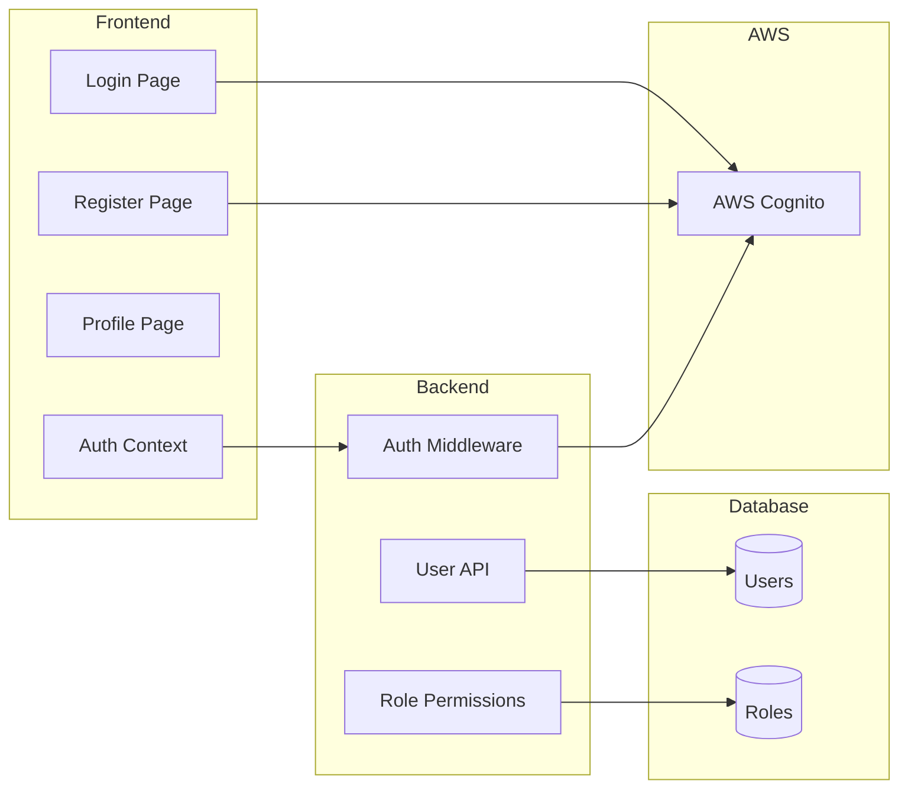

# Phase 4: Authentication & Users

> **Add user accounts with AWS Cognito for role ownership and profiles**

## Overview

**Goal**: Implement user authentication via AWS Cognito, user profiles, and role ownership.

**Duration**: ~2 weeks

**Prerequisites**: Phase 3 (Role Builder) complete

**Deliverables**:
- AWS Cognito integration (email/password)
- Anonymous session support (no account required to play)
- User profile with owned roles
- Role ownership and permission model
- Profile settings page

---

## Architecture



---

## AWS Cognito Setup

### 1. User Pool Configuration

Create Cognito User Pool with the following settings:

```yaml
# cognito-user-pool.yaml (CloudFormation template for reference)
AWSTemplateFormatVersion: '2010-09-09'
Description: YourWolf Cognito User Pool

Resources:
  UserPool:
    Type: AWS::Cognito::UserPool
    Properties:
      UserPoolName: yourwolf-users
      
      # Sign-in options
      UsernameAttributes:
        - email
      AutoVerifiedAttributes:
        - email
      
      # Password policy
      Policies:
        PasswordPolicy:
          MinimumLength: 8
          RequireLowercase: true
          RequireUppercase: false
          RequireNumbers: true
          RequireSymbols: false
      
      # MFA - Off for now
      MfaConfiguration: 'OFF'
      
      # Email verification
      VerificationMessageTemplate:
        DefaultEmailOption: CONFIRM_WITH_CODE
        EmailSubject: 'Your YourWolf Verification Code'
        EmailMessage: 'Your verification code is {####}'
      
      # Account recovery
      AccountRecoverySetting:
        RecoveryMechanisms:
          - Name: verified_email
            Priority: 1
      
      # Schema
      Schema:
        - Name: email
          Required: true
          Mutable: true
        - Name: display_name
          AttributeDataType: String
          Mutable: true
          StringAttributeConstraints:
            MinLength: '2'
            MaxLength: '50'
  
  UserPoolClient:
    Type: AWS::Cognito::UserPoolClient
    Properties:
      ClientName: yourwolf-web
      UserPoolId: !Ref UserPool
      GenerateSecret: false  # SPA client
      
      # Auth flows
      ExplicitAuthFlows:
        - ALLOW_USER_SRP_AUTH
        - ALLOW_REFRESH_TOKEN_AUTH
      
      # Token validity
      AccessTokenValidity: 1  # 1 hour
      IdTokenValidity: 1
      RefreshTokenValidity: 30  # 30 days
      TokenValidityUnits:
        AccessToken: hours
        IdToken: hours
        RefreshToken: days
      
      # Callback URLs (add production URLs later)
      CallbackURLs:
        - http://localhost:5173/auth/callback
      LogoutURLs:
        - http://localhost:5173/auth/logout

Outputs:
  UserPoolId:
    Value: !Ref UserPool
  UserPoolClientId:
    Value: !Ref UserPoolClient
  CognitoDomain:
    Value: !Sub 'https://cognito-idp.${AWS::Region}.amazonaws.com/${UserPool}'
```

### 2. Environment Variables

```bash
# Backend .env
COGNITO_USER_POOL_ID=us-west-2_xxxxxxxxx
COGNITO_CLIENT_ID=xxxxxxxxxxxxxxxxxxxxxxxxxx
COGNITO_REGION=us-west-2

# Frontend .env
VITE_COGNITO_USER_POOL_ID=us-west-2_xxxxxxxxx
VITE_COGNITO_CLIENT_ID=xxxxxxxxxxxxxxxxxxxxxxxxxx
VITE_COGNITO_REGION=us-west-2
```

---

## Backend Components

### 1. Auth Dependencies (`app/auth/cognito.py`)

```python
import os
from functools import lru_cache
from typing import Optional
import httpx
import jwt
from jwt import PyJWKClient
from fastapi import HTTPException, Security
from fastapi.security import HTTPBearer, HTTPAuthorizationCredentials

security = HTTPBearer(auto_error=False)

class CognitoAuth:
    def __init__(self):
        self.region = os.environ['COGNITO_REGION']
        self.user_pool_id = os.environ['COGNITO_USER_POOL_ID']
        self.client_id = os.environ['COGNITO_CLIENT_ID']
        
        self.issuer = f"https://cognito-idp.{self.region}.amazonaws.com/{self.user_pool_id}"
        self.jwks_url = f"{self.issuer}/.well-known/jwks.json"
        self._jwk_client = None
    
    @property
    def jwk_client(self):
        if self._jwk_client is None:
            self._jwk_client = PyJWKClient(self.jwks_url)
        return self._jwk_client
    
    def verify_token(self, token: str) -> dict:
        """Verify JWT token from Cognito and return claims."""
        try:
            signing_key = self.jwk_client.get_signing_key_from_jwt(token)
            
            claims = jwt.decode(
                token,
                signing_key.key,
                algorithms=["RS256"],
                issuer=self.issuer,
                options={"verify_aud": False}  # Cognito uses client_id in different claim
            )
            
            # Verify client_id (Cognito puts it in 'client_id' or 'aud')
            token_client_id = claims.get('client_id') or claims.get('aud')
            if token_client_id != self.client_id:
                raise HTTPException(status_code=401, detail="Invalid client")
            
            return claims
            
        except jwt.ExpiredSignatureError:
            raise HTTPException(status_code=401, detail="Token expired")
        except jwt.InvalidTokenError as e:
            raise HTTPException(status_code=401, detail=f"Invalid token: {str(e)}")

@lru_cache()
def get_cognito_auth() -> CognitoAuth:
    return CognitoAuth()
```

### 2. Auth Middleware (`app/auth/dependencies.py`)

```python
from typing import Optional
from uuid import UUID
from fastapi import Depends, HTTPException
from fastapi.security import HTTPBearer, HTTPAuthorizationCredentials
from sqlalchemy.orm import Session

from app.database import get_db
from app.models.user import User
from app.auth.cognito import get_cognito_auth, CognitoAuth

security = HTTPBearer(auto_error=False)

class CurrentUser:
    """Represents the current authenticated user."""
    def __init__(self, user: Optional[User], cognito_sub: Optional[str]):
        self.user = user
        self.cognito_sub = cognito_sub
        self.is_authenticated = user is not None
        self.is_anonymous = user is None
    
    @property
    def id(self) -> Optional[UUID]:
        return self.user.id if self.user else None
    
    @property
    def email(self) -> Optional[str]:
        return self.user.email if self.user else None
    
    @property
    def display_name(self) -> Optional[str]:
        return self.user.display_name if self.user else None

async def get_current_user_optional(
    credentials: Optional[HTTPAuthorizationCredentials] = Security(security),
    db: Session = Depends(get_db),
    cognito: CognitoAuth = Depends(get_cognito_auth)
) -> CurrentUser:
    """Get current user if authenticated, otherwise return anonymous user."""
    if not credentials:
        return CurrentUser(None, None)
    
    try:
        claims = cognito.verify_token(credentials.credentials)
        cognito_sub = claims['sub']
        
        # Find or create user
        user = db.query(User).filter(User.cognito_sub == cognito_sub).first()
        
        if not user:
            # First login - create user record
            user = User(
                cognito_sub=cognito_sub,
                email=claims.get('email'),
                display_name=claims.get('custom:display_name') or claims.get('email', '').split('@')[0]
            )
            db.add(user)
            db.commit()
            db.refresh(user)
        
        return CurrentUser(user, cognito_sub)
        
    except HTTPException:
        # Invalid token - treat as anonymous
        return CurrentUser(None, None)

async def get_current_user_required(
    current_user: CurrentUser = Depends(get_current_user_optional)
) -> CurrentUser:
    """Require authenticated user - raises 401 if not logged in."""
    if current_user.is_anonymous:
        raise HTTPException(status_code=401, detail="Authentication required")
    return current_user
```

### 3. User Model Enhancement (`app/models/user.py`)

```python
from datetime import datetime
from uuid import uuid4
from sqlalchemy import Column, String, DateTime, Boolean, Text
from sqlalchemy.dialects.postgresql import UUID
from sqlalchemy.orm import relationship

from app.database import Base

class User(Base):
    __tablename__ = "users"
    
    id = Column(UUID(as_uuid=True), primary_key=True, default=uuid4)
    cognito_sub = Column(String(255), unique=True, nullable=False, index=True)
    email = Column(String(255), unique=True, nullable=False)
    display_name = Column(String(50), nullable=False)
    bio = Column(Text, nullable=True)
    avatar_url = Column(String(500), nullable=True)
    
    # Preferences
    theme = Column(String(20), default='dark')
    default_timer_duration = Column(Integer, default=300)  # 5 minutes
    
    # Status
    is_active = Column(Boolean, default=True)
    is_verified = Column(Boolean, default=False)
    
    # Timestamps
    created_at = Column(DateTime, default=datetime.utcnow)
    last_login = Column(DateTime, nullable=True)
    
    # Relationships
    roles = relationship("Role", back_populates="creator", foreign_keys="Role.creator_id")
    game_sessions = relationship("GameSession", back_populates="facilitator")

# SQL Migration
"""
CREATE TABLE users (
    id UUID PRIMARY KEY DEFAULT gen_random_uuid(),
    cognito_sub VARCHAR(255) UNIQUE NOT NULL,
    email VARCHAR(255) UNIQUE NOT NULL,
    display_name VARCHAR(50) NOT NULL,
    bio TEXT,
    avatar_url VARCHAR(500),
    theme VARCHAR(20) DEFAULT 'dark',
    default_timer_duration INTEGER DEFAULT 300,
    is_active BOOLEAN DEFAULT true,
    is_verified BOOLEAN DEFAULT false,
    created_at TIMESTAMP DEFAULT CURRENT_TIMESTAMP,
    last_login TIMESTAMP
);

CREATE INDEX idx_users_cognito_sub ON users(cognito_sub);
CREATE INDEX idx_users_email ON users(email);
"""
```

### 4. User API (`app/routers/users.py`)

```python
from fastapi import APIRouter, Depends, HTTPException
from sqlalchemy.orm import Session
from datetime import datetime

from app.database import get_db
from app.auth.dependencies import get_current_user_required, CurrentUser
from app.schemas.user import UserProfile, UserUpdate, UserRolesResponse

router = APIRouter()

@router.get("/me", response_model=UserProfile)
async def get_current_user_profile(
    current_user: CurrentUser = Depends(get_current_user_required)
):
    """Get current user's profile."""
    return current_user.user

@router.patch("/me", response_model=UserProfile)
async def update_profile(
    updates: UserUpdate,
    db: Session = Depends(get_db),
    current_user: CurrentUser = Depends(get_current_user_required)
):
    """Update current user's profile."""
    user = current_user.user
    
    if updates.display_name is not None:
        if len(updates.display_name) < 2 or len(updates.display_name) > 50:
            raise HTTPException(400, "Display name must be 2-50 characters")
        user.display_name = updates.display_name
    
    if updates.bio is not None:
        if len(updates.bio) > 500:
            raise HTTPException(400, "Bio must be 500 characters or less")
        user.bio = updates.bio
    
    if updates.theme is not None:
        if updates.theme not in ['dark', 'light']:
            raise HTTPException(400, "Theme must be 'dark' or 'light'")
        user.theme = updates.theme
    
    if updates.default_timer_duration is not None:
        if updates.default_timer_duration < 60 or updates.default_timer_duration > 1800:
            raise HTTPException(400, "Timer duration must be 60-1800 seconds")
        user.default_timer_duration = updates.default_timer_duration
    
    db.commit()
    db.refresh(user)
    return user

@router.get("/me/roles", response_model=UserRolesResponse)
async def get_my_roles(
    db: Session = Depends(get_db),
    current_user: CurrentUser = Depends(get_current_user_required)
):
    """Get all roles created by current user."""
    from app.models.role import Role, Visibility
    
    roles = db.query(Role).filter(
        Role.creator_id == current_user.id
    ).order_by(Role.created_at.desc()).all()
    
    # Group by visibility
    private_roles = [r for r in roles if r.visibility == Visibility.PRIVATE]
    public_roles = [r for r in roles if r.visibility == Visibility.PUBLIC]
    
    return UserRolesResponse(
        private_roles=private_roles,
        public_roles=public_roles,
        total_count=len(roles)
    )

@router.post("/me/logout")
async def record_logout(
    db: Session = Depends(get_db),
    current_user: CurrentUser = Depends(get_current_user_required)
):
    """Record logout (for analytics)."""
    # Just acknowledge - actual logout happens on client
    return {"message": "Logged out"}

@router.delete("/me")
async def delete_account(
    db: Session = Depends(get_db),
    current_user: CurrentUser = Depends(get_current_user_required)
):
    """Soft-delete user account."""
    user = current_user.user
    user.is_active = False
    user.email = f"deleted_{user.id}@deleted.local"
    user.display_name = "Deleted User"
    
    # Anonymize but don't delete roles (preserve game history)
    from app.models.role import Role
    db.query(Role).filter(Role.creator_id == user.id).update({
        Role.creator_id: None
    })
    
    db.commit()
    return {"message": "Account deleted"}
```

### 5. User Schemas (`app/schemas/user.py`)

```python
from typing import Optional, List
from datetime import datetime
from uuid import UUID
from pydantic import BaseModel, EmailStr

class UserProfile(BaseModel):
    id: UUID
    email: str
    display_name: str
    bio: Optional[str]
    avatar_url: Optional[str]
    theme: str
    default_timer_duration: int
    is_verified: bool
    created_at: datetime
    
    class Config:
        from_attributes = True

class UserUpdate(BaseModel):
    display_name: Optional[str] = None
    bio: Optional[str] = None
    theme: Optional[str] = None
    default_timer_duration: Optional[int] = None

class UserPublic(BaseModel):
    """Public user info (for role creator display)"""
    id: UUID
    display_name: str
    avatar_url: Optional[str]
    
    class Config:
        from_attributes = True

class UserRolesResponse(BaseModel):
    private_roles: List  # RoleResponse
    public_roles: List   # RoleResponse
    total_count: int
```

### 6. Update Role Routes with Auth

```python
# app/routers/roles.py - additions

from app.auth.dependencies import get_current_user_optional, get_current_user_required, CurrentUser

@router.post("/", response_model=RoleResponse, status_code=201)
def create_role(
    role: RoleCreate,
    db: Session = Depends(get_db),
    current_user: CurrentUser = Depends(get_current_user_optional)
):
    """Create a new role. Authenticated users own their roles."""
    service = RoleService(db)
    
    try:
        created = service.create_role(
            role,
            creator_id=current_user.id if current_user.is_authenticated else None
        )
        return created
    except RoleValidationError as e:
        raise HTTPException(status_code=400, detail=e.errors)

@router.put("/{role_id}", response_model=RoleResponse)
def update_role(
    role_id: UUID,
    role: RoleUpdate,
    db: Session = Depends(get_db),
    current_user: CurrentUser = Depends(get_current_user_required)
):
    """Update an existing role. Must own the role."""
    service = RoleService(db)
    
    try:
        updated = service.update_role(role_id, role, current_user.id)
        if not updated:
            raise HTTPException(status_code=404, detail="Role not found")
        return updated
    except PermissionError as e:
        raise HTTPException(status_code=403, detail=str(e))
    except RoleValidationError as e:
        raise HTTPException(status_code=400, detail=e.errors)

@router.delete("/{role_id}")
def delete_role(
    role_id: UUID,
    db: Session = Depends(get_db),
    current_user: CurrentUser = Depends(get_current_user_required)
):
    """Delete a role. Must own the role."""
    service = RoleService(db)
    
    try:
        if not service.delete_role(role_id, current_user.id):
            raise HTTPException(status_code=404, detail="Role not found")
        return {"message": "Role deleted"}
    except PermissionError as e:
        raise HTTPException(status_code=403, detail=str(e))
```

---

## Frontend Components

### 1. Auth Context (`src/contexts/AuthContext.tsx`)

```typescript
import React, { createContext, useContext, useState, useEffect, useCallback } from 'react';
import { 
  CognitoUserPool,
  CognitoUser,
  AuthenticationDetails,
  CognitoUserSession
} from 'amazon-cognito-identity-js';

const poolData = {
  UserPoolId: import.meta.env.VITE_COGNITO_USER_POOL_ID,
  ClientId: import.meta.env.VITE_COGNITO_CLIENT_ID
};

const userPool = new CognitoUserPool(poolData);

interface User {
  id: string;
  email: string;
  displayName: string;
  isVerified: boolean;
}

interface AuthContextType {
  user: User | null;
  isLoading: boolean;
  isAuthenticated: boolean;
  accessToken: string | null;
  login: (email: string, password: string) => Promise<void>;
  register: (email: string, password: string, displayName: string) => Promise<void>;
  confirmEmail: (email: string, code: string) => Promise<void>;
  logout: () => void;
  forgotPassword: (email: string) => Promise<void>;
  confirmPassword: (email: string, code: string, newPassword: string) => Promise<void>;
  refreshSession: () => Promise<void>;
}

const AuthContext = createContext<AuthContextType | undefined>(undefined);

export const AuthProvider: React.FC<{ children: React.ReactNode }> = ({ children }) => {
  const [user, setUser] = useState<User | null>(null);
  const [isLoading, setIsLoading] = useState(true);
  const [accessToken, setAccessToken] = useState<string | null>(null);
  
  // Check for existing session on mount
  useEffect(() => {
    const cognitoUser = userPool.getCurrentUser();
    if (cognitoUser) {
      cognitoUser.getSession((err: Error | null, session: CognitoUserSession | null) => {
        if (err || !session?.isValid()) {
          setIsLoading(false);
          return;
        }
        
        setAccessToken(session.getAccessToken().getJwtToken());
        fetchUserProfile(session.getAccessToken().getJwtToken());
      });
    } else {
      setIsLoading(false);
    }
  }, []);
  
  const fetchUserProfile = async (token: string) => {
    try {
      const response = await fetch('/api/users/me', {
        headers: { Authorization: `Bearer ${token}` }
      });
      
      if (response.ok) {
        const profile = await response.json();
        setUser({
          id: profile.id,
          email: profile.email,
          displayName: profile.display_name,
          isVerified: profile.is_verified
        });
      }
    } catch (error) {
      console.error('Failed to fetch profile', error);
    } finally {
      setIsLoading(false);
    }
  };
  
  const login = async (email: string, password: string): Promise<void> => {
    return new Promise((resolve, reject) => {
      const cognitoUser = new CognitoUser({
        Username: email,
        Pool: userPool
      });
      
      const authDetails = new AuthenticationDetails({
        Username: email,
        Password: password
      });
      
      cognitoUser.authenticateUser(authDetails, {
        onSuccess: async (session) => {
          const token = session.getAccessToken().getJwtToken();
          setAccessToken(token);
          await fetchUserProfile(token);
          resolve();
        },
        onFailure: (err) => {
          reject(new Error(err.message || 'Login failed'));
        },
        newPasswordRequired: () => {
          reject(new Error('Password change required'));
        }
      });
    });
  };
  
  const register = async (email: string, password: string, displayName: string): Promise<void> => {
    return new Promise((resolve, reject) => {
      userPool.signUp(
        email,
        password,
        [
          { Name: 'email', Value: email },
          { Name: 'custom:display_name', Value: displayName }
        ],
        [],
        (err, result) => {
          if (err) {
            reject(new Error(err.message || 'Registration failed'));
            return;
          }
          resolve();
        }
      );
    });
  };
  
  const confirmEmail = async (email: string, code: string): Promise<void> => {
    return new Promise((resolve, reject) => {
      const cognitoUser = new CognitoUser({
        Username: email,
        Pool: userPool
      });
      
      cognitoUser.confirmRegistration(code, true, (err, result) => {
        if (err) {
          reject(new Error(err.message || 'Confirmation failed'));
          return;
        }
        resolve();
      });
    });
  };
  
  const logout = useCallback(() => {
    const cognitoUser = userPool.getCurrentUser();
    if (cognitoUser) {
      cognitoUser.signOut();
    }
    setUser(null);
    setAccessToken(null);
  }, []);
  
  const forgotPassword = async (email: string): Promise<void> => {
    return new Promise((resolve, reject) => {
      const cognitoUser = new CognitoUser({
        Username: email,
        Pool: userPool
      });
      
      cognitoUser.forgotPassword({
        onSuccess: () => resolve(),
        onFailure: (err) => reject(new Error(err.message || 'Request failed'))
      });
    });
  };
  
  const confirmPassword = async (email: string, code: string, newPassword: string): Promise<void> => {
    return new Promise((resolve, reject) => {
      const cognitoUser = new CognitoUser({
        Username: email,
        Pool: userPool
      });
      
      cognitoUser.confirmPassword(code, newPassword, {
        onSuccess: () => resolve(),
        onFailure: (err) => reject(new Error(err.message || 'Password reset failed'))
      });
    });
  };
  
  const refreshSession = async (): Promise<void> => {
    const cognitoUser = userPool.getCurrentUser();
    if (!cognitoUser) {
      throw new Error('No user session');
    }
    
    return new Promise((resolve, reject) => {
      cognitoUser.getSession((err: Error | null, session: CognitoUserSession | null) => {
        if (err || !session) {
          reject(err || new Error('No session'));
          return;
        }
        
        if (session.isValid()) {
          setAccessToken(session.getAccessToken().getJwtToken());
          resolve();
        } else {
          const refreshToken = session.getRefreshToken();
          cognitoUser.refreshSession(refreshToken, (refreshErr, newSession) => {
            if (refreshErr) {
              reject(refreshErr);
              return;
            }
            setAccessToken(newSession.getAccessToken().getJwtToken());
            resolve();
          });
        }
      });
    });
  };
  
  return (
    <AuthContext.Provider value={{
      user,
      isLoading,
      isAuthenticated: user !== null,
      accessToken,
      login,
      register,
      confirmEmail,
      logout,
      forgotPassword,
      confirmPassword,
      refreshSession
    }}>
      {children}
    </AuthContext.Provider>
  );
};

export const useAuth = () => {
  const context = useContext(AuthContext);
  if (!context) {
    throw new Error('useAuth must be used within AuthProvider');
  }
  return context;
};
```

### 2. Login Page (`src/pages/Login.tsx`)

```typescript
import React, { useState } from 'react';
import { useNavigate, Link, useLocation } from 'react-router-dom';
import { useAuth } from '../contexts/AuthContext';
import { theme } from '../styles/theme';

export const LoginPage: React.FC = () => {
  const navigate = useNavigate();
  const location = useLocation();
  const { login, isLoading } = useAuth();
  
  const [email, setEmail] = useState('');
  const [password, setPassword] = useState('');
  const [error, setError] = useState<string | null>(null);
  const [submitting, setSubmitting] = useState(false);
  
  const from = (location.state as any)?.from?.pathname || '/';
  
  const handleSubmit = async (e: React.FormEvent) => {
    e.preventDefault();
    setError(null);
    setSubmitting(true);
    
    try {
      await login(email, password);
      navigate(from, { replace: true });
    } catch (err: any) {
      setError(err.message);
    } finally {
      setSubmitting(false);
    }
  };
  
  return (
    <div style={pageStyle}>
      <div style={cardStyle}>
        <h1 style={{ color: theme.colors.text, marginBottom: theme.spacing.xl }}>
          Sign In
        </h1>
        
        <form onSubmit={handleSubmit}>
          {error && (
            <div style={errorStyle}>{error}</div>
          )}
          
          <div style={{ marginBottom: theme.spacing.md }}>
            <label style={labelStyle}>Email</label>
            <input
              type="email"
              value={email}
              onChange={e => setEmail(e.target.value)}
              required
              style={inputStyle}
            />
          </div>
          
          <div style={{ marginBottom: theme.spacing.lg }}>
            <label style={labelStyle}>Password</label>
            <input
              type="password"
              value={password}
              onChange={e => setPassword(e.target.value)}
              required
              minLength={8}
              style={inputStyle}
            />
          </div>
          
          <button
            type="submit"
            disabled={submitting || isLoading}
            style={buttonStyle}
          >
            {submitting ? 'Signing in...' : 'Sign In'}
          </button>
        </form>
        
        <div style={{ marginTop: theme.spacing.lg, textAlign: 'center' }}>
          <Link to="/forgot-password" style={linkStyle}>
            Forgot password?
          </Link>
        </div>
        
        <hr style={{ margin: `${theme.spacing.lg} 0`, borderColor: theme.colors.secondary }} />
        
        <p style={{ color: theme.colors.textMuted, textAlign: 'center' }}>
          Don't have an account?{' '}
          <Link to="/register" style={linkStyle}>
            Sign up
          </Link>
        </p>
        
        <div style={{ marginTop: theme.spacing.lg, textAlign: 'center' }}>
          <Link to="/" style={{ ...linkStyle, color: theme.colors.textMuted }}>
            Continue as guest
          </Link>
        </div>
      </div>
    </div>
  );
};

const pageStyle: React.CSSProperties = {
  minHeight: '100vh',
  display: 'flex',
  alignItems: 'center',
  justifyContent: 'center',
  padding: theme.spacing.lg,
  backgroundColor: theme.colors.background
};

const cardStyle: React.CSSProperties = {
  width: '100%',
  maxWidth: '400px',
  padding: theme.spacing.xl,
  backgroundColor: theme.colors.surface,
  borderRadius: theme.borderRadius.md,
  boxShadow: '0 4px 6px rgba(0, 0, 0, 0.3)'
};

const labelStyle: React.CSSProperties = {
  display: 'block',
  color: theme.colors.text,
  marginBottom: theme.spacing.xs,
  fontWeight: 'bold'
};

const inputStyle: React.CSSProperties = {
  width: '100%',
  padding: theme.spacing.sm,
  backgroundColor: theme.colors.surfaceLight,
  border: `1px solid ${theme.colors.secondary}`,
  borderRadius: theme.borderRadius.sm,
  color: theme.colors.text,
  fontSize: '16px'
};

const buttonStyle: React.CSSProperties = {
  width: '100%',
  padding: theme.spacing.md,
  backgroundColor: theme.colors.primary,
  color: theme.colors.text,
  border: 'none',
  borderRadius: theme.borderRadius.sm,
  fontSize: '16px',
  fontWeight: 'bold',
  cursor: 'pointer'
};

const errorStyle: React.CSSProperties = {
  padding: theme.spacing.sm,
  backgroundColor: theme.colors.error + '22',
  border: `1px solid ${theme.colors.error}`,
  borderRadius: theme.borderRadius.sm,
  color: theme.colors.error,
  marginBottom: theme.spacing.md
};

const linkStyle: React.CSSProperties = {
  color: theme.colors.primary,
  textDecoration: 'none'
};
```

### 3. Profile Page (`src/pages/Profile.tsx`)

```typescript
import React, { useState, useEffect } from 'react';
import { useAuth } from '../contexts/AuthContext';
import { useApi } from '../hooks/useApi';
import { theme } from '../styles/theme';

interface UserProfile {
  id: string;
  email: string;
  display_name: string;
  bio: string | null;
  theme: string;
  default_timer_duration: number;
  created_at: string;
}

export const ProfilePage: React.FC = () => {
  const { user, logout } = useAuth();
  const api = useApi();
  
  const [profile, setProfile] = useState<UserProfile | null>(null);
  const [editing, setEditing] = useState(false);
  const [displayName, setDisplayName] = useState('');
  const [bio, setBio] = useState('');
  const [timerDuration, setTimerDuration] = useState(300);
  const [saving, setSaving] = useState(false);
  const [error, setError] = useState<string | null>(null);
  
  useEffect(() => {
    loadProfile();
  }, []);
  
  const loadProfile = async () => {
    try {
      const data = await api.get('/api/users/me');
      setProfile(data);
      setDisplayName(data.display_name);
      setBio(data.bio || '');
      setTimerDuration(data.default_timer_duration);
    } catch (err) {
      console.error('Failed to load profile', err);
    }
  };
  
  const handleSave = async () => {
    setSaving(true);
    setError(null);
    
    try {
      const updated = await api.patch('/api/users/me', {
        display_name: displayName,
        bio: bio || null,
        default_timer_duration: timerDuration
      });
      setProfile(updated);
      setEditing(false);
    } catch (err: any) {
      setError(err.message);
    } finally {
      setSaving(false);
    }
  };
  
  if (!profile) return <div>Loading...</div>;
  
  return (
    <div style={{ padding: theme.spacing.xl, maxWidth: '600px', margin: '0 auto' }}>
      <h1 style={{ color: theme.colors.text }}>Your Profile</h1>
      
      <div style={sectionStyle}>
        <h2 style={sectionTitleStyle}>Account Info</h2>
        <p style={{ color: theme.colors.textMuted }}>Email: {profile.email}</p>
        <p style={{ color: theme.colors.textMuted }}>
          Member since: {new Date(profile.created_at).toLocaleDateString()}
        </p>
      </div>
      
      <div style={sectionStyle}>
        <div style={{ display: 'flex', justifyContent: 'space-between', alignItems: 'center' }}>
          <h2 style={sectionTitleStyle}>Profile</h2>
          {!editing && (
            <button onClick={() => setEditing(true)} style={editButtonStyle}>
              Edit
            </button>
          )}
        </div>
        
        {error && <div style={errorStyle}>{error}</div>}
        
        {editing ? (
          <>
            <div style={{ marginBottom: theme.spacing.md }}>
              <label style={labelStyle}>Display Name</label>
              <input
                type="text"
                value={displayName}
                onChange={e => setDisplayName(e.target.value)}
                maxLength={50}
                style={inputStyle}
              />
            </div>
            
            <div style={{ marginBottom: theme.spacing.md }}>
              <label style={labelStyle}>Bio</label>
              <textarea
                value={bio}
                onChange={e => setBio(e.target.value)}
                maxLength={500}
                rows={3}
                placeholder="Tell others about yourself..."
                style={{ ...inputStyle, resize: 'vertical' }}
              />
            </div>
            
            <div style={{ marginBottom: theme.spacing.lg }}>
              <label style={labelStyle}>Default Timer Duration (seconds)</label>
              <input
                type="number"
                value={timerDuration}
                onChange={e => setTimerDuration(parseInt(e.target.value) || 300)}
                min={60}
                max={1800}
                style={{ ...inputStyle, width: '120px' }}
              />
            </div>
            
            <div style={{ display: 'flex', gap: theme.spacing.sm }}>
              <button onClick={handleSave} disabled={saving} style={saveButtonStyle}>
                {saving ? 'Saving...' : 'Save Changes'}
              </button>
              <button onClick={() => setEditing(false)} style={cancelButtonStyle}>
                Cancel
              </button>
            </div>
          </>
        ) : (
          <>
            <p style={{ color: theme.colors.text }}>
              <strong>Display Name:</strong> {profile.display_name}
            </p>
            <p style={{ color: theme.colors.text }}>
              <strong>Bio:</strong> {profile.bio || '(none)'}
            </p>
            <p style={{ color: theme.colors.text }}>
              <strong>Default Timer:</strong> {profile.default_timer_duration} seconds
            </p>
          </>
        )}
      </div>
      
      <div style={sectionStyle}>
        <h2 style={sectionTitleStyle}>Actions</h2>
        <button onClick={logout} style={logoutButtonStyle}>
          Sign Out
        </button>
      </div>
    </div>
  );
};

const sectionStyle: React.CSSProperties = {
  backgroundColor: theme.colors.surface,
  padding: theme.spacing.lg,
  borderRadius: theme.borderRadius.md,
  marginBottom: theme.spacing.lg
};

const sectionTitleStyle: React.CSSProperties = {
  color: theme.colors.text,
  marginBottom: theme.spacing.md,
  marginTop: 0
};

const labelStyle: React.CSSProperties = {
  display: 'block',
  color: theme.colors.text,
  marginBottom: theme.spacing.xs,
  fontWeight: 'bold'
};

const inputStyle: React.CSSProperties = {
  width: '100%',
  padding: theme.spacing.sm,
  backgroundColor: theme.colors.surfaceLight,
  border: `1px solid ${theme.colors.secondary}`,
  borderRadius: theme.borderRadius.sm,
  color: theme.colors.text
};

const editButtonStyle: React.CSSProperties = {
  padding: `${theme.spacing.xs} ${theme.spacing.md}`,
  backgroundColor: 'transparent',
  color: theme.colors.primary,
  border: `1px solid ${theme.colors.primary}`,
  borderRadius: theme.borderRadius.sm,
  cursor: 'pointer'
};

const saveButtonStyle: React.CSSProperties = {
  padding: `${theme.spacing.sm} ${theme.spacing.lg}`,
  backgroundColor: theme.colors.primary,
  color: theme.colors.text,
  border: 'none',
  borderRadius: theme.borderRadius.sm,
  cursor: 'pointer'
};

const cancelButtonStyle: React.CSSProperties = {
  padding: `${theme.spacing.sm} ${theme.spacing.lg}`,
  backgroundColor: 'transparent',
  color: theme.colors.textMuted,
  border: `1px solid ${theme.colors.secondary}`,
  borderRadius: theme.borderRadius.sm,
  cursor: 'pointer'
};

const logoutButtonStyle: React.CSSProperties = {
  padding: `${theme.spacing.sm} ${theme.spacing.lg}`,
  backgroundColor: theme.colors.error,
  color: 'white',
  border: 'none',
  borderRadius: theme.borderRadius.sm,
  cursor: 'pointer'
};

const errorStyle: React.CSSProperties = {
  padding: theme.spacing.sm,
  backgroundColor: theme.colors.error + '22',
  border: `1px solid ${theme.colors.error}`,
  borderRadius: theme.borderRadius.sm,
  color: theme.colors.error,
  marginBottom: theme.spacing.md
};
```

### 4. Protected Route Component (`src/components/ProtectedRoute.tsx`)

```typescript
import React from 'react';
import { Navigate, useLocation } from 'react-router-dom';
import { useAuth } from '../contexts/AuthContext';

interface ProtectedRouteProps {
  children: React.ReactNode;
  requireAuth?: boolean;
}

export const ProtectedRoute: React.FC<ProtectedRouteProps> = ({ 
  children, 
  requireAuth = true 
}) => {
  const { isAuthenticated, isLoading } = useAuth();
  const location = useLocation();
  
  if (isLoading) {
    return <div>Loading...</div>;
  }
  
  if (requireAuth && !isAuthenticated) {
    return <Navigate to="/login" state={{ from: location }} replace />;
  }
  
  return <>{children}</>;
};
```

### 5. API Hook with Auth (`src/hooks/useApi.ts`)

```typescript
import { useCallback } from 'react';
import { useAuth } from '../contexts/AuthContext';

export const useApi = () => {
  const { accessToken, refreshSession, logout } = useAuth();
  
  const request = useCallback(async (
    path: string,
    options: RequestInit = {}
  ): Promise<any> => {
    const headers: HeadersInit = {
      'Content-Type': 'application/json',
      ...options.headers
    };
    
    if (accessToken) {
      headers['Authorization'] = `Bearer ${accessToken}`;
    }
    
    let response = await fetch(path, {
      ...options,
      headers
    });
    
    // If 401, try to refresh token and retry
    if (response.status === 401 && accessToken) {
      try {
        await refreshSession();
        // Retry with new token
        response = await fetch(path, {
          ...options,
          headers: {
            ...headers,
            Authorization: `Bearer ${accessToken}`
          }
        });
      } catch {
        logout();
        throw new Error('Session expired');
      }
    }
    
    if (!response.ok) {
      const error = await response.json().catch(() => ({ detail: 'Request failed' }));
      throw new Error(error.detail || 'Request failed');
    }
    
    if (response.status === 204) {
      return null;
    }
    
    return response.json();
  }, [accessToken, refreshSession, logout]);
  
  return {
    get: (path: string) => request(path, { method: 'GET' }),
    post: (path: string, data: any) => request(path, { method: 'POST', body: JSON.stringify(data) }),
    put: (path: string, data: any) => request(path, { method: 'PUT', body: JSON.stringify(data) }),
    patch: (path: string, data: any) => request(path, { method: 'PATCH', body: JSON.stringify(data) }),
    delete: (path: string) => request(path, { method: 'DELETE' })
  };
};
```

---

## Tests

### Backend Auth Tests

```python
# tests/test_auth.py
import pytest
from unittest.mock import Mock, patch
from fastapi.testclient import TestClient

from app.main import app
from app.auth.dependencies import get_current_user_optional

class TestAuthMiddleware:
    def test_unauthenticated_request_allowed(self, client):
        """Requests without token should work for public endpoints."""
        response = client.get("/api/roles")
        assert response.status_code == 200
    
    def test_protected_endpoint_requires_auth(self, client):
        """Protected endpoints should return 401 without token."""
        response = client.get("/api/users/me")
        assert response.status_code == 401
    
    @patch('app.auth.cognito.CognitoAuth.verify_token')
    def test_valid_token_authenticates(self, mock_verify, client, db):
        """Valid token should authenticate user."""
        mock_verify.return_value = {
            'sub': 'cognito-123',
            'email': 'test@example.com',
            'client_id': 'test-client'
        }
        
        response = client.get(
            "/api/users/me",
            headers={"Authorization": "Bearer valid-token"}
        )
        
        assert response.status_code == 200
        assert response.json()['email'] == 'test@example.com'
    
    @patch('app.auth.cognito.CognitoAuth.verify_token')
    def test_expired_token_returns_401(self, mock_verify, client):
        """Expired token should return 401."""
        from jwt import ExpiredSignatureError
        mock_verify.side_effect = ExpiredSignatureError()
        
        response = client.get(
            "/api/users/me",
            headers={"Authorization": "Bearer expired-token"}
        )
        
        # Actually returns anonymous for optional auth
        # Would be 401 for required auth endpoint

class TestUserProfile:
    @patch('app.auth.cognito.CognitoAuth.verify_token')
    def test_update_profile(self, mock_verify, client, db):
        mock_verify.return_value = {'sub': 'user-1', 'email': 'user@test.com'}
        
        # Create user first
        client.get("/api/users/me", headers={"Authorization": "Bearer token"})
        
        # Update profile
        response = client.patch(
            "/api/users/me",
            headers={"Authorization": "Bearer token"},
            json={"display_name": "New Name", "bio": "My bio"}
        )
        
        assert response.status_code == 200
        assert response.json()['display_name'] == 'New Name'
        assert response.json()['bio'] == 'My bio'
    
    @patch('app.auth.cognito.CognitoAuth.verify_token')
    def test_invalid_display_name_rejected(self, mock_verify, client, db):
        mock_verify.return_value = {'sub': 'user-1', 'email': 'user@test.com'}
        client.get("/api/users/me", headers={"Authorization": "Bearer token"})
        
        response = client.patch(
            "/api/users/me",
            headers={"Authorization": "Bearer token"},
            json={"display_name": "X"}  # Too short
        )
        
        assert response.status_code == 400
```

### Frontend Auth Tests

```typescript
// src/contexts/AuthContext.test.tsx
import { renderHook, act, waitFor } from '@testing-library/react';
import { AuthProvider, useAuth } from './AuthContext';

jest.mock('amazon-cognito-identity-js', () => ({
  CognitoUserPool: jest.fn().mockImplementation(() => ({
    getCurrentUser: () => null,
    signUp: jest.fn()
  })),
  CognitoUser: jest.fn(),
  AuthenticationDetails: jest.fn()
}));

describe('AuthContext', () => {
  it('starts as not authenticated', async () => {
    const { result } = renderHook(() => useAuth(), {
      wrapper: AuthProvider
    });
    
    await waitFor(() => expect(result.current.isLoading).toBe(false));
    expect(result.current.isAuthenticated).toBe(false);
    expect(result.current.user).toBeNull();
  });
  
  it('logout clears user state', async () => {
    const { result } = renderHook(() => useAuth(), {
      wrapper: AuthProvider
    });
    
    await waitFor(() => expect(result.current.isLoading).toBe(false));
    
    act(() => {
      result.current.logout();
    });
    
    expect(result.current.user).toBeNull();
    expect(result.current.accessToken).toBeNull();
  });
});
```

---

## Acceptance Criteria

| Criteria | Verification |
|----------|--------------|
| Can register with email/password | User receives verification email |
| Can verify email with code | Account becomes verified |
| Can login with email/password | Returns JWT token |
| Can access protected endpoints | Token in header works |
| Anonymous users can browse | Public endpoints work without auth |
| Anonymous users can create roles | Role created with null creator_id |
| Authenticated users own roles | Role has creator_id set |
| Can update own profile | Display name, bio update |
| Cannot edit others' roles | 403 returned |
| Token refresh works | Expired token triggers refresh |
| Logout clears session | Token cleared from storage |

---

## Definition of Done

- [ ] Cognito User Pool created and configured
- [ ] Backend JWT verification working
- [ ] User model with cognito_sub
- [ ] Auto-create user on first login
- [ ] User profile API (GET, PATCH)
- [ ] Role ownership enforcement
- [ ] Auth context in frontend
- [ ] Login/Register pages
- [ ] Email verification flow
- [ ] Forgot password flow
- [ ] Protected route component
- [ ] API hook with token handling
- [ ] Profile settings page
- [ ] Token refresh on expiry
- [ ] Backend auth tests
- [ ] Frontend auth tests

---

*Last updated: January 31, 2026*
