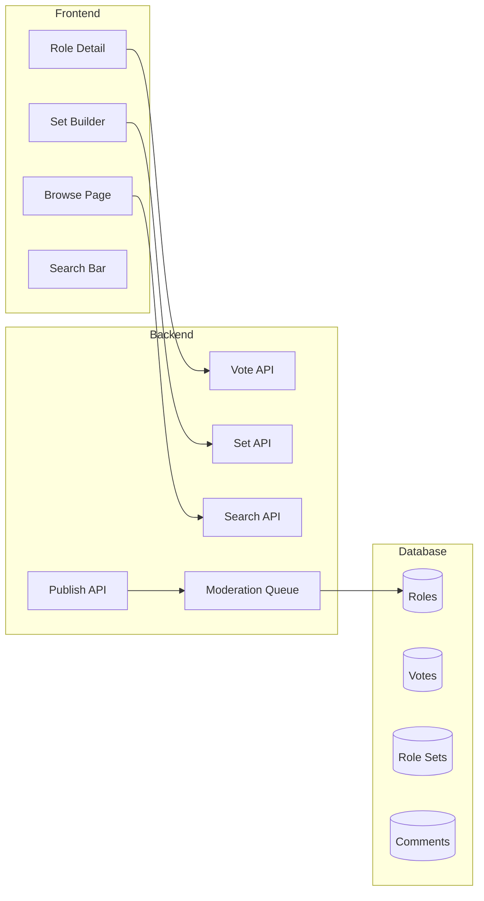

# Phase 5: Community Features

> **Enable public role sharing, voting, role sets, and discovery**

## Overview

**Goal**: Build the community layer where users can share roles, vote on favorites, create curated role sets, and discover content.

**Duration**: ~3 weeks

**Prerequisites**: Phase 4 (Auth & Users) complete

**Deliverables**:
- Publish roles to public (with moderation queue)
- Upvote/downvote system for roles
- Curated role sets (collections)
- Search and filter functionality
- Role detail pages with comments
- Popular/trending feeds

---

## Architecture



---

## Database Schema Extensions

### New Tables

```sql
-- Role votes (upvote/downvote)
CREATE TABLE role_votes (
    id UUID PRIMARY KEY DEFAULT gen_random_uuid(),
    role_id UUID NOT NULL REFERENCES roles(id) ON DELETE CASCADE,
    user_id UUID NOT NULL REFERENCES users(id) ON DELETE CASCADE,
    vote_type SMALLINT NOT NULL CHECK (vote_type IN (-1, 1)), -- -1 = down, 1 = up
    created_at TIMESTAMP DEFAULT CURRENT_TIMESTAMP,
    UNIQUE(role_id, user_id)
);

CREATE INDEX idx_role_votes_role ON role_votes(role_id);
CREATE INDEX idx_role_votes_user ON role_votes(user_id);

-- Role sets (curated collections)
CREATE TABLE role_sets (
    id UUID PRIMARY KEY DEFAULT gen_random_uuid(),
    name VARCHAR(100) NOT NULL,
    description TEXT,
    creator_id UUID REFERENCES users(id) ON DELETE SET NULL,
    visibility VARCHAR(20) DEFAULT 'private' CHECK (visibility IN ('private', 'public', 'official')),
    player_count_min INTEGER DEFAULT 3,
    player_count_max INTEGER DEFAULT 10,
    
    -- Denormalized stats
    vote_score INTEGER DEFAULT 0,
    use_count INTEGER DEFAULT 0,
    
    created_at TIMESTAMP DEFAULT CURRENT_TIMESTAMP,
    updated_at TIMESTAMP DEFAULT CURRENT_TIMESTAMP
);

CREATE INDEX idx_role_sets_creator ON role_sets(creator_id);
CREATE INDEX idx_role_sets_visibility ON role_sets(visibility);
CREATE INDEX idx_role_sets_vote_score ON role_sets(vote_score DESC);

-- Role set items (roles in a set)
CREATE TABLE role_set_items (
    id UUID PRIMARY KEY DEFAULT gen_random_uuid(),
    set_id UUID NOT NULL REFERENCES role_sets(id) ON DELETE CASCADE,
    role_id UUID NOT NULL REFERENCES roles(id) ON DELETE CASCADE,
    quantity INTEGER DEFAULT 1 CHECK (quantity > 0),
    UNIQUE(set_id, role_id)
);

CREATE INDEX idx_role_set_items_set ON role_set_items(set_id);

-- Role set votes
CREATE TABLE role_set_votes (
    id UUID PRIMARY KEY DEFAULT gen_random_uuid(),
    set_id UUID NOT NULL REFERENCES role_sets(id) ON DELETE CASCADE,
    user_id UUID NOT NULL REFERENCES users(id) ON DELETE CASCADE,
    vote_type SMALLINT NOT NULL CHECK (vote_type IN (-1, 1)),
    created_at TIMESTAMP DEFAULT CURRENT_TIMESTAMP,
    UNIQUE(set_id, user_id)
);

-- Comments on roles
CREATE TABLE role_comments (
    id UUID PRIMARY KEY DEFAULT gen_random_uuid(),
    role_id UUID NOT NULL REFERENCES roles(id) ON DELETE CASCADE,
    user_id UUID NOT NULL REFERENCES users(id) ON DELETE CASCADE,
    content TEXT NOT NULL CHECK (LENGTH(content) <= 1000),
    parent_id UUID REFERENCES role_comments(id) ON DELETE CASCADE,
    is_hidden BOOLEAN DEFAULT false,
    created_at TIMESTAMP DEFAULT CURRENT_TIMESTAMP,
    updated_at TIMESTAMP DEFAULT CURRENT_TIMESTAMP
);

CREATE INDEX idx_role_comments_role ON role_comments(role_id);
CREATE INDEX idx_role_comments_parent ON role_comments(parent_id);

-- Moderation queue
CREATE TABLE moderation_queue (
    id UUID PRIMARY KEY DEFAULT gen_random_uuid(),
    content_type VARCHAR(20) NOT NULL CHECK (content_type IN ('role', 'set', 'comment')),
    content_id UUID NOT NULL,
    user_id UUID NOT NULL REFERENCES users(id),
    status VARCHAR(20) DEFAULT 'pending' CHECK (status IN ('pending', 'approved', 'rejected')),
    reason TEXT,
    moderator_id UUID REFERENCES users(id),
    submitted_at TIMESTAMP DEFAULT CURRENT_TIMESTAMP,
    reviewed_at TIMESTAMP
);

CREATE INDEX idx_mod_queue_status ON moderation_queue(status);
CREATE INDEX idx_mod_queue_type ON moderation_queue(content_type);

-- Add vote_score to roles table
ALTER TABLE roles ADD COLUMN vote_score INTEGER DEFAULT 0;
ALTER TABLE roles ADD COLUMN use_count INTEGER DEFAULT 0;
CREATE INDEX idx_roles_vote_score ON roles(vote_score DESC);
CREATE INDEX idx_roles_visibility ON roles(visibility);
```

### Models

```python
# app/models/vote.py
from sqlalchemy import Column, ForeignKey, SmallInteger, DateTime
from sqlalchemy.dialects.postgresql import UUID
from sqlalchemy.orm import relationship
from datetime import datetime
from uuid import uuid4

from app.database import Base

class RoleVote(Base):
    __tablename__ = "role_votes"
    
    id = Column(UUID(as_uuid=True), primary_key=True, default=uuid4)
    role_id = Column(UUID(as_uuid=True), ForeignKey("roles.id", ondelete="CASCADE"), nullable=False)
    user_id = Column(UUID(as_uuid=True), ForeignKey("users.id", ondelete="CASCADE"), nullable=False)
    vote_type = Column(SmallInteger, nullable=False)  # -1 or 1
    created_at = Column(DateTime, default=datetime.utcnow)
    
    role = relationship("Role", back_populates="votes_rel")
    user = relationship("User")


# app/models/role_set.py
from sqlalchemy import Column, String, Text, ForeignKey, Integer, DateTime
from sqlalchemy.dialects.postgresql import UUID
from sqlalchemy.orm import relationship
from datetime import datetime
from uuid import uuid4

from app.database import Base
from app.models.role import Visibility

class RoleSet(Base):
    __tablename__ = "role_sets"
    
    id = Column(UUID(as_uuid=True), primary_key=True, default=uuid4)
    name = Column(String(100), nullable=False)
    description = Column(Text)
    creator_id = Column(UUID(as_uuid=True), ForeignKey("users.id", ondelete="SET NULL"))
    visibility = Column(String(20), default=Visibility.PRIVATE)
    player_count_min = Column(Integer, default=3)
    player_count_max = Column(Integer, default=10)
    vote_score = Column(Integer, default=0)
    use_count = Column(Integer, default=0)
    created_at = Column(DateTime, default=datetime.utcnow)
    updated_at = Column(DateTime, default=datetime.utcnow, onupdate=datetime.utcnow)
    
    creator = relationship("User")
    items = relationship("RoleSetItem", back_populates="role_set", cascade="all, delete-orphan")


class RoleSetItem(Base):
    __tablename__ = "role_set_items"
    
    id = Column(UUID(as_uuid=True), primary_key=True, default=uuid4)
    set_id = Column(UUID(as_uuid=True), ForeignKey("role_sets.id", ondelete="CASCADE"), nullable=False)
    role_id = Column(UUID(as_uuid=True), ForeignKey("roles.id", ondelete="CASCADE"), nullable=False)
    quantity = Column(Integer, default=1)
    
    role_set = relationship("RoleSet", back_populates="items")
    role = relationship("Role")


# app/models/comment.py
class RoleComment(Base):
    __tablename__ = "role_comments"
    
    id = Column(UUID(as_uuid=True), primary_key=True, default=uuid4)
    role_id = Column(UUID(as_uuid=True), ForeignKey("roles.id", ondelete="CASCADE"), nullable=False)
    user_id = Column(UUID(as_uuid=True), ForeignKey("users.id", ondelete="CASCADE"), nullable=False)
    content = Column(Text, nullable=False)
    parent_id = Column(UUID(as_uuid=True), ForeignKey("role_comments.id", ondelete="CASCADE"))
    is_hidden = Column(Boolean, default=False)
    created_at = Column(DateTime, default=datetime.utcnow)
    updated_at = Column(DateTime, default=datetime.utcnow, onupdate=datetime.utcnow)
    
    role = relationship("Role", back_populates="comments")
    user = relationship("User")
    replies = relationship("RoleComment", backref=backref("parent", remote_side=[id]))
```

---

## Backend Components

### 1. Publishing Service (`app/services/publish_service.py`)

```python
from uuid import UUID
from sqlalchemy.orm import Session
from datetime import datetime

from app.models.role import Role, Visibility
from app.models.moderation import ModerationQueue

class PublishService:
    def __init__(self, db: Session):
        self.db = db
    
    def request_publish(self, role_id: UUID, user_id: UUID) -> ModerationQueue:
        """Submit a role for public publishing."""
        role = self.db.query(Role).filter(Role.id == role_id).first()
        
        if not role:
            raise ValueError("Role not found")
        if role.creator_id != user_id:
            raise PermissionError("You can only publish your own roles")
        if role.visibility == Visibility.PUBLIC:
            raise ValueError("Role is already public")
        if role.visibility == Visibility.OFFICIAL:
            raise ValueError("Cannot modify official roles")
        
        # Check if already pending
        existing = self.db.query(ModerationQueue).filter(
            ModerationQueue.content_type == 'role',
            ModerationQueue.content_id == role_id,
            ModerationQueue.status == 'pending'
        ).first()
        
        if existing:
            raise ValueError("Role is already pending review")
        
        # Check for duplicate name
        duplicate = self.db.query(Role).filter(
            Role.name.ilike(role.name),
            Role.visibility == Visibility.PUBLIC,
            Role.id != role_id
        ).first()
        
        if duplicate:
            raise ValueError(f"A public role named '{role.name}' already exists")
        
        # Add to moderation queue
        mod_item = ModerationQueue(
            content_type='role',
            content_id=role_id,
            user_id=user_id,
            status='pending'
        )
        self.db.add(mod_item)
        self.db.commit()
        
        return mod_item
    
    def approve_publish(self, queue_id: UUID, moderator_id: UUID) -> Role:
        """Approve a role for public visibility."""
        item = self.db.query(ModerationQueue).filter(
            ModerationQueue.id == queue_id
        ).first()
        
        if not item:
            raise ValueError("Queue item not found")
        if item.status != 'pending':
            raise ValueError("Item is not pending")
        
        # Update queue
        item.status = 'approved'
        item.moderator_id = moderator_id
        item.reviewed_at = datetime.utcnow()
        
        # Make role public and lock it
        role = self.db.query(Role).filter(Role.id == item.content_id).first()
        role.visibility = Visibility.PUBLIC
        role.is_locked = True
        
        self.db.commit()
        return role
    
    def reject_publish(self, queue_id: UUID, moderator_id: UUID, reason: str) -> ModerationQueue:
        """Reject a publish request."""
        item = self.db.query(ModerationQueue).filter(
            ModerationQueue.id == queue_id
        ).first()
        
        if not item:
            raise ValueError("Queue item not found")
        
        item.status = 'rejected'
        item.moderator_id = moderator_id
        item.reason = reason
        item.reviewed_at = datetime.utcnow()
        
        self.db.commit()
        return item
    
    def unpublish(self, role_id: UUID, user_id: UUID) -> Role:
        """Revert a public role to private."""
        role = self.db.query(Role).filter(Role.id == role_id).first()
        
        if not role:
            raise ValueError("Role not found")
        if role.creator_id != user_id:
            raise PermissionError("You can only unpublish your own roles")
        if role.visibility != Visibility.PUBLIC:
            raise ValueError("Role is not public")
        
        role.visibility = Visibility.PRIVATE
        role.is_locked = False
        
        self.db.commit()
        return role
```

### 2. Vote Service (`app/services/vote_service.py`)

```python
from uuid import UUID
from sqlalchemy.orm import Session
from sqlalchemy import func

from app.models.vote import RoleVote
from app.models.role import Role

class VoteService:
    def __init__(self, db: Session):
        self.db = db
    
    def vote(self, role_id: UUID, user_id: UUID, vote_type: int) -> dict:
        """Cast or update a vote on a role."""
        if vote_type not in [-1, 1]:
            raise ValueError("Vote must be -1 (down) or 1 (up)")
        
        role = self.db.query(Role).filter(Role.id == role_id).first()
        if not role:
            raise ValueError("Role not found")
        
        # Find existing vote
        existing = self.db.query(RoleVote).filter(
            RoleVote.role_id == role_id,
            RoleVote.user_id == user_id
        ).first()
        
        old_vote = 0
        if existing:
            old_vote = existing.vote_type
            if existing.vote_type == vote_type:
                # Same vote - remove it
                self.db.delete(existing)
                vote_type = 0
            else:
                # Different vote - update
                existing.vote_type = vote_type
        else:
            # New vote
            vote = RoleVote(
                role_id=role_id,
                user_id=user_id,
                vote_type=vote_type
            )
            self.db.add(vote)
        
        # Update denormalized score
        score_change = vote_type - old_vote
        role.vote_score = (role.vote_score or 0) + score_change
        
        self.db.commit()
        
        return {
            "role_id": role_id,
            "your_vote": vote_type if vote_type != 0 else None,
            "total_score": role.vote_score
        }
    
    def get_user_vote(self, role_id: UUID, user_id: UUID) -> int | None:
        """Get user's current vote on a role."""
        vote = self.db.query(RoleVote).filter(
            RoleVote.role_id == role_id,
            RoleVote.user_id == user_id
        ).first()
        
        return vote.vote_type if vote else None
    
    def get_user_votes(self, role_ids: list[UUID], user_id: UUID) -> dict[UUID, int]:
        """Get user's votes on multiple roles (for listing pages)."""
        votes = self.db.query(RoleVote).filter(
            RoleVote.role_id.in_(role_ids),
            RoleVote.user_id == user_id
        ).all()
        
        return {v.role_id: v.vote_type for v in votes}
```

### 3. Search Service (`app/services/search_service.py`)

```python
from uuid import UUID
from sqlalchemy.orm import Session
from sqlalchemy import or_, func, desc
from typing import Optional

from app.models.role import Role, Visibility, Team
from app.models.role_set import RoleSet

class SearchService:
    def __init__(self, db: Session):
        self.db = db
    
    def search_roles(
        self,
        query: Optional[str] = None,
        team: Optional[Team] = None,
        has_ability: Optional[str] = None,
        sort_by: str = 'popular',  # popular, new, top
        visibility: str = 'public',
        creator_id: Optional[UUID] = None,
        page: int = 1,
        per_page: int = 20
    ) -> dict:
        """Search public roles with filters."""
        q = self.db.query(Role)
        
        # Base visibility filter
        if visibility == 'public':
            q = q.filter(Role.visibility.in_([Visibility.PUBLIC, Visibility.OFFICIAL]))
        elif visibility == 'mine' and creator_id:
            q = q.filter(Role.creator_id == creator_id)
        
        # Text search
        if query:
            search_term = f"%{query}%"
            q = q.filter(or_(
                Role.name.ilike(search_term),
                Role.description.ilike(search_term)
            ))
        
        # Team filter
        if team:
            q = q.filter(Role.team == team)
        
        # Ability filter (requires join)
        if has_ability:
            from app.models.ability_step import AbilityStep
            from app.models.ability import Ability
            
            q = q.join(AbilityStep).join(Ability).filter(
                Ability.type == has_ability
            ).distinct()
        
        # Sorting
        if sort_by == 'popular':
            q = q.order_by(desc(Role.vote_score), desc(Role.use_count))
        elif sort_by == 'new':
            q = q.order_by(desc(Role.created_at))
        elif sort_by == 'top':
            q = q.order_by(desc(Role.vote_score))
        elif sort_by == 'name':
            q = q.order_by(Role.name)
        
        # Pagination
        total = q.count()
        roles = q.offset((page - 1) * per_page).limit(per_page).all()
        
        return {
            "roles": roles,
            "total": total,
            "page": page,
            "per_page": per_page,
            "total_pages": (total + per_page - 1) // per_page
        }
    
    def search_sets(
        self,
        query: Optional[str] = None,
        player_count: Optional[int] = None,
        sort_by: str = 'popular',
        page: int = 1,
        per_page: int = 20
    ) -> dict:
        """Search public role sets."""
        q = self.db.query(RoleSet).filter(
            RoleSet.visibility.in_([Visibility.PUBLIC, Visibility.OFFICIAL])
        )
        
        if query:
            search_term = f"%{query}%"
            q = q.filter(or_(
                RoleSet.name.ilike(search_term),
                RoleSet.description.ilike(search_term)
            ))
        
        if player_count:
            q = q.filter(
                RoleSet.player_count_min <= player_count,
                RoleSet.player_count_max >= player_count
            )
        
        # Sorting
        if sort_by == 'popular':
            q = q.order_by(desc(RoleSet.vote_score), desc(RoleSet.use_count))
        elif sort_by == 'new':
            q = q.order_by(desc(RoleSet.created_at))
        elif sort_by == 'name':
            q = q.order_by(RoleSet.name)
        
        total = q.count()
        sets = q.offset((page - 1) * per_page).limit(per_page).all()
        
        return {
            "sets": sets,
            "total": total,
            "page": page,
            "per_page": per_page,
            "total_pages": (total + per_page - 1) // per_page
        }
    
    def get_trending(self, limit: int = 10) -> list[Role]:
        """Get trending roles (high recent votes)."""
        from datetime import datetime, timedelta
        from app.models.vote import RoleVote
        
        recent_cutoff = datetime.utcnow() - timedelta(days=7)
        
        # Roles with most votes in last 7 days
        recent_votes = self.db.query(
            RoleVote.role_id,
            func.sum(RoleVote.vote_type).label('recent_score')
        ).filter(
            RoleVote.created_at >= recent_cutoff
        ).group_by(
            RoleVote.role_id
        ).subquery()
        
        roles = self.db.query(Role).join(
            recent_votes, Role.id == recent_votes.c.role_id
        ).filter(
            Role.visibility.in_([Visibility.PUBLIC, Visibility.OFFICIAL])
        ).order_by(
            desc(recent_votes.c.recent_score)
        ).limit(limit).all()
        
        return roles
```

### 4. Role Set API (`app/routers/role_sets.py`)

```python
from fastapi import APIRouter, Depends, HTTPException, Query
from sqlalchemy.orm import Session
from uuid import UUID
from typing import Optional

from app.database import get_db
from app.auth.dependencies import get_current_user_optional, get_current_user_required, CurrentUser
from app.schemas.role_set import RoleSetCreate, RoleSetResponse, RoleSetListResponse
from app.models.role_set import RoleSet, RoleSetItem, Visibility

router = APIRouter()

@router.get("/", response_model=RoleSetListResponse)
def list_role_sets(
    query: Optional[str] = None,
    player_count: Optional[int] = None,
    sort_by: str = Query("popular", regex="^(popular|new|name)$"),
    page: int = Query(1, ge=1),
    per_page: int = Query(20, ge=1, le=100),
    db: Session = Depends(get_db),
    current_user: CurrentUser = Depends(get_current_user_optional)
):
    """List public role sets with search and filters."""
    from app.services.search_service import SearchService
    
    service = SearchService(db)
    result = service.search_sets(
        query=query,
        player_count=player_count,
        sort_by=sort_by,
        page=page,
        per_page=per_page
    )
    
    return result

@router.get("/{set_id}", response_model=RoleSetResponse)
def get_role_set(
    set_id: UUID,
    db: Session = Depends(get_db),
    current_user: CurrentUser = Depends(get_current_user_optional)
):
    """Get a role set by ID."""
    role_set = db.query(RoleSet).filter(RoleSet.id == set_id).first()
    
    if not role_set:
        raise HTTPException(404, "Role set not found")
    
    # Check visibility
    if role_set.visibility == Visibility.PRIVATE:
        if not current_user.is_authenticated or role_set.creator_id != current_user.id:
            raise HTTPException(404, "Role set not found")
    
    return role_set

@router.post("/", response_model=RoleSetResponse, status_code=201)
def create_role_set(
    data: RoleSetCreate,
    db: Session = Depends(get_db),
    current_user: CurrentUser = Depends(get_current_user_optional)
):
    """Create a new role set."""
    # Validate player counts
    if data.player_count_min > data.player_count_max:
        raise HTTPException(400, "Min players cannot exceed max players")
    
    # Validate role IDs exist
    from app.models.role import Role
    role_ids = [item.role_id for item in data.items]
    existing = db.query(Role.id).filter(Role.id.in_(role_ids)).all()
    existing_ids = {r.id for r in existing}
    
    missing = set(role_ids) - existing_ids
    if missing:
        raise HTTPException(400, f"Invalid role IDs: {missing}")
    
    # Create set
    role_set = RoleSet(
        name=data.name,
        description=data.description,
        creator_id=current_user.id if current_user.is_authenticated else None,
        visibility=Visibility.PRIVATE,
        player_count_min=data.player_count_min,
        player_count_max=data.player_count_max
    )
    db.add(role_set)
    db.flush()
    
    # Add items
    for item in data.items:
        set_item = RoleSetItem(
            set_id=role_set.id,
            role_id=item.role_id,
            quantity=item.quantity
        )
        db.add(set_item)
    
    db.commit()
    db.refresh(role_set)
    
    return role_set

@router.put("/{set_id}", response_model=RoleSetResponse)
def update_role_set(
    set_id: UUID,
    data: RoleSetCreate,
    db: Session = Depends(get_db),
    current_user: CurrentUser = Depends(get_current_user_required)
):
    """Update a role set."""
    role_set = db.query(RoleSet).filter(RoleSet.id == set_id).first()
    
    if not role_set:
        raise HTTPException(404, "Role set not found")
    if role_set.creator_id != current_user.id:
        raise HTTPException(403, "Cannot edit sets you don't own")
    if role_set.visibility == Visibility.OFFICIAL:
        raise HTTPException(403, "Cannot edit official sets")
    
    # Update basic fields
    role_set.name = data.name
    role_set.description = data.description
    role_set.player_count_min = data.player_count_min
    role_set.player_count_max = data.player_count_max
    
    # Replace items
    db.query(RoleSetItem).filter(RoleSetItem.set_id == set_id).delete()
    for item in data.items:
        set_item = RoleSetItem(
            set_id=role_set.id,
            role_id=item.role_id,
            quantity=item.quantity
        )
        db.add(set_item)
    
    db.commit()
    db.refresh(role_set)
    
    return role_set

@router.delete("/{set_id}")
def delete_role_set(
    set_id: UUID,
    db: Session = Depends(get_db),
    current_user: CurrentUser = Depends(get_current_user_required)
):
    """Delete a role set."""
    role_set = db.query(RoleSet).filter(RoleSet.id == set_id).first()
    
    if not role_set:
        raise HTTPException(404, "Role set not found")
    if role_set.creator_id != current_user.id:
        raise HTTPException(403, "Cannot delete sets you don't own")
    if role_set.visibility == Visibility.OFFICIAL:
        raise HTTPException(403, "Cannot delete official sets")
    
    db.delete(role_set)
    db.commit()
    
    return {"message": "Role set deleted"}
```

### 5. Browse API (`app/routers/browse.py`)

```python
from fastapi import APIRouter, Depends, Query
from sqlalchemy.orm import Session
from typing import Optional

from app.database import get_db
from app.auth.dependencies import get_current_user_optional, CurrentUser
from app.services.search_service import SearchService
from app.services.vote_service import VoteService
from app.schemas.role import RoleListResponse

router = APIRouter()

@router.get("/roles", response_model=RoleListResponse)
def browse_roles(
    q: Optional[str] = None,
    team: Optional[str] = None,
    ability: Optional[str] = None,
    sort: str = Query("popular", regex="^(popular|new|top|name)$"),
    page: int = Query(1, ge=1),
    per_page: int = Query(20, ge=1, le=100),
    db: Session = Depends(get_db),
    current_user: CurrentUser = Depends(get_current_user_optional)
):
    """Browse public roles with search and filters."""
    search = SearchService(db)
    result = search.search_roles(
        query=q,
        team=team,
        has_ability=ability,
        sort_by=sort,
        page=page,
        per_page=per_page
    )
    
    # Add user's votes if authenticated
    if current_user.is_authenticated and result['roles']:
        vote_service = VoteService(db)
        role_ids = [r.id for r in result['roles']]
        votes = vote_service.get_user_votes(role_ids, current_user.id)
        
        for role in result['roles']:
            role.user_vote = votes.get(role.id)
    
    return result

@router.get("/trending")
def get_trending(
    limit: int = Query(10, ge=1, le=50),
    db: Session = Depends(get_db)
):
    """Get trending roles (most votes in last 7 days)."""
    search = SearchService(db)
    roles = search.get_trending(limit)
    return {"roles": roles}

@router.get("/featured")
def get_featured(db: Session = Depends(get_db)):
    """Get featured/official content."""
    from app.models.role import Role, Visibility
    from app.models.role_set import RoleSet
    
    # Official roles
    official_roles = db.query(Role).filter(
        Role.visibility == Visibility.OFFICIAL
    ).order_by(Role.name).all()
    
    # Official sets
    official_sets = db.query(RoleSet).filter(
        RoleSet.visibility == Visibility.OFFICIAL
    ).order_by(RoleSet.name).all()
    
    return {
        "official_roles": official_roles,
        "official_sets": official_sets
    }
```

---

## Frontend Components

### 1. Browse Page (`src/pages/Browse.tsx`)

```typescript
import React, { useState, useEffect } from 'react';
import { useSearchParams } from 'react-router-dom';
import { useApi } from '../hooks/useApi';
import { RoleCard } from '../components/RoleCard';
import { SearchFilters } from '../components/SearchFilters';
import { Pagination } from '../components/Pagination';
import { theme } from '../styles/theme';

interface Role {
  id: string;
  name: string;
  description: string;
  team: string;
  vote_score: number;
  user_vote: number | null;
  creator?: { display_name: string };
}

interface SearchResult {
  roles: Role[];
  total: number;
  page: number;
  per_page: number;
  total_pages: number;
}

export const BrowsePage: React.FC = () => {
  const [searchParams, setSearchParams] = useSearchParams();
  const api = useApi();
  
  const [result, setResult] = useState<SearchResult | null>(null);
  const [loading, setLoading] = useState(true);
  
  const query = searchParams.get('q') || '';
  const team = searchParams.get('team') || '';
  const ability = searchParams.get('ability') || '';
  const sort = searchParams.get('sort') || 'popular';
  const page = parseInt(searchParams.get('page') || '1');
  
  useEffect(() => {
    loadRoles();
  }, [query, team, ability, sort, page]);
  
  const loadRoles = async () => {
    setLoading(true);
    try {
      const params = new URLSearchParams();
      if (query) params.set('q', query);
      if (team) params.set('team', team);
      if (ability) params.set('ability', ability);
      params.set('sort', sort);
      params.set('page', String(page));
      
      const data = await api.get(`/api/browse/roles?${params}`);
      setResult(data);
    } catch (error) {
      console.error('Failed to load roles', error);
    } finally {
      setLoading(false);
    }
  };
  
  const updateFilter = (key: string, value: string) => {
    const newParams = new URLSearchParams(searchParams);
    if (value) {
      newParams.set(key, value);
    } else {
      newParams.delete(key);
    }
    newParams.set('page', '1'); // Reset to page 1 on filter change
    setSearchParams(newParams);
  };
  
  const handleVote = async (roleId: string, voteType: number) => {
    try {
      const data = await api.post(`/api/roles/${roleId}/vote`, { vote_type: voteType });
      
      // Update local state
      if (result) {
        setResult({
          ...result,
          roles: result.roles.map(r => 
            r.id === roleId 
              ? { ...r, vote_score: data.total_score, user_vote: data.your_vote }
              : r
          )
        });
      }
    } catch (error) {
      console.error('Vote failed', error);
    }
  };
  
  return (
    <div style={{ padding: theme.spacing.xl }}>
      <h1 style={{ color: theme.colors.text, marginBottom: theme.spacing.lg }}>
        Browse Roles
      </h1>
      
      <SearchFilters
        query={query}
        team={team}
        ability={ability}
        sort={sort}
        onQueryChange={v => updateFilter('q', v)}
        onTeamChange={v => updateFilter('team', v)}
        onAbilityChange={v => updateFilter('ability', v)}
        onSortChange={v => updateFilter('sort', v)}
      />
      
      {loading ? (
        <div style={{ color: theme.colors.textMuted, padding: theme.spacing.xl }}>
          Loading...
        </div>
      ) : result && result.roles.length > 0 ? (
        <>
          <div style={{ 
            display: 'grid', 
            gridTemplateColumns: 'repeat(auto-fill, minmax(300px, 1fr))',
            gap: theme.spacing.md,
            marginTop: theme.spacing.lg
          }}>
            {result.roles.map(role => (
              <RoleCard
                key={role.id}
                role={role}
                onVote={handleVote}
              />
            ))}
          </div>
          
          <Pagination
            currentPage={result.page}
            totalPages={result.total_pages}
            onPageChange={p => updateFilter('page', String(p))}
          />
        </>
      ) : (
        <div style={{ 
          color: theme.colors.textMuted, 
          textAlign: 'center',
          padding: theme.spacing.xl 
        }}>
          No roles found. Try adjusting your filters.
        </div>
      )}
    </div>
  );
};
```

### 2. Role Card with Voting (`src/components/RoleCard.tsx`)

```typescript
import React from 'react';
import { Link } from 'react-router-dom';
import { useAuth } from '../contexts/AuthContext';
import { theme } from '../styles/theme';

interface Role {
  id: string;
  name: string;
  description: string;
  team: string;
  vote_score: number;
  user_vote: number | null;
  creator?: { display_name: string };
}

interface RoleCardProps {
  role: Role;
  onVote: (roleId: string, voteType: number) => void;
}

const TEAM_COLORS: Record<string, string> = {
  village: theme.colors.village,
  werewolf: theme.colors.werewolf,
  vampire: theme.colors.vampire,
  alien: theme.colors.alien,
  neutral: theme.colors.neutral
};

export const RoleCard: React.FC<RoleCardProps> = ({ role, onVote }) => {
  const { isAuthenticated } = useAuth();
  const teamColor = TEAM_COLORS[role.team] || theme.colors.secondary;
  
  return (
    <div style={{
      backgroundColor: theme.colors.surface,
      borderRadius: theme.borderRadius.md,
      border: `1px solid ${theme.colors.secondary}`,
      overflow: 'hidden'
    }}>
      {/* Team color bar */}
      <div style={{ height: '4px', backgroundColor: teamColor }} />
      
      <div style={{ padding: theme.spacing.md }}>
        <div style={{ display: 'flex', justifyContent: 'space-between', alignItems: 'flex-start' }}>
          {/* Vote buttons */}
          <div style={{ 
            display: 'flex', 
            flexDirection: 'column', 
            alignItems: 'center',
            marginRight: theme.spacing.md
          }}>
            <button
              onClick={() => isAuthenticated && onVote(role.id, 1)}
              disabled={!isAuthenticated}
              style={{
                ...voteButtonStyle,
                color: role.user_vote === 1 ? theme.colors.primary : theme.colors.textMuted
              }}
              title={isAuthenticated ? 'Upvote' : 'Login to vote'}
            >
              ▲
            </button>
            <span style={{ 
              color: theme.colors.text, 
              fontWeight: 'bold',
              fontSize: '14px'
            }}>
              {role.vote_score}
            </span>
            <button
              onClick={() => isAuthenticated && onVote(role.id, -1)}
              disabled={!isAuthenticated}
              style={{
                ...voteButtonStyle,
                color: role.user_vote === -1 ? theme.colors.error : theme.colors.textMuted
              }}
              title={isAuthenticated ? 'Downvote' : 'Login to vote'}
            >
              ▼
            </button>
          </div>
          
          {/* Content */}
          <div style={{ flex: 1 }}>
            <Link to={`/roles/${role.id}`} style={{ textDecoration: 'none' }}>
              <h3 style={{ 
                color: theme.colors.text, 
                margin: 0,
                marginBottom: theme.spacing.xs
              }}>
                {role.name}
              </h3>
            </Link>
            
            <span style={{
              display: 'inline-block',
              padding: '2px 8px',
              backgroundColor: teamColor + '33',
              color: teamColor,
              borderRadius: '12px',
              fontSize: '12px',
              textTransform: 'capitalize',
              marginBottom: theme.spacing.sm
            }}>
              {role.team}
            </span>
            
            <p style={{ 
              color: theme.colors.textMuted, 
              fontSize: '14px',
              margin: 0,
              overflow: 'hidden',
              textOverflow: 'ellipsis',
              display: '-webkit-box',
              WebkitLineClamp: 2,
              WebkitBoxOrient: 'vertical'
            }}>
              {role.description}
            </p>
            
            {role.creator && (
              <p style={{ 
                color: theme.colors.textMuted, 
                fontSize: '12px',
                marginTop: theme.spacing.sm,
                marginBottom: 0
              }}>
                by {role.creator.display_name}
              </p>
            )}
          </div>
        </div>
      </div>
    </div>
  );
};

const voteButtonStyle: React.CSSProperties = {
  background: 'none',
  border: 'none',
  cursor: 'pointer',
  padding: '4px 8px',
  fontSize: '16px'
};
```

### 3. Search Filters (`src/components/SearchFilters.tsx`)

```typescript
import React, { useState } from 'react';
import { theme } from '../styles/theme';

interface SearchFiltersProps {
  query: string;
  team: string;
  ability: string;
  sort: string;
  onQueryChange: (value: string) => void;
  onTeamChange: (value: string) => void;
  onAbilityChange: (value: string) => void;
  onSortChange: (value: string) => void;
}

const TEAMS = ['', 'village', 'werewolf', 'vampire', 'alien', 'neutral'];
const ABILITIES = ['', 'view_card', 'swap_card', 'copy_role', 'change_to_team', 'view_awake'];
const SORTS = [
  { value: 'popular', label: 'Popular' },
  { value: 'new', label: 'Newest' },
  { value: 'top', label: 'Top Rated' },
  { value: 'name', label: 'A-Z' }
];

export const SearchFilters: React.FC<SearchFiltersProps> = ({
  query,
  team,
  ability,
  sort,
  onQueryChange,
  onTeamChange,
  onAbilityChange,
  onSortChange
}) => {
  const [searchInput, setSearchInput] = useState(query);
  
  const handleSearchSubmit = (e: React.FormEvent) => {
    e.preventDefault();
    onQueryChange(searchInput);
  };
  
  return (
    <div style={{
      display: 'flex',
      flexWrap: 'wrap',
      gap: theme.spacing.md,
      alignItems: 'center',
      padding: theme.spacing.md,
      backgroundColor: theme.colors.surface,
      borderRadius: theme.borderRadius.md
    }}>
      {/* Search box */}
      <form onSubmit={handleSearchSubmit} style={{ flex: '1 1 300px' }}>
        <input
          type="text"
          value={searchInput}
          onChange={e => setSearchInput(e.target.value)}
          placeholder="Search roles..."
          style={{
            width: '100%',
            padding: theme.spacing.sm,
            backgroundColor: theme.colors.surfaceLight,
            border: `1px solid ${theme.colors.secondary}`,
            borderRadius: theme.borderRadius.sm,
            color: theme.colors.text
          }}
        />
      </form>
      
      {/* Team filter */}
      <select
        value={team}
        onChange={e => onTeamChange(e.target.value)}
        style={selectStyle}
      >
        <option value="">All Teams</option>
        {TEAMS.filter(t => t).map(t => (
          <option key={t} value={t} style={{ textTransform: 'capitalize' }}>
            {t.charAt(0).toUpperCase() + t.slice(1)}
          </option>
        ))}
      </select>
      
      {/* Ability filter */}
      <select
        value={ability}
        onChange={e => onAbilityChange(e.target.value)}
        style={selectStyle}
      >
        <option value="">Any Ability</option>
        {ABILITIES.filter(a => a).map(a => (
          <option key={a} value={a}>
            {a.replace(/_/g, ' ')}
          </option>
        ))}
      </select>
      
      {/* Sort */}
      <select
        value={sort}
        onChange={e => onSortChange(e.target.value)}
        style={selectStyle}
      >
        {SORTS.map(s => (
          <option key={s.value} value={s.value}>{s.label}</option>
        ))}
      </select>
    </div>
  );
};

const selectStyle: React.CSSProperties = {
  padding: theme.spacing.sm,
  backgroundColor: theme.colors.surfaceLight,
  border: `1px solid ${theme.colors.secondary}`,
  borderRadius: theme.borderRadius.sm,
  color: theme.colors.text,
  minWidth: '140px'
};
```

### 4. Role Detail Page (`src/pages/RoleDetail.tsx`)

```typescript
import React, { useState, useEffect } from 'react';
import { useParams, Link } from 'react-router-dom';
import { useApi } from '../hooks/useApi';
import { useAuth } from '../contexts/AuthContext';
import { theme } from '../styles/theme';

interface RoleDetail {
  id: string;
  name: string;
  description: string;
  team: string;
  wake_order: number | null;
  votes: number;
  vote_score: number;
  user_vote: number | null;
  visibility: string;
  creator?: { id: string; display_name: string };
  ability_steps: any[];
  win_conditions: any[];
  created_at: string;
}

export const RoleDetailPage: React.FC = () => {
  const { roleId } = useParams<{ roleId: string }>();
  const api = useApi();
  const { isAuthenticated, user } = useAuth();
  
  const [role, setRole] = useState<RoleDetail | null>(null);
  const [loading, setLoading] = useState(true);
  const [publishing, setPublishing] = useState(false);
  
  useEffect(() => {
    loadRole();
  }, [roleId]);
  
  const loadRole = async () => {
    try {
      const data = await api.get(`/api/roles/${roleId}`);
      setRole(data);
    } catch (error) {
      console.error('Failed to load role', error);
    } finally {
      setLoading(false);
    }
  };
  
  const handleVote = async (voteType: number) => {
    if (!isAuthenticated || !role) return;
    
    try {
      const data = await api.post(`/api/roles/${roleId}/vote`, { vote_type: voteType });
      setRole({
        ...role,
        vote_score: data.total_score,
        user_vote: data.your_vote
      });
    } catch (error) {
      console.error('Vote failed', error);
    }
  };
  
  const handlePublish = async () => {
    if (!role) return;
    
    setPublishing(true);
    try {
      await api.post(`/api/roles/${roleId}/publish`);
      alert('Role submitted for review!');
      loadRole();
    } catch (error: any) {
      alert(error.message);
    } finally {
      setPublishing(false);
    }
  };
  
  if (loading) return <div>Loading...</div>;
  if (!role) return <div>Role not found</div>;
  
  const isOwner = user && role.creator && user.id === role.creator.id;
  
  return (
    <div style={{ padding: theme.spacing.xl, maxWidth: '800px', margin: '0 auto' }}>
      {/* Header */}
      <div style={{ 
        display: 'flex', 
        justifyContent: 'space-between',
        alignItems: 'flex-start',
        marginBottom: theme.spacing.xl
      }}>
        <div>
          <h1 style={{ color: theme.colors.text, marginBottom: theme.spacing.sm }}>
            {role.name}
          </h1>
          <div style={{ display: 'flex', gap: theme.spacing.sm, alignItems: 'center' }}>
            <span style={teamBadgeStyle(role.team)}>{role.team}</span>
            <span style={{ color: theme.colors.textMuted }}>
              {role.visibility === 'official' ? '⭐ Official' : role.visibility}
            </span>
          </div>
        </div>
        
        {/* Vote section */}
        <div style={{ textAlign: 'center' }}>
          <button
            onClick={() => handleVote(1)}
            disabled={!isAuthenticated}
            style={{
              ...voteButtonStyle,
              color: role.user_vote === 1 ? theme.colors.primary : theme.colors.textMuted
            }}
          >
            ▲
          </button>
          <div style={{ fontSize: '24px', fontWeight: 'bold', color: theme.colors.text }}>
            {role.vote_score}
          </div>
          <button
            onClick={() => handleVote(-1)}
            disabled={!isAuthenticated}
            style={{
              ...voteButtonStyle,
              color: role.user_vote === -1 ? theme.colors.error : theme.colors.textMuted
            }}
          >
            ▼
          </button>
        </div>
      </div>
      
      {/* Description */}
      <section style={sectionStyle}>
        <h2 style={sectionTitleStyle}>Description</h2>
        <p style={{ color: theme.colors.text }}>{role.description || 'No description'}</p>
      </section>
      
      {/* Stats */}
      <section style={sectionStyle}>
        <h2 style={sectionTitleStyle}>Stats</h2>
        <div style={{ display: 'grid', gridTemplateColumns: 'repeat(3, 1fr)', gap: theme.spacing.md }}>
          <div>
            <div style={{ color: theme.colors.textMuted, fontSize: '12px' }}>Wake Order</div>
            <div style={{ color: theme.colors.text, fontSize: '18px', fontWeight: 'bold' }}>
              {role.wake_order ?? 'Never'}
            </div>
          </div>
          <div>
            <div style={{ color: theme.colors.textMuted, fontSize: '12px' }}>Votes</div>
            <div style={{ color: theme.colors.text, fontSize: '18px', fontWeight: 'bold' }}>
              {role.votes}
            </div>
          </div>
          <div>
            <div style={{ color: theme.colors.textMuted, fontSize: '12px' }}>Created</div>
            <div style={{ color: theme.colors.text, fontSize: '14px' }}>
              {new Date(role.created_at).toLocaleDateString()}
            </div>
          </div>
        </div>
      </section>
      
      {/* Abilities */}
      <section style={sectionStyle}>
        <h2 style={sectionTitleStyle}>Abilities</h2>
        {role.ability_steps.length > 0 ? (
          <ol style={{ color: theme.colors.text, paddingLeft: '20px' }}>
            {role.ability_steps.map((step, i) => (
              <li key={i} style={{ marginBottom: theme.spacing.sm }}>
                {step.modifier !== 'none' && (
                  <strong style={{ color: theme.colors.primary }}>{step.modifier.toUpperCase()} </strong>
                )}
                {step.ability_name}
              </li>
            ))}
          </ol>
        ) : (
          <p style={{ color: theme.colors.textMuted }}>No abilities</p>
        )}
      </section>
      
      {/* Win Conditions */}
      <section style={sectionStyle}>
        <h2 style={sectionTitleStyle}>Win Conditions</h2>
        <ul style={{ color: theme.colors.text, paddingLeft: '20px' }}>
          {role.win_conditions.map((wc, i) => (
            <li key={i} style={{ marginBottom: theme.spacing.xs }}>
              {wc.condition_type.replace(/_/g, ' ')}
              {wc.is_primary && <span style={{ color: theme.colors.textMuted }}> (primary)</span>}
            </li>
          ))}
        </ul>
      </section>
      
      {/* Actions */}
      {isOwner && role.visibility === 'private' && (
        <section style={sectionStyle}>
          <h2 style={sectionTitleStyle}>Actions</h2>
          <div style={{ display: 'flex', gap: theme.spacing.sm }}>
            <Link to={`/role-builder/${role.id}`} style={buttonStyle}>
              Edit Role
            </Link>
            <button 
              onClick={handlePublish} 
              disabled={publishing}
              style={{ ...buttonStyle, backgroundColor: theme.colors.primary }}
            >
              {publishing ? 'Submitting...' : 'Submit for Review'}
            </button>
          </div>
        </section>
      )}
      
      {/* Creator */}
      {role.creator && (
        <p style={{ color: theme.colors.textMuted, marginTop: theme.spacing.xl }}>
          Created by <strong>{role.creator.display_name}</strong>
        </p>
      )}
    </div>
  );
};

const sectionStyle: React.CSSProperties = {
  backgroundColor: theme.colors.surface,
  padding: theme.spacing.lg,
  borderRadius: theme.borderRadius.md,
  marginBottom: theme.spacing.lg
};

const sectionTitleStyle: React.CSSProperties = {
  color: theme.colors.text,
  marginTop: 0,
  marginBottom: theme.spacing.md
};

const teamBadgeStyle = (team: string): React.CSSProperties => {
  const colors: Record<string, string> = {
    village: theme.colors.village,
    werewolf: theme.colors.werewolf,
    vampire: theme.colors.vampire,
    alien: theme.colors.alien,
    neutral: theme.colors.neutral
  };
  const color = colors[team] || theme.colors.secondary;
  
  return {
    display: 'inline-block',
    padding: '4px 12px',
    backgroundColor: color + '33',
    color: color,
    borderRadius: '16px',
    fontSize: '14px',
    textTransform: 'capitalize'
  };
};

const voteButtonStyle: React.CSSProperties = {
  background: 'none',
  border: 'none',
  cursor: 'pointer',
  fontSize: '24px',
  padding: theme.spacing.xs
};

const buttonStyle: React.CSSProperties = {
  padding: `${theme.spacing.sm} ${theme.spacing.lg}`,
  backgroundColor: theme.colors.surface,
  color: theme.colors.text,
  border: `1px solid ${theme.colors.secondary}`,
  borderRadius: theme.borderRadius.sm,
  cursor: 'pointer',
  textDecoration: 'none'
};
```

---

## Tests

### Backend Tests

```python
# tests/test_voting.py
import pytest

class TestVoting:
    def test_upvote_role(self, client, auth_headers, public_role):
        response = client.post(
            f"/api/roles/{public_role.id}/vote",
            headers=auth_headers,
            json={"vote_type": 1}
        )
        
        assert response.status_code == 200
        assert response.json()["your_vote"] == 1
        assert response.json()["total_score"] == 1
    
    def test_downvote_role(self, client, auth_headers, public_role):
        response = client.post(
            f"/api/roles/{public_role.id}/vote",
            headers=auth_headers,
            json={"vote_type": -1}
        )
        
        assert response.status_code == 200
        assert response.json()["your_vote"] == -1
        assert response.json()["total_score"] == -1
    
    def test_toggle_vote_off(self, client, auth_headers, public_role):
        # Vote up
        client.post(
            f"/api/roles/{public_role.id}/vote",
            headers=auth_headers,
            json={"vote_type": 1}
        )
        
        # Vote up again to toggle off
        response = client.post(
            f"/api/roles/{public_role.id}/vote",
            headers=auth_headers,
            json={"vote_type": 1}
        )
        
        assert response.json()["your_vote"] is None
        assert response.json()["total_score"] == 0
    
    def test_change_vote(self, client, auth_headers, public_role):
        # Vote up
        client.post(
            f"/api/roles/{public_role.id}/vote",
            headers=auth_headers,
            json={"vote_type": 1}
        )
        
        # Change to down
        response = client.post(
            f"/api/roles/{public_role.id}/vote",
            headers=auth_headers,
            json={"vote_type": -1}
        )
        
        assert response.json()["your_vote"] == -1
        assert response.json()["total_score"] == -1
    
    def test_anonymous_cannot_vote(self, client, public_role):
        response = client.post(
            f"/api/roles/{public_role.id}/vote",
            json={"vote_type": 1}
        )
        
        assert response.status_code == 401


# tests/test_search.py
class TestSearch:
    def test_search_by_name(self, client, seeded_roles):
        response = client.get("/api/browse/roles?q=werewolf")
        
        assert response.status_code == 200
        roles = response.json()["roles"]
        assert len(roles) > 0
        assert any("werewolf" in r["name"].lower() for r in roles)
    
    def test_filter_by_team(self, client, seeded_roles):
        response = client.get("/api/browse/roles?team=werewolf")
        
        assert response.status_code == 200
        roles = response.json()["roles"]
        assert all(r["team"] == "werewolf" for r in roles)
    
    def test_sort_by_new(self, client, seeded_roles):
        response = client.get("/api/browse/roles?sort=new")
        
        assert response.status_code == 200
        roles = response.json()["roles"]
        dates = [r["created_at"] for r in roles]
        assert dates == sorted(dates, reverse=True)
    
    def test_pagination(self, client, seeded_roles):
        response1 = client.get("/api/browse/roles?per_page=5&page=1")
        response2 = client.get("/api/browse/roles?per_page=5&page=2")
        
        assert response1.status_code == 200
        assert response2.status_code == 200
        
        ids1 = [r["id"] for r in response1.json()["roles"]]
        ids2 = [r["id"] for r in response2.json()["roles"]]
        
        # No overlap
        assert not set(ids1) & set(ids2)


# tests/test_role_sets.py
class TestRoleSets:
    def test_create_role_set(self, client, auth_headers, seeded_roles):
        role_ids = [str(r.id) for r in seeded_roles[:3]]
        
        response = client.post(
            "/api/role-sets",
            headers=auth_headers,
            json={
                "name": "Test Set",
                "description": "A test set",
                "player_count_min": 3,
                "player_count_max": 5,
                "items": [
                    {"role_id": role_ids[0], "quantity": 1},
                    {"role_id": role_ids[1], "quantity": 1},
                    {"role_id": role_ids[2], "quantity": 2}
                ]
            }
        )
        
        assert response.status_code == 201
        assert response.json()["name"] == "Test Set"
        assert len(response.json()["items"]) == 3
    
    def test_filter_sets_by_player_count(self, client, role_set_5_players, role_set_10_players):
        response = client.get("/api/role-sets?player_count=6")
        
        sets = response.json()["sets"]
        # Should only return sets that include 6 players
        for s in sets:
            assert s["player_count_min"] <= 6 <= s["player_count_max"]
```

---

## Acceptance Criteria

| Criteria | Verification |
|----------|--------------|
| Can publish role for review | Role enters moderation queue |
| Moderator can approve/reject | Status updates, visibility changes |
| Can upvote/downvote roles | Vote score updates |
| Can toggle vote off | Same vote removes it |
| Anonymous cannot vote | Returns 401 |
| Can search by name | Partial match works |
| Can filter by team | Only matching roles returned |
| Can filter by ability | Roles with ability returned |
| Pagination works | Different pages, no overlap |
| Can create role sets | Set with items created |
| Can filter sets by player count | Only valid sets returned |
| Trending shows recent activity | High recent votes first |

---

## Definition of Done

- [ ] Publishing service with moderation queue
- [ ] Vote API (upvote/downvote/toggle)
- [ ] Vote score denormalization
- [ ] Search service with filters
- [ ] Role set CRUD API
- [ ] Browse page with search
- [ ] Role cards with voting
- [ ] Search filters component
- [ ] Role detail page
- [ ] Role set builder UI
- [ ] Trending feed
- [ ] Comments on roles (basic)
- [ ] Backend tests (voting, search, sets)
- [ ] Frontend tests
- [ ] E2E: create role, publish, vote, search

---

*Last updated: January 31, 2026*
