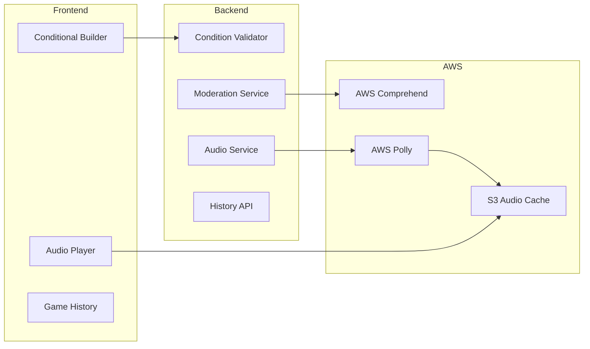

# Phase 6: Advanced Features

> **Add conditional ability builder, content moderation, audio narration, and game history**

## Overview

**Goal**: Enhance the platform with advanced role creation capabilities (IF/THEN conditionals), automated content moderation, optional audio narration, and game history tracking.

**Duration**: ~4 weeks

**Prerequisites**: Phase 5 (Community) complete

**Deliverables**:
- Conditional ability builder (IF/THEN/ELSE logic)
- AWS Comprehend for content moderation
- AWS Polly for audio narration (optional)
- Game history and replay viewing
- Advanced role templates

---

## Architecture



---

## 1. Conditional Ability Builder

### Enhanced Ability Step Model

```python
# app/models/ability_step.py - enhanced
from sqlalchemy import Column, ForeignKey, Integer, String, Boolean, JSON, Enum as SQLEnum
from sqlalchemy.dialects.postgresql import UUID
from sqlalchemy.orm import relationship
from uuid import uuid4
import enum

from app.database import Base

class ConditionType(str, enum.Enum):
    # Role conditions
    IF_ROLE_IS = "if_role_is"  # If target has specific role
    IF_ROLE_NOT = "if_role_not"  # If target does NOT have role
    IF_TEAM_IS = "if_team_is"  # If target is on team
    IF_TEAM_NOT = "if_team_not"  # If target is NOT on team
    
    # Action conditions  
    IF_ACTION_TAKEN = "if_action_taken"  # If an action was taken
    IF_ACTION_NOT_TAKEN = "if_action_not_taken"  # If no action was taken
    
    # Game state conditions
    IF_CENTER_HAS = "if_center_has"  # If center contains role
    IF_PLAYER_COUNT = "if_player_count"  # Based on player count
    IF_ALONE = "if_alone"  # Only one of this role
    IF_NOT_ALONE = "if_not_alone"  # Multiple of this role
    
    # Vote conditions (for win conditions)
    IF_VOTED_OUT = "if_voted_out"
    IF_NOT_VOTED_OUT = "if_not_voted_out"

class StepModifier(str, enum.Enum):
    NONE = "none"  # First step or standalone
    AND = "and"  # Also do this
    OR = "or"  # Or do this instead
    IF = "if"  # Only if condition met
    ELSE = "else"  # If previous condition failed
    REPEAT = "repeat"  # Repeat until condition
    ONLY_IF_OPPONENT = "only_if_opponent"  # Legacy support

class AbilityStep(Base):
    __tablename__ = "ability_steps"
    
    id = Column(UUID(as_uuid=True), primary_key=True, default=uuid4)
    role_id = Column(UUID(as_uuid=True), ForeignKey("roles.id", ondelete="CASCADE"), nullable=False)
    ability_id = Column(UUID(as_uuid=True), ForeignKey("abilities.id"), nullable=False)
    order = Column(Integer, nullable=False)
    modifier = Column(SQLEnum(StepModifier), default=StepModifier.NONE)
    is_required = Column(Boolean, default=True)
    parameters = Column(JSON, default={})
    
    # Conditional logic
    condition_type = Column(SQLEnum(ConditionType), nullable=True)
    condition_params = Column(JSON, default={})  # e.g., {"role": "werewolf", "team": "village"}
    
    # Nested conditions (for complex IF/THEN/ELSE)
    else_ability_id = Column(UUID(as_uuid=True), ForeignKey("abilities.id"), nullable=True)
    else_parameters = Column(JSON, default={})
    
    role = relationship("Role", back_populates="ability_steps")
    ability = relationship("Ability", foreign_keys=[ability_id])
    else_ability = relationship("Ability", foreign_keys=[else_ability_id])
```

### Condition Validator Service

```python
# app/services/condition_validator.py
from typing import Optional
from uuid import UUID

from app.models.ability_step import ConditionType, StepModifier

class ConditionValidator:
    """Validates conditional ability step configurations."""
    
    CONDITION_PARAM_REQUIREMENTS = {
        ConditionType.IF_ROLE_IS: ["role_name"],
        ConditionType.IF_ROLE_NOT: ["role_name"],
        ConditionType.IF_TEAM_IS: ["team"],
        ConditionType.IF_TEAM_NOT: ["team"],
        ConditionType.IF_ACTION_TAKEN: [],
        ConditionType.IF_ACTION_NOT_TAKEN: [],
        ConditionType.IF_CENTER_HAS: ["role_name"],
        ConditionType.IF_PLAYER_COUNT: ["operator", "count"],  # operator: gte, lte, eq
        ConditionType.IF_ALONE: [],
        ConditionType.IF_NOT_ALONE: [],
        ConditionType.IF_VOTED_OUT: [],
        ConditionType.IF_NOT_VOTED_OUT: []
    }
    
    def validate_step(self, step_data: dict) -> list[str]:
        """Validate a single ability step configuration."""
        errors = []
        
        modifier = step_data.get('modifier', StepModifier.NONE)
        condition_type = step_data.get('condition_type')
        condition_params = step_data.get('condition_params', {})
        
        # IF modifier requires condition
        if modifier in [StepModifier.IF, StepModifier.REPEAT]:
            if not condition_type:
                errors.append(f"Step with '{modifier}' modifier requires a condition_type")
        
        # ELSE must follow IF
        if modifier == StepModifier.ELSE:
            # This would need context of previous step - handled at role level
            pass
        
        # Validate condition params
        if condition_type:
            if condition_type not in ConditionType.__members__.values():
                errors.append(f"Invalid condition_type: {condition_type}")
            else:
                required_params = self.CONDITION_PARAM_REQUIREMENTS.get(condition_type, [])
                for param in required_params:
                    if param not in condition_params:
                        errors.append(f"Condition '{condition_type}' requires param '{param}'")
                
                # Type-specific validation
                if condition_type in [ConditionType.IF_TEAM_IS, ConditionType.IF_TEAM_NOT]:
                    team = condition_params.get('team')
                    valid_teams = ['village', 'werewolf', 'vampire', 'alien', 'neutral']
                    if team and team not in valid_teams:
                        errors.append(f"Invalid team: {team}")
                
                if condition_type == ConditionType.IF_PLAYER_COUNT:
                    operator = condition_params.get('operator')
                    count = condition_params.get('count')
                    if operator not in ['gte', 'lte', 'eq', 'gt', 'lt']:
                        errors.append(f"Invalid operator: {operator}")
                    if not isinstance(count, int) or count < 1:
                        errors.append("Player count must be a positive integer")
        
        # Validate else branch if present
        if step_data.get('else_ability_id'):
            if modifier != StepModifier.IF:
                errors.append("else_ability_id only valid with IF modifier")
        
        return errors
    
    def validate_step_sequence(self, steps: list[dict]) -> list[str]:
        """Validate a sequence of ability steps."""
        errors = []
        
        for i, step in enumerate(steps):
            step_errors = self.validate_step(step)
            for err in step_errors:
                errors.append(f"Step {i + 1}: {err}")
            
            # ELSE must follow IF
            if step.get('modifier') == StepModifier.ELSE:
                if i == 0:
                    errors.append(f"Step {i + 1}: ELSE cannot be first step")
                elif steps[i - 1].get('modifier') not in [StepModifier.IF, StepModifier.ELSE]:
                    errors.append(f"Step {i + 1}: ELSE must follow IF or another ELSE")
        
        return errors
```

### Conditional Builder UI Component

```typescript
// src/components/RoleBuilder/ConditionalBuilder.tsx
import React, { useState } from 'react';
import { AbilityStep, ConditionType, StepModifier, Ability } from '../../types/role';
import { theme } from '../../styles/theme';

interface ConditionalBuilderProps {
  step: AbilityStep;
  abilities: Ability[];
  onUpdate: (updates: Partial<AbilityStep>) => void;
}

const CONDITION_TYPES: { value: ConditionType; label: string; params: string[] }[] = [
  { value: 'if_role_is', label: 'If target role is...', params: ['role_name'] },
  { value: 'if_role_not', label: 'If target role is NOT...', params: ['role_name'] },
  { value: 'if_team_is', label: 'If target team is...', params: ['team'] },
  { value: 'if_team_not', label: 'If target team is NOT...', params: ['team'] },
  { value: 'if_action_taken', label: 'If action was taken', params: [] },
  { value: 'if_action_not_taken', label: 'If NO action was taken', params: [] },
  { value: 'if_alone', label: 'If only one of this role', params: [] },
  { value: 'if_not_alone', label: 'If multiple of this role', params: [] },
  { value: 'if_player_count', label: 'If player count...', params: ['operator', 'count'] }
];

const TEAMS = ['village', 'werewolf', 'vampire', 'alien', 'neutral'];
const OPERATORS = [
  { value: 'gte', label: '>=' },
  { value: 'lte', label: '<=' },
  { value: 'eq', label: '=' },
  { value: 'gt', label: '>' },
  { value: 'lt', label: '<' }
];

export const ConditionalBuilder: React.FC<ConditionalBuilderProps> = ({
  step,
  abilities,
  onUpdate
}) => {
  const conditionConfig = CONDITION_TYPES.find(c => c.value === step.condition_type);
  
  const updateConditionParam = (key: string, value: any) => {
    onUpdate({
      condition_params: {
        ...step.condition_params,
        [key]: value
      }
    });
  };
  
  return (
    <div style={containerStyle}>
      <h4 style={{ color: theme.colors.text, margin: 0, marginBottom: theme.spacing.md }}>
        Condition Configuration
      </h4>
      
      {/* Condition Type */}
      <div style={{ marginBottom: theme.spacing.md }}>
        <label style={labelStyle}>Condition Type</label>
        <select
          value={step.condition_type || ''}
          onChange={e => onUpdate({ 
            condition_type: e.target.value as ConditionType,
            condition_params: {}
          })}
          style={selectStyle}
        >
          <option value="">Select a condition...</option>
          {CONDITION_TYPES.map(c => (
            <option key={c.value} value={c.value}>{c.label}</option>
          ))}
        </select>
      </div>
      
      {/* Condition Parameters */}
      {conditionConfig && (
        <div style={{ marginBottom: theme.spacing.md }}>
          {conditionConfig.params.includes('role_name') && (
            <div style={{ marginBottom: theme.spacing.sm }}>
              <label style={labelStyle}>Role Name</label>
              <input
                type="text"
                value={step.condition_params?.role_name || ''}
                onChange={e => updateConditionParam('role_name', e.target.value)}
                placeholder="e.g., Werewolf"
                style={inputStyle}
              />
            </div>
          )}
          
          {conditionConfig.params.includes('team') && (
            <div style={{ marginBottom: theme.spacing.sm }}>
              <label style={labelStyle}>Team</label>
              <select
                value={step.condition_params?.team || ''}
                onChange={e => updateConditionParam('team', e.target.value)}
                style={selectStyle}
              >
                <option value="">Select team...</option>
                {TEAMS.map(t => (
                  <option key={t} value={t} style={{ textTransform: 'capitalize' }}>
                    {t.charAt(0).toUpperCase() + t.slice(1)}
                  </option>
                ))}
              </select>
            </div>
          )}
          
          {conditionConfig.params.includes('operator') && (
            <div style={{ display: 'flex', gap: theme.spacing.sm, marginBottom: theme.spacing.sm }}>
              <div style={{ flex: 1 }}>
                <label style={labelStyle}>Operator</label>
                <select
                  value={step.condition_params?.operator || 'gte'}
                  onChange={e => updateConditionParam('operator', e.target.value)}
                  style={selectStyle}
                >
                  {OPERATORS.map(o => (
                    <option key={o.value} value={o.value}>{o.label}</option>
                  ))}
                </select>
              </div>
              <div style={{ flex: 1 }}>
                <label style={labelStyle}>Count</label>
                <input
                  type="number"
                  value={step.condition_params?.count || 5}
                  onChange={e => updateConditionParam('count', parseInt(e.target.value))}
                  min={1}
                  max={20}
                  style={inputStyle}
                />
              </div>
            </div>
          )}
        </div>
      )}
      
      {/* Else Branch (if IF modifier) */}
      {step.modifier === 'if' && (
        <div style={{ 
          marginTop: theme.spacing.md,
          padding: theme.spacing.md,
          backgroundColor: theme.colors.surfaceLight,
          borderRadius: theme.borderRadius.sm,
          borderLeft: `3px solid ${theme.colors.warning}`
        }}>
          <label style={labelStyle}>ELSE: If condition is NOT met...</label>
          <select
            value={step.else_ability_id || ''}
            onChange={e => onUpdate({ else_ability_id: e.target.value || null })}
            style={selectStyle}
          >
            <option value="">Do nothing</option>
            {abilities.map(a => (
              <option key={a.id} value={a.id}>{a.name}</option>
            ))}
          </select>
        </div>
      )}
    </div>
  );
};

const containerStyle: React.CSSProperties = {
  padding: theme.spacing.md,
  backgroundColor: theme.colors.surface,
  borderRadius: theme.borderRadius.sm,
  border: `1px solid ${theme.colors.primary}`,
  marginTop: theme.spacing.sm
};

const labelStyle: React.CSSProperties = {
  display: 'block',
  color: theme.colors.text,
  fontSize: '12px',
  marginBottom: theme.spacing.xs
};

const selectStyle: React.CSSProperties = {
  width: '100%',
  padding: theme.spacing.sm,
  backgroundColor: theme.colors.surfaceLight,
  border: `1px solid ${theme.colors.secondary}`,
  borderRadius: theme.borderRadius.sm,
  color: theme.colors.text
};

const inputStyle: React.CSSProperties = {
  width: '100%',
  padding: theme.spacing.sm,
  backgroundColor: theme.colors.surfaceLight,
  border: `1px solid ${theme.colors.secondary}`,
  borderRadius: theme.borderRadius.sm,
  color: theme.colors.text
};
```

---

## 2. AWS Comprehend Content Moderation

### Moderation Service

```python
# app/services/moderation_service.py
import boto3
import os
from typing import Optional
from enum import Enum

class ModerationResult(Enum):
    CLEAN = "clean"
    FLAGGED = "flagged"
    BLOCKED = "blocked"

class ContentModerationService:
    def __init__(self):
        self.comprehend = boto3.client(
            'comprehend',
            region_name=os.environ.get('AWS_REGION', 'us-west-2')
        )
        self.enabled = os.environ.get('ENABLE_CONTENT_MODERATION', 'false').lower() == 'true'
        
        # Thresholds
        self.toxic_threshold = 0.7
        self.pii_threshold = 0.5
    
    def check_text(self, text: str) -> tuple[ModerationResult, Optional[str]]:
        """Check text for inappropriate content."""
        if not self.enabled or not text:
            return ModerationResult.CLEAN, None
        
        try:
            # Check for toxic content
            toxic_response = self.comprehend.detect_toxic_content(
                TextSegments=[{'Text': text}],
                LanguageCode='en'
            )
            
            for segment in toxic_response.get('ResultList', []):
                toxicity = segment.get('Toxicity', 0)
                labels = segment.get('Labels', [])
                
                # Check overall toxicity
                if toxicity > self.toxic_threshold:
                    return ModerationResult.BLOCKED, "Content flagged as toxic"
                
                # Check specific categories
                for label in labels:
                    if label['Score'] > self.toxic_threshold:
                        if label['Name'] in ['HATE_SPEECH', 'VIOLENCE', 'SEXUAL']:
                            return ModerationResult.BLOCKED, f"Content flagged for {label['Name']}"
                        else:
                            return ModerationResult.FLAGGED, f"Content may contain {label['Name']}"
            
            # Check for PII
            pii_response = self.comprehend.detect_pii_entities(
                Text=text,
                LanguageCode='en'
            )
            
            pii_types = ['EMAIL', 'PHONE', 'ADDRESS', 'SSN', 'CREDIT_DEBIT_NUMBER']
            for entity in pii_response.get('Entities', []):
                if entity['Type'] in pii_types and entity['Score'] > self.pii_threshold:
                    return ModerationResult.FLAGGED, f"Content may contain personal information ({entity['Type']})"
            
            return ModerationResult.CLEAN, None
            
        except Exception as e:
            # Log error but don't block on moderation failure
            print(f"Moderation check failed: {e}")
            return ModerationResult.CLEAN, None
    
    def check_role(self, name: str, description: str) -> tuple[ModerationResult, list[str]]:
        """Check role name and description."""
        issues = []
        worst_result = ModerationResult.CLEAN
        
        # Check name
        name_result, name_issue = self.check_text(name)
        if name_result != ModerationResult.CLEAN:
            issues.append(f"Name: {name_issue}")
            if name_result.value > worst_result.value:
                worst_result = name_result
        
        # Check description
        if description:
            desc_result, desc_issue = self.check_text(description)
            if desc_result != ModerationResult.CLEAN:
                issues.append(f"Description: {desc_issue}")
                if desc_result.value > worst_result.value:
                    worst_result = desc_result
        
        return worst_result, issues
```

### Integration with Publishing

```python
# app/services/publish_service.py - additions

from app.services.moderation_service import ContentModerationService, ModerationResult

class PublishService:
    def __init__(self, db: Session):
        self.db = db
        self.moderation = ContentModerationService()
    
    def request_publish(self, role_id: UUID, user_id: UUID) -> ModerationQueue:
        """Submit a role for public publishing with auto-moderation."""
        role = self.db.query(Role).filter(Role.id == role_id).first()
        
        # ... existing validation ...
        
        # Auto-moderation check
        mod_result, mod_issues = self.moderation.check_role(role.name, role.description)
        
        if mod_result == ModerationResult.BLOCKED:
            raise ValueError(f"Content blocked: {'; '.join(mod_issues)}")
        
        # Create moderation queue entry
        mod_item = ModerationQueue(
            content_type='role',
            content_id=role_id,
            user_id=user_id,
            status='auto_flagged' if mod_result == ModerationResult.FLAGGED else 'pending',
            reason='; '.join(mod_issues) if mod_issues else None
        )
        
        # If clean, can be auto-approved (based on config)
        if mod_result == ModerationResult.CLEAN and self._can_auto_approve(user_id):
            mod_item.status = 'approved'
            role.visibility = Visibility.PUBLIC
            role.is_locked = True
        
        self.db.add(mod_item)
        self.db.commit()
        
        return mod_item
    
    def _can_auto_approve(self, user_id: UUID) -> bool:
        """Check if user can have auto-approved content."""
        # Example: users with X approved roles get auto-approve
        from app.models.moderation import ModerationQueue
        
        approved_count = self.db.query(ModerationQueue).filter(
            ModerationQueue.user_id == user_id,
            ModerationQueue.status == 'approved'
        ).count()
        
        return approved_count >= 5
```

---

## 3. AWS Polly Audio Narration

### Audio Service

```python
# app/services/audio_service.py
import boto3
import hashlib
import os
from typing import Optional
from uuid import UUID

class AudioService:
    def __init__(self):
        self.polly = boto3.client(
            'polly',
            region_name=os.environ.get('AWS_REGION', 'us-west-2')
        )
        self.s3 = boto3.client('s3')
        self.bucket = os.environ.get('AUDIO_BUCKET', 'yourwolf-audio')
        self.enabled = os.environ.get('ENABLE_AUDIO', 'false').lower() == 'true'
        
        # Voice settings
        self.voice_id = 'Matthew'  # Male US voice
        self.engine = 'neural'
    
    def get_or_generate_audio(self, text: str, cache_key: Optional[str] = None) -> Optional[str]:
        """Get audio URL for text, generating if not cached."""
        if not self.enabled:
            return None
        
        # Generate cache key from text hash
        if not cache_key:
            cache_key = hashlib.md5(text.encode()).hexdigest()
        
        s3_key = f"narration/{cache_key}.mp3"
        
        # Check if already cached
        try:
            self.s3.head_object(Bucket=self.bucket, Key=s3_key)
            return self._get_presigned_url(s3_key)
        except:
            pass  # Not cached, generate
        
        # Generate audio
        try:
            response = self.polly.synthesize_speech(
                Text=text,
                OutputFormat='mp3',
                VoiceId=self.voice_id,
                Engine=self.engine
            )
            
            # Upload to S3
            self.s3.put_object(
                Bucket=self.bucket,
                Key=s3_key,
                Body=response['AudioStream'].read(),
                ContentType='audio/mpeg'
            )
            
            return self._get_presigned_url(s3_key)
            
        except Exception as e:
            print(f"Audio generation failed: {e}")
            return None
    
    def _get_presigned_url(self, key: str, expiry: int = 3600) -> str:
        """Generate presigned URL for audio file."""
        return self.s3.generate_presigned_url(
            'get_object',
            Params={'Bucket': self.bucket, 'Key': key},
            ExpiresIn=expiry
        )
    
    def generate_game_script_audio(self, script_items: list[dict]) -> list[dict]:
        """Generate audio for a full game script."""
        for item in script_items:
            if item.get('text'):
                cache_key = f"script_{hashlib.md5(item['text'].encode()).hexdigest()}"
                item['audio_url'] = self.get_or_generate_audio(item['text'], cache_key)
        
        return script_items
```

### Script Service Integration

```python
# app/services/script_service.py - additions

from app.services.audio_service import AudioService

class ScriptService:
    def __init__(self, db: Session):
        self.db = db
        self.audio = AudioService()
    
    def generate_night_script(
        self, 
        role_ids: list[UUID], 
        include_audio: bool = False
    ) -> list[dict]:
        """Generate night phase script with optional audio."""
        script = self._build_script(role_ids)
        
        if include_audio:
            script = self.audio.generate_game_script_audio(script)
        
        return script
```

### Audio Player Component

```typescript
// src/components/AudioPlayer.tsx
import React, { useRef, useState, useEffect } from 'react';
import { theme } from '../styles/theme';

interface AudioPlayerProps {
  audioUrl: string | null;
  autoPlay?: boolean;
  onEnded?: () => void;
}

export const AudioPlayer: React.FC<AudioPlayerProps> = ({
  audioUrl,
  autoPlay = false,
  onEnded
}) => {
  const audioRef = useRef<HTMLAudioElement>(null);
  const [playing, setPlaying] = useState(false);
  const [progress, setProgress] = useState(0);
  const [duration, setDuration] = useState(0);
  
  useEffect(() => {
    if (audioUrl && autoPlay && audioRef.current) {
      audioRef.current.play();
      setPlaying(true);
    }
  }, [audioUrl, autoPlay]);
  
  const togglePlay = () => {
    if (!audioRef.current) return;
    
    if (playing) {
      audioRef.current.pause();
    } else {
      audioRef.current.play();
    }
    setPlaying(!playing);
  };
  
  const handleTimeUpdate = () => {
    if (!audioRef.current) return;
    setProgress(audioRef.current.currentTime);
  };
  
  const handleLoadedMetadata = () => {
    if (!audioRef.current) return;
    setDuration(audioRef.current.duration);
  };
  
  const handleEnded = () => {
    setPlaying(false);
    setProgress(0);
    onEnded?.();
  };
  
  const seek = (e: React.ChangeEvent<HTMLInputElement>) => {
    if (!audioRef.current) return;
    audioRef.current.currentTime = parseFloat(e.target.value);
    setProgress(parseFloat(e.target.value));
  };
  
  if (!audioUrl) return null;
  
  return (
    <div style={{
      display: 'flex',
      alignItems: 'center',
      gap: theme.spacing.sm,
      padding: theme.spacing.sm,
      backgroundColor: theme.colors.surface,
      borderRadius: theme.borderRadius.sm
    }}>
      <audio
        ref={audioRef}
        src={audioUrl}
        onTimeUpdate={handleTimeUpdate}
        onLoadedMetadata={handleLoadedMetadata}
        onEnded={handleEnded}
      />
      
      <button onClick={togglePlay} style={playButtonStyle}>
        {playing ? '⏸' : '▶'}
      </button>
      
      <input
        type="range"
        min={0}
        max={duration || 100}
        value={progress}
        onChange={seek}
        style={{ flex: 1, cursor: 'pointer' }}
      />
      
      <span style={{ color: theme.colors.textMuted, fontSize: '12px', width: '45px' }}>
        {formatTime(progress)} / {formatTime(duration)}
      </span>
    </div>
  );
};

const formatTime = (seconds: number): string => {
  const mins = Math.floor(seconds / 60);
  const secs = Math.floor(seconds % 60);
  return `${mins}:${secs.toString().padStart(2, '0')}`;
};

const playButtonStyle: React.CSSProperties = {
  width: '36px',
  height: '36px',
  borderRadius: '50%',
  backgroundColor: theme.colors.primary,
  border: 'none',
  color: theme.colors.text,
  cursor: 'pointer',
  display: 'flex',
  alignItems: 'center',
  justifyContent: 'center'
};
```

---

## 4. Game History

### History Models

```python
# app/models/game_history.py
from sqlalchemy import Column, ForeignKey, Integer, String, Text, DateTime, JSON
from sqlalchemy.dialects.postgresql import UUID
from sqlalchemy.orm import relationship
from datetime import datetime
from uuid import uuid4

from app.database import Base

class GameHistory(Base):
    __tablename__ = "game_history"
    
    id = Column(UUID(as_uuid=True), primary_key=True, default=uuid4)
    session_id = Column(UUID(as_uuid=True), ForeignKey("game_sessions.id", ondelete="SET NULL"))
    facilitator_id = Column(UUID(as_uuid=True), ForeignKey("users.id", ondelete="SET NULL"))
    
    # Snapshot of game state
    player_count = Column(Integer, nullable=False)
    role_assignments = Column(JSON, nullable=False)  # {player_name: role_id}
    role_set_id = Column(UUID(as_uuid=True), ForeignKey("role_sets.id", ondelete="SET NULL"))
    
    # Outcome
    winning_team = Column(String(50))
    voted_player = Column(String(100))
    was_correct_vote = Column(Boolean)
    
    # Timing
    started_at = Column(DateTime, nullable=False)
    ended_at = Column(DateTime, nullable=False)
    night_duration_seconds = Column(Integer)
    day_duration_seconds = Column(Integer)
    
    # Notes
    notes = Column(Text)
    
    # Relationships
    session = relationship("GameSession")
    facilitator = relationship("User")
    role_set = relationship("RoleSet")
    events = relationship("GameEvent", back_populates="game", cascade="all, delete-orphan")


class GameEvent(Base):
    __tablename__ = "game_events"
    
    id = Column(UUID(as_uuid=True), primary_key=True, default=uuid4)
    game_id = Column(UUID(as_uuid=True), ForeignKey("game_history.id", ondelete="CASCADE"), nullable=False)
    event_type = Column(String(50), nullable=False)  # role_woke, ability_used, vote_cast, etc.
    timestamp = Column(DateTime, default=datetime.utcnow)
    data = Column(JSON)  # Event-specific data
    
    game = relationship("GameHistory", back_populates="events")
```

### History API

```python
# app/routers/game_history.py
from fastapi import APIRouter, Depends, HTTPException, Query
from sqlalchemy.orm import Session
from uuid import UUID
from typing import Optional
from datetime import datetime

from app.database import get_db
from app.auth.dependencies import get_current_user_required, CurrentUser
from app.models.game_history import GameHistory, GameEvent
from app.schemas.game_history import GameHistoryCreate, GameHistoryResponse, GameHistoryList

router = APIRouter()

@router.get("/", response_model=GameHistoryList)
def list_game_history(
    page: int = Query(1, ge=1),
    per_page: int = Query(20, ge=1, le=100),
    role_set_id: Optional[UUID] = None,
    winning_team: Optional[str] = None,
    db: Session = Depends(get_db),
    current_user: CurrentUser = Depends(get_current_user_required)
):
    """List user's game history."""
    query = db.query(GameHistory).filter(
        GameHistory.facilitator_id == current_user.id
    )
    
    if role_set_id:
        query = query.filter(GameHistory.role_set_id == role_set_id)
    if winning_team:
        query = query.filter(GameHistory.winning_team == winning_team)
    
    query = query.order_by(GameHistory.ended_at.desc())
    
    total = query.count()
    games = query.offset((page - 1) * per_page).limit(per_page).all()
    
    return {
        "games": games,
        "total": total,
        "page": page,
        "per_page": per_page
    }

@router.get("/{game_id}", response_model=GameHistoryResponse)
def get_game_history(
    game_id: UUID,
    db: Session = Depends(get_db),
    current_user: CurrentUser = Depends(get_current_user_required)
):
    """Get detailed game history."""
    game = db.query(GameHistory).filter(
        GameHistory.id == game_id,
        GameHistory.facilitator_id == current_user.id
    ).first()
    
    if not game:
        raise HTTPException(404, "Game not found")
    
    return game

@router.post("/", response_model=GameHistoryResponse, status_code=201)
def record_game(
    data: GameHistoryCreate,
    db: Session = Depends(get_db),
    current_user: CurrentUser = Depends(get_current_user_required)
):
    """Record a completed game."""
    game = GameHistory(
        session_id=data.session_id,
        facilitator_id=current_user.id,
        player_count=data.player_count,
        role_assignments=data.role_assignments,
        role_set_id=data.role_set_id,
        winning_team=data.winning_team,
        voted_player=data.voted_player,
        was_correct_vote=data.was_correct_vote,
        started_at=data.started_at,
        ended_at=data.ended_at or datetime.utcnow(),
        night_duration_seconds=data.night_duration_seconds,
        day_duration_seconds=data.day_duration_seconds,
        notes=data.notes
    )
    db.add(game)
    
    # Add events
    for event_data in (data.events or []):
        event = GameEvent(
            game_id=game.id,
            event_type=event_data.event_type,
            timestamp=event_data.timestamp,
            data=event_data.data
        )
        db.add(event)
    
    db.commit()
    db.refresh(game)
    
    return game

@router.get("/stats/summary")
def get_history_stats(
    db: Session = Depends(get_db),
    current_user: CurrentUser = Depends(get_current_user_required)
):
    """Get summary stats for user's game history."""
    from sqlalchemy import func
    
    games = db.query(GameHistory).filter(
        GameHistory.facilitator_id == current_user.id
    )
    
    total_games = games.count()
    
    if total_games == 0:
        return {
            "total_games": 0,
            "total_players": 0,
            "team_wins": {},
            "correct_vote_rate": 0,
            "avg_game_duration": 0
        }
    
    # Team win counts
    team_wins = db.query(
        GameHistory.winning_team,
        func.count(GameHistory.id)
    ).filter(
        GameHistory.facilitator_id == current_user.id,
        GameHistory.winning_team.isnot(None)
    ).group_by(GameHistory.winning_team).all()
    
    # Correct vote rate
    voted_games = games.filter(GameHistory.was_correct_vote.isnot(None))
    correct_votes = voted_games.filter(GameHistory.was_correct_vote == True).count()
    vote_rate = correct_votes / voted_games.count() if voted_games.count() > 0 else 0
    
    # Avg duration
    durations = db.query(
        func.avg(GameHistory.night_duration_seconds + GameHistory.day_duration_seconds)
    ).filter(
        GameHistory.facilitator_id == current_user.id
    ).scalar() or 0
    
    return {
        "total_games": total_games,
        "total_players": games.with_entities(func.sum(GameHistory.player_count)).scalar() or 0,
        "team_wins": {team: count for team, count in team_wins},
        "correct_vote_rate": round(vote_rate * 100, 1),
        "avg_game_duration": int(durations)
    }
```

---

## Tests

### Condition Validator Tests

```python
# tests/test_conditions.py
import pytest
from app.services.condition_validator import ConditionValidator
from app.models.ability_step import ConditionType, StepModifier

class TestConditionValidator:
    def test_if_requires_condition(self):
        validator = ConditionValidator()
        
        step = {
            "modifier": StepModifier.IF,
            "condition_type": None
        }
        
        errors = validator.validate_step(step)
        assert any("requires a condition_type" in e for e in errors)
    
    def test_valid_team_condition(self):
        validator = ConditionValidator()
        
        step = {
            "modifier": StepModifier.IF,
            "condition_type": ConditionType.IF_TEAM_IS,
            "condition_params": {"team": "werewolf"}
        }
        
        errors = validator.validate_step(step)
        assert len(errors) == 0
    
    def test_invalid_team_rejected(self):
        validator = ConditionValidator()
        
        step = {
            "modifier": StepModifier.IF,
            "condition_type": ConditionType.IF_TEAM_IS,
            "condition_params": {"team": "dragons"}  # Invalid
        }
        
        errors = validator.validate_step(step)
        assert any("Invalid team" in e for e in errors)
    
    def test_player_count_requires_operator(self):
        validator = ConditionValidator()
        
        step = {
            "modifier": StepModifier.IF,
            "condition_type": ConditionType.IF_PLAYER_COUNT,
            "condition_params": {"count": 5}  # Missing operator
        }
        
        errors = validator.validate_step(step)
        assert any("requires param 'operator'" in e for e in errors)
    
    def test_else_must_follow_if(self):
        validator = ConditionValidator()
        
        steps = [
            {"modifier": StepModifier.NONE},
            {"modifier": StepModifier.ELSE}  # Invalid - follows NONE
        ]
        
        errors = validator.validate_step_sequence(steps)
        assert any("must follow IF" in e for e in errors)
    
    def test_valid_if_else_sequence(self):
        validator = ConditionValidator()
        
        steps = [
            {
                "modifier": StepModifier.IF,
                "condition_type": ConditionType.IF_ALONE,
                "condition_params": {}
            },
            {"modifier": StepModifier.ELSE}
        ]
        
        errors = validator.validate_step_sequence(steps)
        assert len(errors) == 0
```

### Audio Service Tests

```python
# tests/test_audio.py (with mocking)
import pytest
from unittest.mock import Mock, patch, MagicMock

class TestAudioService:
    @patch.dict('os.environ', {'ENABLE_AUDIO': 'true', 'AUDIO_BUCKET': 'test-bucket'})
    @patch('boto3.client')
    def test_generates_audio_when_not_cached(self, mock_boto):
        from app.services.audio_service import AudioService
        
        # Mock S3 - file not found
        mock_s3 = MagicMock()
        mock_s3.head_object.side_effect = Exception("Not found")
        mock_s3.generate_presigned_url.return_value = "https://example.com/audio.mp3"
        
        # Mock Polly
        mock_polly = MagicMock()
        mock_polly.synthesize_speech.return_value = {
            'AudioStream': MagicMock(read=lambda: b'audio data')
        }
        
        mock_boto.side_effect = lambda service, **kwargs: {
            'polly': mock_polly,
            's3': mock_s3
        }[service]
        
        service = AudioService()
        url = service.get_or_generate_audio("Test text")
        
        assert url is not None
        mock_polly.synthesize_speech.assert_called_once()
        mock_s3.put_object.assert_called_once()
    
    @patch.dict('os.environ', {'ENABLE_AUDIO': 'false'})
    def test_returns_none_when_disabled(self):
        from app.services.audio_service import AudioService
        
        service = AudioService()
        url = service.get_or_generate_audio("Test text")
        
        assert url is None
```

---

## Acceptance Criteria

| Criteria | Verification |
|----------|--------------|
| Can create conditional abilities | IF/THEN/ELSE steps validated |
| Condition types validated | Required params checked |
| Content moderation auto-checks | Flagged content enters queue |
| Blocked content rejected | Returns error immediately |
| Audio generated on demand | Polly called, S3 cached |
| Audio URL returned | Presigned URL works |
| Game history recorded | POST creates record |
| History filterable | Query params work |
| Stats calculated | Aggregations correct |

---

## Definition of Done

- [ ] Enhanced AbilityStep model with conditions
- [ ] Condition validator service
- [ ] Conditional builder UI component
- [ ] Content moderation service (Comprehend)
- [ ] Auto-moderation on publish
- [ ] Audio service (Polly)
- [ ] S3 caching for audio
- [ ] Audio player component
- [ ] Game history models
- [ ] History API with CRUD
- [ ] History stats endpoint
- [ ] Backend tests (conditions, audio)
- [ ] Frontend tests
- [ ] Integration with role builder

---

*Last updated: January 31, 2026*
