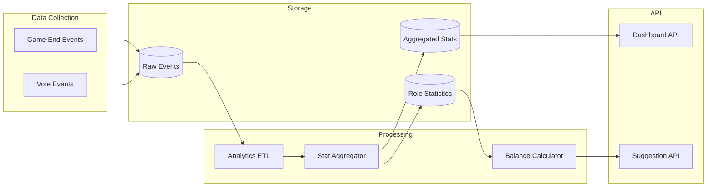

# Phase 7: Analytics & Balance Metrics

> **Track game statistics, role balance, and provide data-driven set suggestions**

## Overview

**Goal**: Build analytics infrastructure to track game outcomes, calculate role balance metrics, and provide intelligent suggestions for balanced game sets.

**Duration**: ~3 weeks

**Prerequisites**: Phase 6 (Advanced Features) complete

**Deliverables**:
- Role win rate tracking
- Balance score calculations
- Set recommendation engine
- Analytics dashboard for facilitators
- Community-wide statistics

---

## Architecture



---

## Database Schema

### Statistics Tables

```sql
-- Role statistics (aggregated)
CREATE TABLE role_statistics (
    id UUID PRIMARY KEY DEFAULT gen_random_uuid(),
    role_id UUID NOT NULL REFERENCES roles(id) ON DELETE CASCADE,
    
    -- Time window (for historical tracking)
    period_start DATE NOT NULL,
    period_end DATE NOT NULL,
    
    -- Basic counts
    games_played INTEGER DEFAULT 0,
    games_won INTEGER DEFAULT 0,
    times_voted_out INTEGER DEFAULT 0,
    
    -- Team correlation
    team_wins_when_present INTEGER DEFAULT 0,
    team_losses_when_present INTEGER DEFAULT 0,
    
    -- Usage stats
    times_used_in_sets INTEGER DEFAULT 0,
    times_ability_triggered INTEGER DEFAULT 0,
    
    UNIQUE(role_id, period_start, period_end)
);

CREATE INDEX idx_role_stats_role ON role_statistics(role_id);
CREATE INDEX idx_role_stats_period ON role_statistics(period_start, period_end);

-- Set statistics
CREATE TABLE set_statistics (
    id UUID PRIMARY KEY DEFAULT gen_random_uuid(),
    set_id UUID NOT NULL REFERENCES role_sets(id) ON DELETE CASCADE,
    
    period_start DATE NOT NULL,
    period_end DATE NOT NULL,
    
    games_played INTEGER DEFAULT 0,
    village_wins INTEGER DEFAULT 0,
    werewolf_wins INTEGER DEFAULT 0,
    vampire_wins INTEGER DEFAULT 0,
    alien_wins INTEGER DEFAULT 0,
    neutral_wins INTEGER DEFAULT 0,
    no_lynch INTEGER DEFAULT 0,  -- Nobody executed
    
    avg_game_duration_seconds INTEGER DEFAULT 0,
    
    -- Balance score (0-100, 50 = perfectly balanced)
    balance_score DECIMAL(5, 2),
    
    UNIQUE(set_id, period_start, period_end)
);

CREATE INDEX idx_set_stats_set ON set_statistics(set_id);

-- Player count statistics (for recommendations)
CREATE TABLE player_count_stats (
    id UUID PRIMARY KEY DEFAULT gen_random_uuid(),
    player_count INTEGER NOT NULL,
    
    period_start DATE NOT NULL,
    period_end DATE NOT NULL,
    
    -- Best performing sets at this player count
    top_set_ids UUID[] DEFAULT '{}',
    most_balanced_set_id UUID,
    
    -- Win rates by team at this player count
    village_win_rate DECIMAL(5, 2),
    werewolf_win_rate DECIMAL(5, 2),
    
    games_analyzed INTEGER DEFAULT 0,
    
    UNIQUE(player_count, period_start, period_end)
);

-- Add balance_score to roles
ALTER TABLE roles ADD COLUMN balance_score DECIMAL(5, 2) DEFAULT 50.0;
```

### Models

```python
# app/models/statistics.py
from sqlalchemy import Column, ForeignKey, Integer, Date, DECIMAL, ARRAY
from sqlalchemy.dialects.postgresql import UUID
from sqlalchemy.orm import relationship
from uuid import uuid4
from datetime import date

from app.database import Base

class RoleStatistics(Base):
    __tablename__ = "role_statistics"
    
    id = Column(UUID(as_uuid=True), primary_key=True, default=uuid4)
    role_id = Column(UUID(as_uuid=True), ForeignKey("roles.id", ondelete="CASCADE"), nullable=False)
    
    period_start = Column(Date, nullable=False)
    period_end = Column(Date, nullable=False)
    
    games_played = Column(Integer, default=0)
    games_won = Column(Integer, default=0)
    times_voted_out = Column(Integer, default=0)
    team_wins_when_present = Column(Integer, default=0)
    team_losses_when_present = Column(Integer, default=0)
    times_used_in_sets = Column(Integer, default=0)
    times_ability_triggered = Column(Integer, default=0)
    
    role = relationship("Role")


class SetStatistics(Base):
    __tablename__ = "set_statistics"
    
    id = Column(UUID(as_uuid=True), primary_key=True, default=uuid4)
    set_id = Column(UUID(as_uuid=True), ForeignKey("role_sets.id", ondelete="CASCADE"), nullable=False)
    
    period_start = Column(Date, nullable=False)
    period_end = Column(Date, nullable=False)
    
    games_played = Column(Integer, default=0)
    village_wins = Column(Integer, default=0)
    werewolf_wins = Column(Integer, default=0)
    vampire_wins = Column(Integer, default=0)
    alien_wins = Column(Integer, default=0)
    neutral_wins = Column(Integer, default=0)
    no_lynch = Column(Integer, default=0)
    
    avg_game_duration_seconds = Column(Integer, default=0)
    balance_score = Column(DECIMAL(5, 2))
    
    role_set = relationship("RoleSet")


class PlayerCountStats(Base):
    __tablename__ = "player_count_stats"
    
    id = Column(UUID(as_uuid=True), primary_key=True, default=uuid4)
    player_count = Column(Integer, nullable=False)
    
    period_start = Column(Date, nullable=False)
    period_end = Column(Date, nullable=False)
    
    top_set_ids = Column(ARRAY(UUID), default=[])
    most_balanced_set_id = Column(UUID(as_uuid=True), ForeignKey("role_sets.id"))
    
    village_win_rate = Column(DECIMAL(5, 2))
    werewolf_win_rate = Column(DECIMAL(5, 2))
    
    games_analyzed = Column(Integer, default=0)
```

---

## Backend Services

### 1. Statistics Aggregator (`app/services/stats_aggregator.py`)

```python
from sqlalchemy.orm import Session
from sqlalchemy import func
from uuid import UUID
from datetime import date, timedelta
from decimal import Decimal

from app.models.game_history import GameHistory
from app.models.statistics import RoleStatistics, SetStatistics, PlayerCountStats
from app.models.role import Role

class StatsAggregator:
    """Aggregates game data into statistics tables."""
    
    def __init__(self, db: Session):
        self.db = db
    
    def aggregate_all(self, period_start: date, period_end: date):
        """Run all aggregations for a time period."""
        self.aggregate_role_stats(period_start, period_end)
        self.aggregate_set_stats(period_start, period_end)
        self.aggregate_player_count_stats(period_start, period_end)
        self.update_role_balance_scores()
    
    def aggregate_role_stats(self, period_start: date, period_end: date):
        """Aggregate role-level statistics."""
        # Get all games in period
        games = self.db.query(GameHistory).filter(
            GameHistory.ended_at >= period_start,
            GameHistory.ended_at < period_end
        ).all()
        
        # Track stats per role
        role_stats = {}
        
        for game in games:
            assignments = game.role_assignments or {}
            winning_team = game.winning_team
            voted_player = game.voted_player
            
            for player_name, role_id in assignments.items():
                if role_id not in role_stats:
                    role_stats[role_id] = {
                        'games_played': 0,
                        'games_won': 0,
                        'times_voted_out': 0,
                        'team_wins': 0,
                        'team_losses': 0
                    }
                
                stats = role_stats[role_id]
                stats['games_played'] += 1
                
                # Check if this role won
                role = self.db.query(Role).filter(Role.id == role_id).first()
                if role and role.team == winning_team:
                    stats['games_won'] += 1
                    stats['team_wins'] += 1
                else:
                    stats['team_losses'] += 1
                
                # Check if voted out
                if player_name == voted_player:
                    stats['times_voted_out'] += 1
        
        # Upsert stats
        for role_id, stats in role_stats.items():
            existing = self.db.query(RoleStatistics).filter(
                RoleStatistics.role_id == role_id,
                RoleStatistics.period_start == period_start,
                RoleStatistics.period_end == period_end
            ).first()
            
            if existing:
                existing.games_played += stats['games_played']
                existing.games_won += stats['games_won']
                existing.times_voted_out += stats['times_voted_out']
                existing.team_wins_when_present += stats['team_wins']
                existing.team_losses_when_present += stats['team_losses']
            else:
                new_stat = RoleStatistics(
                    role_id=role_id,
                    period_start=period_start,
                    period_end=period_end,
                    games_played=stats['games_played'],
                    games_won=stats['games_won'],
                    times_voted_out=stats['times_voted_out'],
                    team_wins_when_present=stats['team_wins'],
                    team_losses_when_present=stats['team_losses']
                )
                self.db.add(new_stat)
        
        self.db.commit()
    
    def aggregate_set_stats(self, period_start: date, period_end: date):
        """Aggregate set-level statistics."""
        # Group games by set
        set_games = self.db.query(
            GameHistory.role_set_id,
            func.count(GameHistory.id).label('games_played'),
            func.sum(func.cast(GameHistory.winning_team == 'village', Integer)).label('village_wins'),
            func.sum(func.cast(GameHistory.winning_team == 'werewolf', Integer)).label('werewolf_wins'),
            func.sum(func.cast(GameHistory.winning_team == 'vampire', Integer)).label('vampire_wins'),
            func.sum(func.cast(GameHistory.winning_team == 'alien', Integer)).label('alien_wins'),
            func.sum(func.cast(GameHistory.winning_team == 'neutral', Integer)).label('neutral_wins'),
            func.sum(func.cast(GameHistory.winning_team.is_(None), Integer)).label('no_lynch'),
            func.avg(
                GameHistory.night_duration_seconds + GameHistory.day_duration_seconds
            ).label('avg_duration')
        ).filter(
            GameHistory.ended_at >= period_start,
            GameHistory.ended_at < period_end,
            GameHistory.role_set_id.isnot(None)
        ).group_by(GameHistory.role_set_id).all()
        
        for row in set_games:
            # Calculate balance score
            balance_score = self._calculate_balance_score(
                row.village_wins or 0,
                row.werewolf_wins or 0,
                row.vampire_wins or 0,
                row.alien_wins or 0,
                row.games_played
            )
            
            existing = self.db.query(SetStatistics).filter(
                SetStatistics.set_id == row.role_set_id,
                SetStatistics.period_start == period_start,
                SetStatistics.period_end == period_end
            ).first()
            
            if existing:
                # Update existing
                existing.games_played += row.games_played
                existing.village_wins += row.village_wins or 0
                existing.werewolf_wins += row.werewolf_wins or 0
                existing.vampire_wins += row.vampire_wins or 0
                existing.alien_wins += row.alien_wins or 0
                existing.neutral_wins += row.neutral_wins or 0
                existing.no_lynch += row.no_lynch or 0
                existing.balance_score = balance_score
            else:
                new_stat = SetStatistics(
                    set_id=row.role_set_id,
                    period_start=period_start,
                    period_end=period_end,
                    games_played=row.games_played,
                    village_wins=row.village_wins or 0,
                    werewolf_wins=row.werewolf_wins or 0,
                    vampire_wins=row.vampire_wins or 0,
                    alien_wins=row.alien_wins or 0,
                    neutral_wins=row.neutral_wins or 0,
                    no_lynch=row.no_lynch or 0,
                    avg_game_duration_seconds=int(row.avg_duration or 0),
                    balance_score=balance_score
                )
                self.db.add(new_stat)
        
        self.db.commit()
    
    def _calculate_balance_score(
        self,
        village_wins: int,
        werewolf_wins: int,
        vampire_wins: int,
        alien_wins: int,
        total_games: int
    ) -> Decimal:
        """
        Calculate balance score (0-100).
        50 = perfectly balanced
        <50 = one team dominates
        >50 = very close games
        """
        if total_games == 0:
            return Decimal('50.0')
        
        # Calculate win rates
        win_rates = []
        if village_wins > 0:
            win_rates.append(village_wins / total_games)
        if werewolf_wins > 0:
            win_rates.append(werewolf_wins / total_games)
        if vampire_wins > 0:
            win_rates.append(vampire_wins / total_games)
        if alien_wins > 0:
            win_rates.append(alien_wins / total_games)
        
        if len(win_rates) < 2:
            # Only one team ever wins
            return Decimal('0.0')
        
        # Calculate variance from ideal distribution
        ideal = 1.0 / len(win_rates)
        variance = sum((r - ideal) ** 2 for r in win_rates) / len(win_rates)
        
        # Convert to 0-100 score (lower variance = higher score)
        # Max variance would be (1 - ideal)^2 ≈ 0.25 for 2 teams
        max_variance = (1 - ideal) ** 2
        balance = 1 - (variance / max_variance)
        
        return Decimal(str(round(balance * 100, 2)))
    
    def update_role_balance_scores(self):
        """Update balance scores on role table."""
        # Get all-time stats
        stats = self.db.query(
            RoleStatistics.role_id,
            func.sum(RoleStatistics.games_played).label('total_games'),
            func.sum(RoleStatistics.team_wins_when_present).label('team_wins'),
            func.sum(RoleStatistics.team_losses_when_present).label('team_losses')
        ).group_by(RoleStatistics.role_id).all()
        
        for stat in stats:
            if stat.total_games >= 10:  # Minimum sample size
                total = stat.team_wins + stat.team_losses
                if total > 0:
                    win_rate = stat.team_wins / total
                    # Convert to balance score (50% win rate = 100 balance)
                    balance = 100 - abs(win_rate - 0.5) * 200
                    
                    role = self.db.query(Role).filter(Role.id == stat.role_id).first()
                    if role:
                        role.balance_score = Decimal(str(round(balance, 2)))
        
        self.db.commit()
    
    def aggregate_player_count_stats(self, period_start: date, period_end: date):
        """Aggregate stats by player count."""
        # Group by player count
        player_counts = self.db.query(
            GameHistory.player_count,
            func.count(GameHistory.id).label('games'),
            func.sum(func.cast(GameHistory.winning_team == 'village', Integer)).label('village_wins'),
            func.sum(func.cast(GameHistory.winning_team == 'werewolf', Integer)).label('werewolf_wins')
        ).filter(
            GameHistory.ended_at >= period_start,
            GameHistory.ended_at < period_end
        ).group_by(GameHistory.player_count).all()
        
        for row in player_counts:
            village_rate = (row.village_wins or 0) / row.games if row.games > 0 else 0.5
            werewolf_rate = (row.werewolf_wins or 0) / row.games if row.games > 0 else 0.5
            
            # Find most balanced set for this player count
            best_set = self.db.query(SetStatistics.set_id).join(
                RoleSet
            ).filter(
                SetStatistics.period_start == period_start,
                SetStatistics.games_played >= 5,
                RoleSet.player_count_min <= row.player_count,
                RoleSet.player_count_max >= row.player_count
            ).order_by(
                func.abs(SetStatistics.balance_score - 50)
            ).first()
            
            existing = self.db.query(PlayerCountStats).filter(
                PlayerCountStats.player_count == row.player_count,
                PlayerCountStats.period_start == period_start,
                PlayerCountStats.period_end == period_end
            ).first()
            
            if existing:
                existing.games_analyzed = row.games
                existing.village_win_rate = Decimal(str(round(village_rate * 100, 2)))
                existing.werewolf_win_rate = Decimal(str(round(werewolf_rate * 100, 2)))
                if best_set:
                    existing.most_balanced_set_id = best_set.set_id
            else:
                new_stat = PlayerCountStats(
                    player_count=row.player_count,
                    period_start=period_start,
                    period_end=period_end,
                    games_analyzed=row.games,
                    village_win_rate=Decimal(str(round(village_rate * 100, 2))),
                    werewolf_win_rate=Decimal(str(round(werewolf_rate * 100, 2))),
                    most_balanced_set_id=best_set.set_id if best_set else None
                )
                self.db.add(new_stat)
        
        self.db.commit()
```

### 2. Recommendation Engine (`app/services/recommendation_service.py`)

```python
from sqlalchemy.orm import Session
from sqlalchemy import func, desc
from uuid import UUID
from typing import Optional
from decimal import Decimal

from app.models.role_set import RoleSet, RoleSetItem
from app.models.statistics import SetStatistics, PlayerCountStats, RoleStatistics
from app.models.role import Role, Visibility

class RecommendationService:
    """Provides intelligent set and role recommendations."""
    
    def __init__(self, db: Session):
        self.db = db
    
    def recommend_sets_for_players(
        self,
        player_count: int,
        limit: int = 5,
        prefer_balanced: bool = True
    ) -> list[dict]:
        """Recommend role sets for a given player count."""
        # Base query for sets matching player count
        query = self.db.query(RoleSet).filter(
            RoleSet.visibility.in_([Visibility.PUBLIC, Visibility.OFFICIAL]),
            RoleSet.player_count_min <= player_count,
            RoleSet.player_count_max >= player_count
        )
        
        # Join with stats if available
        query = query.outerjoin(
            SetStatistics,
            SetStatistics.set_id == RoleSet.id
        )
        
        if prefer_balanced:
            # Sort by balance score closest to 50
            query = query.order_by(
                func.coalesce(func.abs(SetStatistics.balance_score - 50), 50),
                desc(SetStatistics.games_played)
            )
        else:
            # Sort by popularity
            query = query.order_by(
                desc(RoleSet.vote_score),
                desc(RoleSet.use_count)
            )
        
        sets = query.limit(limit).all()
        
        return [
            {
                'set': s,
                'stats': self._get_set_stats(s.id),
                'recommendation_reason': self._get_recommendation_reason(s, player_count)
            }
            for s in sets
        ]
    
    def suggest_balanced_additions(
        self,
        current_role_ids: list[UUID],
        player_count: int
    ) -> list[dict]:
        """Suggest roles to add for better balance."""
        # Analyze current composition
        current_roles = self.db.query(Role).filter(Role.id.in_(current_role_ids)).all()
        
        team_counts = {}
        for role in current_roles:
            team = role.team
            team_counts[team] = team_counts.get(team, 0) + 1
        
        # Determine which team needs more roles
        total_roles = len(current_role_ids)
        ideal_werewolf_ratio = 0.2  # ~20% werewolves is typical
        current_werewolf_ratio = team_counts.get('werewolf', 0) / total_roles if total_roles > 0 else 0
        
        suggestions = []
        
        if current_werewolf_ratio < ideal_werewolf_ratio * 0.8:
            # Need more werewolves
            werewolf_roles = self.db.query(Role).filter(
                Role.team == 'werewolf',
                Role.visibility.in_([Visibility.PUBLIC, Visibility.OFFICIAL]),
                ~Role.id.in_(current_role_ids)
            ).order_by(desc(Role.balance_score)).limit(3).all()
            
            for role in werewolf_roles:
                suggestions.append({
                    'role': role,
                    'reason': 'Add werewolf team members for balance',
                    'impact': 'Increases werewolf win chance'
                })
        
        elif current_werewolf_ratio > ideal_werewolf_ratio * 1.5:
            # Need more village helpers
            helper_roles = self.db.query(Role).filter(
                Role.team == 'village',
                Role.visibility.in_([Visibility.PUBLIC, Visibility.OFFICIAL]),
                ~Role.id.in_(current_role_ids)
            ).order_by(desc(Role.balance_score)).limit(3).all()
            
            for role in helper_roles:
                suggestions.append({
                    'role': role,
                    'reason': 'Add village team members for balance',
                    'impact': 'Increases village win chance'
                })
        
        # Always suggest high-balance neutral roles
        neutral_roles = self.db.query(Role).filter(
            Role.team == 'neutral',
            Role.visibility.in_([Visibility.PUBLIC, Visibility.OFFICIAL]),
            Role.balance_score >= 45,
            ~Role.id.in_(current_role_ids)
        ).order_by(desc(Role.vote_score)).limit(2).all()
        
        for role in neutral_roles:
            suggestions.append({
                'role': role,
                'reason': 'Neutral role adds unpredictability',
                'impact': 'Creates interesting dynamics'
            })
        
        return suggestions
    
    def get_role_performance(self, role_id: UUID) -> dict:
        """Get detailed performance metrics for a role."""
        stats = self.db.query(RoleStatistics).filter(
            RoleStatistics.role_id == role_id
        ).all()
        
        if not stats:
            return {'has_data': False}
        
        total_games = sum(s.games_played for s in stats)
        total_wins = sum(s.games_won for s in stats)
        total_voted = sum(s.times_voted_out for s in stats)
        team_wins = sum(s.team_wins_when_present for s in stats)
        team_losses = sum(s.team_losses_when_present for s in stats)
        
        win_rate = total_wins / total_games if total_games > 0 else 0
        voted_rate = total_voted / total_games if total_games > 0 else 0
        team_win_rate = team_wins / (team_wins + team_losses) if (team_wins + team_losses) > 0 else 0.5
        
        return {
            'has_data': True,
            'total_games': total_games,
            'win_rate': round(win_rate * 100, 1),
            'voted_out_rate': round(voted_rate * 100, 1),
            'team_win_rate': round(team_win_rate * 100, 1),
            'effectiveness': self._calculate_effectiveness(win_rate, team_win_rate)
        }
    
    def _calculate_effectiveness(self, personal_win: float, team_win: float) -> str:
        """Calculate role effectiveness rating."""
        if personal_win > 0.6 and team_win > 0.55:
            return 'very_strong'
        elif personal_win > 0.5 and team_win > 0.5:
            return 'strong'
        elif personal_win > 0.4 and team_win > 0.45:
            return 'balanced'
        elif personal_win > 0.3:
            return 'weak'
        else:
            return 'very_weak'
    
    def _get_set_stats(self, set_id: UUID) -> Optional[dict]:
        """Get aggregated stats for a set."""
        stats = self.db.query(SetStatistics).filter(
            SetStatistics.set_id == set_id
        ).order_by(desc(SetStatistics.period_end)).first()
        
        if not stats:
            return None
        
        return {
            'games_played': stats.games_played,
            'balance_score': float(stats.balance_score) if stats.balance_score else None,
            'village_win_rate': stats.village_wins / stats.games_played * 100 if stats.games_played > 0 else 50,
            'werewolf_win_rate': stats.werewolf_wins / stats.games_played * 100 if stats.games_played > 0 else 50
        }
    
    def _get_recommendation_reason(self, role_set: RoleSet, player_count: int) -> str:
        """Generate recommendation reason text."""
        stats = self._get_set_stats(role_set.id)
        
        if role_set.visibility == Visibility.OFFICIAL:
            return "Official set - tested and balanced"
        
        if stats and stats['games_played'] >= 20:
            balance = stats['balance_score']
            if balance and balance >= 45 and balance <= 55:
                return f"Well-balanced ({stats['games_played']} games played)"
            elif stats['games_played'] >= 50:
                return f"Popular choice ({stats['games_played']} games played)"
        
        if role_set.vote_score >= 10:
            return f"Community favorite ({role_set.vote_score} upvotes)"
        
        return "Suitable for your player count"
```

### 3. Analytics API (`app/routers/analytics.py`)

```python
from fastapi import APIRouter, Depends, Query
from sqlalchemy.orm import Session
from uuid import UUID
from typing import Optional
from datetime import date, timedelta

from app.database import get_db
from app.auth.dependencies import get_current_user_optional, get_current_user_required, CurrentUser
from app.services.recommendation_service import RecommendationService
from app.services.stats_aggregator import StatsAggregator

router = APIRouter()

@router.get("/role/{role_id}/performance")
def get_role_performance(
    role_id: UUID,
    db: Session = Depends(get_db)
):
    """Get performance metrics for a role."""
    service = RecommendationService(db)
    return service.get_role_performance(role_id)

@router.get("/recommendations/sets")
def get_set_recommendations(
    player_count: int = Query(..., ge=3, le=20),
    balanced: bool = True,
    limit: int = Query(5, ge=1, le=20),
    db: Session = Depends(get_db)
):
    """Get recommended sets for player count."""
    service = RecommendationService(db)
    recommendations = service.recommend_sets_for_players(
        player_count=player_count,
        limit=limit,
        prefer_balanced=balanced
    )
    return {"recommendations": recommendations}

@router.post("/recommendations/balance")
def get_balance_suggestions(
    role_ids: list[UUID],
    player_count: int = Query(..., ge=3, le=20),
    db: Session = Depends(get_db)
):
    """Get suggestions to balance a role set."""
    service = RecommendationService(db)
    suggestions = service.suggest_balanced_additions(
        current_role_ids=role_ids,
        player_count=player_count
    )
    return {"suggestions": suggestions}

@router.get("/community/overview")
def get_community_overview(
    db: Session = Depends(get_db)
):
    """Get community-wide statistics."""
    from app.models.game_history import GameHistory
    from app.models.role import Role, Visibility
    from app.models.role_set import RoleSet
    from sqlalchemy import func
    
    # Total counts
    total_games = db.query(func.count(GameHistory.id)).scalar()
    total_roles = db.query(func.count(Role.id)).filter(
        Role.visibility.in_([Visibility.PUBLIC, Visibility.OFFICIAL])
    ).scalar()
    total_sets = db.query(func.count(RoleSet.id)).filter(
        RoleSet.visibility.in_([Visibility.PUBLIC, Visibility.OFFICIAL])
    ).scalar()
    
    # Win distribution
    win_dist = db.query(
        GameHistory.winning_team,
        func.count(GameHistory.id)
    ).filter(
        GameHistory.winning_team.isnot(None)
    ).group_by(GameHistory.winning_team).all()
    
    # Most popular roles
    popular_roles = db.query(Role).filter(
        Role.visibility.in_([Visibility.PUBLIC, Visibility.OFFICIAL])
    ).order_by(desc(Role.use_count)).limit(5).all()
    
    return {
        "total_games": total_games,
        "total_public_roles": total_roles,
        "total_public_sets": total_sets,
        "win_distribution": {team: count for team, count in win_dist},
        "popular_roles": [{"id": r.id, "name": r.name, "uses": r.use_count} for r in popular_roles]
    }

@router.get("/dashboard")
def get_facilitator_dashboard(
    db: Session = Depends(get_db),
    current_user: CurrentUser = Depends(get_current_user_required)
):
    """Get personalized dashboard for facilitator."""
    from app.models.game_history import GameHistory
    from sqlalchemy import func
    
    # User's games
    user_games = db.query(GameHistory).filter(
        GameHistory.facilitator_id == current_user.id
    )
    
    total = user_games.count()
    if total == 0:
        return {
            "total_games": 0,
            "recent_games": [],
            "favorite_set": None,
            "win_rates": {}
        }
    
    # Win rates
    wins = user_games.with_entities(
        GameHistory.winning_team,
        func.count(GameHistory.id)
    ).group_by(GameHistory.winning_team).all()
    
    # Most used set
    favorite = user_games.with_entities(
        GameHistory.role_set_id,
        func.count(GameHistory.id).label('uses')
    ).filter(
        GameHistory.role_set_id.isnot(None)
    ).group_by(GameHistory.role_set_id).order_by(
        desc('uses')
    ).first()
    
    # Recent games
    recent = user_games.order_by(
        desc(GameHistory.ended_at)
    ).limit(5).all()
    
    return {
        "total_games": total,
        "win_rates": {team: count / total * 100 for team, count in wins if team},
        "favorite_set_id": str(favorite.role_set_id) if favorite else None,
        "recent_games": [
            {
                "id": g.id,
                "date": g.ended_at.isoformat(),
                "player_count": g.player_count,
                "winner": g.winning_team
            }
            for g in recent
        ]
    }
```

---

## Frontend Components

### Analytics Dashboard (`src/pages/AnalyticsDashboard.tsx`)

```typescript
import React, { useState, useEffect } from 'react';
import { useApi } from '../hooks/useApi';
import { theme } from '../styles/theme';

interface DashboardData {
  total_games: number;
  win_rates: Record<string, number>;
  favorite_set_id: string | null;
  recent_games: Array<{
    id: string;
    date: string;
    player_count: number;
    winner: string;
  }>;
}

interface CommunityData {
  total_games: number;
  total_public_roles: number;
  total_public_sets: number;
  win_distribution: Record<string, number>;
  popular_roles: Array<{ id: string; name: string; uses: number }>;
}

export const AnalyticsDashboardPage: React.FC = () => {
  const api = useApi();
  const [dashboard, setDashboard] = useState<DashboardData | null>(null);
  const [community, setCommunity] = useState<CommunityData | null>(null);
  const [loading, setLoading] = useState(true);
  
  useEffect(() => {
    loadData();
  }, []);
  
  const loadData = async () => {
    try {
      const [dashData, commData] = await Promise.all([
        api.get('/api/analytics/dashboard'),
        api.get('/api/analytics/community/overview')
      ]);
      setDashboard(dashData);
      setCommunity(commData);
    } catch (error) {
      console.error('Failed to load analytics', error);
    } finally {
      setLoading(false);
    }
  };
  
  if (loading) return <div>Loading analytics...</div>;
  
  return (
    <div style={{ padding: theme.spacing.xl }}>
      <h1 style={{ color: theme.colors.text }}>Analytics Dashboard</h1>
      
      {/* Your Stats */}
      <section style={sectionStyle}>
        <h2 style={sectionTitleStyle}>Your Statistics</h2>
        
        {dashboard && dashboard.total_games > 0 ? (
          <div style={{ display: 'grid', gridTemplateColumns: 'repeat(4, 1fr)', gap: theme.spacing.md }}>
            <StatCard label="Total Games" value={dashboard.total_games} />
            {Object.entries(dashboard.win_rates).map(([team, rate]) => (
              <StatCard
                key={team}
                label={`${team} Win Rate`}
                value={`${rate.toFixed(1)}%`}
                color={theme.colors[team as keyof typeof theme.colors] as string}
              />
            ))}
          </div>
        ) : (
          <p style={{ color: theme.colors.textMuted }}>
            No games recorded yet. Start facilitating games to see your stats!
          </p>
        )}
      </section>
      
      {/* Recent Games */}
      {dashboard && dashboard.recent_games.length > 0 && (
        <section style={sectionStyle}>
          <h2 style={sectionTitleStyle}>Recent Games</h2>
          <table style={tableStyle}>
            <thead>
              <tr>
                <th>Date</th>
                <th>Players</th>
                <th>Winner</th>
              </tr>
            </thead>
            <tbody>
              {dashboard.recent_games.map(game => (
                <tr key={game.id}>
                  <td>{new Date(game.date).toLocaleDateString()}</td>
                  <td>{game.player_count}</td>
                  <td style={{ textTransform: 'capitalize' }}>{game.winner || 'No lynch'}</td>
                </tr>
              ))}
            </tbody>
          </table>
        </section>
      )}
      
      {/* Community Stats */}
      {community && (
        <section style={sectionStyle}>
          <h2 style={sectionTitleStyle}>Community Statistics</h2>
          
          <div style={{ display: 'grid', gridTemplateColumns: 'repeat(3, 1fr)', gap: theme.spacing.md }}>
            <StatCard label="Total Games Played" value={community.total_games.toLocaleString()} />
            <StatCard label="Public Roles" value={community.total_public_roles} />
            <StatCard label="Public Sets" value={community.total_public_sets} />
          </div>
          
          <h3 style={{ color: theme.colors.text, marginTop: theme.spacing.lg }}>
            Global Win Distribution
          </h3>
          <WinDistributionChart data={community.win_distribution} />
          
          <h3 style={{ color: theme.colors.text, marginTop: theme.spacing.lg }}>
            Most Popular Roles
          </h3>
          <div style={{ display: 'flex', gap: theme.spacing.sm, flexWrap: 'wrap' }}>
            {community.popular_roles.map(role => (
              <div key={role.id} style={popularRoleStyle}>
                {role.name} ({role.uses} uses)
              </div>
            ))}
          </div>
        </section>
      )}
    </div>
  );
};

const StatCard: React.FC<{ label: string; value: string | number; color?: string }> = ({
  label,
  value,
  color
}) => (
  <div style={{
    backgroundColor: theme.colors.surface,
    padding: theme.spacing.md,
    borderRadius: theme.borderRadius.sm,
    borderLeft: `4px solid ${color || theme.colors.primary}`
  }}>
    <div style={{ color: theme.colors.textMuted, fontSize: '12px' }}>{label}</div>
    <div style={{ color: theme.colors.text, fontSize: '24px', fontWeight: 'bold' }}>
      {value}
    </div>
  </div>
);

const WinDistributionChart: React.FC<{ data: Record<string, number> }> = ({ data }) => {
  const total = Object.values(data).reduce((a, b) => a + b, 0);
  
  return (
    <div style={{ display: 'flex', height: '40px', borderRadius: theme.borderRadius.sm, overflow: 'hidden' }}>
      {Object.entries(data).map(([team, count]) => (
        <div
          key={team}
          style={{
            width: `${(count / total) * 100}%`,
            backgroundColor: theme.colors[team as keyof typeof theme.colors] as string || theme.colors.secondary,
            display: 'flex',
            alignItems: 'center',
            justifyContent: 'center',
            color: theme.colors.text,
            fontSize: '12px'
          }}
          title={`${team}: ${((count / total) * 100).toFixed(1)}%`}
        >
          {count > total * 0.1 && `${((count / total) * 100).toFixed(0)}%`}
        </div>
      ))}
    </div>
  );
};

const sectionStyle: React.CSSProperties = {
  backgroundColor: theme.colors.surfaceLight,
  padding: theme.spacing.lg,
  borderRadius: theme.borderRadius.md,
  marginBottom: theme.spacing.lg
};

const sectionTitleStyle: React.CSSProperties = {
  color: theme.colors.text,
  marginTop: 0,
  marginBottom: theme.spacing.md
};

const tableStyle: React.CSSProperties = {
  width: '100%',
  borderCollapse: 'collapse',
  color: theme.colors.text
};

const popularRoleStyle: React.CSSProperties = {
  padding: `${theme.spacing.xs} ${theme.spacing.sm}`,
  backgroundColor: theme.colors.surface,
  borderRadius: theme.borderRadius.sm,
  color: theme.colors.text,
  fontSize: '14px'
};
```

---

## Background Jobs

### Stats Aggregation Job

```python
# app/jobs/aggregate_stats.py
from datetime import date, timedelta
from sqlalchemy.orm import Session

from app.database import SessionLocal
from app.services.stats_aggregator import StatsAggregator

def run_daily_aggregation():
    """Run daily stats aggregation."""
    db = SessionLocal()
    try:
        aggregator = StatsAggregator(db)
        
        # Aggregate yesterday's data
        yesterday = date.today() - timedelta(days=1)
        aggregator.aggregate_all(yesterday, date.today())
        
        print(f"Stats aggregated for {yesterday}")
        
    finally:
        db.close()

def run_weekly_aggregation():
    """Run weekly stats aggregation."""
    db = SessionLocal()
    try:
        aggregator = StatsAggregator(db)
        
        # Aggregate last 7 days
        end = date.today()
        start = end - timedelta(days=7)
        aggregator.aggregate_all(start, end)
        
        print(f"Weekly stats aggregated for {start} to {end}")
        
    finally:
        db.close()

# For cron or scheduler
if __name__ == "__main__":
    import sys
    if len(sys.argv) > 1 and sys.argv[1] == 'weekly':
        run_weekly_aggregation()
    else:
        run_daily_aggregation()
```

---

## Tests

```python
# tests/test_analytics.py
import pytest
from datetime import date, timedelta
from uuid import uuid4

from app.services.stats_aggregator import StatsAggregator
from app.services.recommendation_service import RecommendationService

class TestStatsAggregator:
    def test_balance_score_calculation(self, db):
        aggregator = StatsAggregator(db)
        
        # Perfectly balanced
        score = aggregator._calculate_balance_score(50, 50, 0, 0, 100)
        assert float(score) >= 90
        
        # One-sided
        score = aggregator._calculate_balance_score(100, 0, 0, 0, 100)
        assert float(score) == 0
    
    def test_role_aggregation(self, db, game_history_data):
        aggregator = StatsAggregator(db)
        
        start = date.today() - timedelta(days=7)
        end = date.today()
        
        aggregator.aggregate_role_stats(start, end)
        
        # Verify stats were created
        from app.models.statistics import RoleStatistics
        stats = db.query(RoleStatistics).filter(
            RoleStatistics.period_start == start
        ).all()
        
        assert len(stats) > 0

class TestRecommendations:
    def test_recommend_sets_for_players(self, db, seeded_sets):
        service = RecommendationService(db)
        
        recs = service.recommend_sets_for_players(player_count=5)
        
        assert len(recs) > 0
        for rec in recs:
            assert rec['set'].player_count_min <= 5
            assert rec['set'].player_count_max >= 5
    
    def test_balance_suggestions(self, db, seeded_roles):
        service = RecommendationService(db)
        
        # All village roles
        village_roles = [r.id for r in seeded_roles if r.team == 'village'][:3]
        
        suggestions = service.suggest_balanced_additions(
            current_role_ids=village_roles,
            player_count=5
        )
        
        # Should suggest werewolf roles
        assert len(suggestions) > 0
        assert any(s['role'].team == 'werewolf' for s in suggestions)
```

---

## Acceptance Criteria

| Criteria | Verification |
|----------|--------------|
| Role stats aggregated | Stats table populated |
| Set stats aggregated | Balance scores calculated |
| Balance score accurate | 50% win rate = high score |
| Recommendations work | Returns suitable sets |
| Balance suggestions work | Suggests opposing team roles |
| Dashboard shows data | Personal stats displayed |
| Community stats work | Global aggregates shown |
| Background jobs run | Cron executes successfully |

---

## Definition of Done

- [ ] Statistics models and migrations
- [ ] Stats aggregator service
- [ ] Recommendation engine
- [ ] Analytics API endpoints
- [ ] Background aggregation job
- [ ] Facilitator dashboard page
- [ ] Community stats section
- [ ] Role performance metrics
- [ ] Set recommendation UI
- [ ] Balance suggestion feature
- [ ] Backend tests (aggregation, recommendations)
- [ ] Job scheduling (cron)

---

*Last updated: January 31, 2026*
