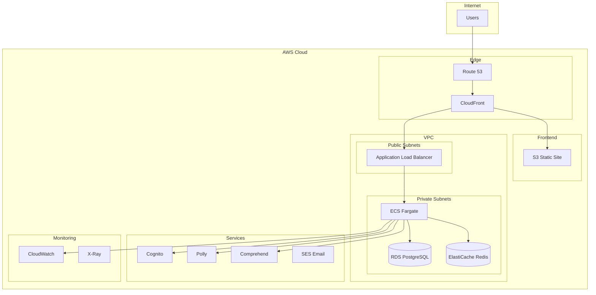

# Phase 8: AWS Deployment

> **Deploy to production with AWS infrastructure**

## Overview

**Goal**: Deploy the application to AWS with production-grade infrastructure, CI/CD pipelines, and monitoring.

**Duration**: ~3 weeks

**Prerequisites**: Phase 7 (Analytics) complete, AWS account configured

**Deliverables**:
- RDS PostgreSQL database
- ECS Fargate for backend
- CloudFront + S3 for frontend
- CI/CD with GitHub Actions
- Monitoring and alerting

---

## Architecture



---

## Infrastructure as Code (Terraform)

### 1. Main Configuration (`infrastructure/main.tf`)

```hcl
terraform {
  required_version = ">= 1.0"
  
  required_providers {
    aws = {
      source  = "hashicorp/aws"
      version = "~> 5.0"
    }
  }
  
  backend "s3" {
    bucket         = "yourwolf-terraform-state"
    key            = "production/terraform.tfstate"
    region         = "us-west-2"
    encrypt        = true
    dynamodb_table = "yourwolf-terraform-locks"
  }
}

provider "aws" {
  region = var.aws_region
  
  default_tags {
    tags = {
      Project     = "YourWolf"
      Environment = var.environment
      ManagedBy   = "Terraform"
    }
  }
}

# Variables
variable "aws_region" {
  default = "us-west-2"
}

variable "environment" {
  default = "production"
}

variable "domain_name" {
  default = "yourwolf.app"
}

variable "db_password" {
  sensitive = true
}

# Locals
locals {
  name_prefix = "yourwolf-${var.environment}"
}
```

### 2. VPC Configuration (`infrastructure/vpc.tf`)

```hcl
module "vpc" {
  source  = "terraform-aws-modules/vpc/aws"
  version = "~> 5.0"
  
  name = "${local.name_prefix}-vpc"
  cidr = "10.0.0.0/16"
  
  azs             = ["${var.aws_region}a", "${var.aws_region}b"]
  private_subnets = ["10.0.1.0/24", "10.0.2.0/24"]
  public_subnets  = ["10.0.101.0/24", "10.0.102.0/24"]
  
  enable_nat_gateway     = true
  single_nat_gateway     = true  # Cost savings, use multiple for HA
  enable_dns_hostnames   = true
  enable_dns_support     = true
  
  # VPC Flow Logs
  enable_flow_log                      = true
  create_flow_log_cloudwatch_log_group = true
  create_flow_log_cloudwatch_iam_role  = true
}

# Security Groups
resource "aws_security_group" "alb" {
  name_prefix = "${local.name_prefix}-alb-"
  vpc_id      = module.vpc.vpc_id
  
  ingress {
    from_port   = 80
    to_port     = 80
    protocol    = "tcp"
    cidr_blocks = ["0.0.0.0/0"]
  }
  
  ingress {
    from_port   = 443
    to_port     = 443
    protocol    = "tcp"
    cidr_blocks = ["0.0.0.0/0"]
  }
  
  egress {
    from_port   = 0
    to_port     = 0
    protocol    = "-1"
    cidr_blocks = ["0.0.0.0/0"]
  }
}

resource "aws_security_group" "ecs" {
  name_prefix = "${local.name_prefix}-ecs-"
  vpc_id      = module.vpc.vpc_id
  
  ingress {
    from_port       = 8000
    to_port         = 8000
    protocol        = "tcp"
    security_groups = [aws_security_group.alb.id]
  }
  
  egress {
    from_port   = 0
    to_port     = 0
    protocol    = "-1"
    cidr_blocks = ["0.0.0.0/0"]
  }
}

resource "aws_security_group" "rds" {
  name_prefix = "${local.name_prefix}-rds-"
  vpc_id      = module.vpc.vpc_id
  
  ingress {
    from_port       = 5432
    to_port         = 5432
    protocol        = "tcp"
    security_groups = [aws_security_group.ecs.id]
  }
}
```

### 3. RDS Database (`infrastructure/rds.tf`)

```hcl
resource "aws_db_subnet_group" "main" {
  name       = "${local.name_prefix}-db-subnet"
  subnet_ids = module.vpc.private_subnets
}

resource "aws_db_instance" "main" {
  identifier = "${local.name_prefix}-postgres"
  
  engine               = "postgres"
  engine_version       = "15.4"
  instance_class       = "db.t3.micro"  # Use db.t3.small+ for production
  allocated_storage    = 20
  max_allocated_storage = 100
  storage_encrypted    = true
  
  db_name  = "yourwolf"
  username = "yourwolf_admin"
  password = var.db_password
  
  vpc_security_group_ids = [aws_security_group.rds.id]
  db_subnet_group_name   = aws_db_subnet_group.main.name
  
  backup_retention_period = 7
  backup_window          = "03:00-04:00"
  maintenance_window     = "Mon:04:00-Mon:05:00"
  
  skip_final_snapshot       = false
  final_snapshot_identifier = "${local.name_prefix}-final-snapshot"
  
  performance_insights_enabled = true
  
  tags = {
    Name = "${local.name_prefix}-postgres"
  }
}

# Store connection string in Secrets Manager
resource "aws_secretsmanager_secret" "db_connection" {
  name = "${local.name_prefix}/database-url"
}

resource "aws_secretsmanager_secret_version" "db_connection" {
  secret_id = aws_secretsmanager_secret.db_connection.id
  secret_string = jsonencode({
    url = "postgresql://${aws_db_instance.main.username}:${var.db_password}@${aws_db_instance.main.endpoint}/${aws_db_instance.main.db_name}"
  })
}
```

### 4. ECS Cluster & Service (`infrastructure/ecs.tf`)

```hcl
resource "aws_ecs_cluster" "main" {
  name = "${local.name_prefix}-cluster"
  
  setting {
    name  = "containerInsights"
    value = "enabled"
  }
}

resource "aws_ecs_cluster_capacity_providers" "main" {
  cluster_name = aws_ecs_cluster.main.name
  
  capacity_providers = ["FARGATE", "FARGATE_SPOT"]
  
  default_capacity_provider_strategy {
    base              = 1
    weight            = 100
    capacity_provider = "FARGATE"
  }
}

# ECR Repository
resource "aws_ecr_repository" "backend" {
  name                 = "${local.name_prefix}-backend"
  image_tag_mutability = "MUTABLE"
  
  image_scanning_configuration {
    scan_on_push = true
  }
}

# Task Definition
resource "aws_ecs_task_definition" "backend" {
  family                   = "${local.name_prefix}-backend"
  network_mode             = "awsvpc"
  requires_compatibilities = ["FARGATE"]
  cpu                      = 256
  memory                   = 512
  execution_role_arn       = aws_iam_role.ecs_execution.arn
  task_role_arn            = aws_iam_role.ecs_task.arn
  
  container_definitions = jsonencode([
    {
      name  = "backend"
      image = "${aws_ecr_repository.backend.repository_url}:latest"
      
      portMappings = [
        {
          containerPort = 8000
          hostPort      = 8000
          protocol      = "tcp"
        }
      ]
      
      environment = [
        { name = "ENVIRONMENT", value = var.environment },
        { name = "AWS_REGION", value = var.aws_region },
        { name = "COGNITO_USER_POOL_ID", value = aws_cognito_user_pool.main.id },
        { name = "COGNITO_CLIENT_ID", value = aws_cognito_user_pool_client.main.id }
      ]
      
      secrets = [
        {
          name      = "DATABASE_URL"
          valueFrom = "${aws_secretsmanager_secret.db_connection.arn}:url::"
        }
      ]
      
      logConfiguration = {
        logDriver = "awslogs"
        options = {
          awslogs-group         = aws_cloudwatch_log_group.ecs.name
          awslogs-region        = var.aws_region
          awslogs-stream-prefix = "backend"
        }
      }
      
      healthCheck = {
        command     = ["CMD-SHELL", "curl -f http://localhost:8000/health || exit 1"]
        interval    = 30
        timeout     = 5
        retries     = 3
        startPeriod = 60
      }
    }
  ])
}

# ECS Service
resource "aws_ecs_service" "backend" {
  name            = "${local.name_prefix}-backend"
  cluster         = aws_ecs_cluster.main.id
  task_definition = aws_ecs_task_definition.backend.arn
  desired_count   = 2
  
  capacity_provider_strategy {
    capacity_provider = "FARGATE"
    weight            = 100
    base              = 1
  }
  
  network_configuration {
    subnets          = module.vpc.private_subnets
    security_groups  = [aws_security_group.ecs.id]
    assign_public_ip = false
  }
  
  load_balancer {
    target_group_arn = aws_lb_target_group.backend.arn
    container_name   = "backend"
    container_port   = 8000
  }
  
  deployment_circuit_breaker {
    enable   = true
    rollback = true
  }
  
  depends_on = [aws_lb_listener.https]
}

# Auto Scaling
resource "aws_appautoscaling_target" "ecs" {
  max_capacity       = 10
  min_capacity       = 2
  resource_id        = "service/${aws_ecs_cluster.main.name}/${aws_ecs_service.backend.name}"
  scalable_dimension = "ecs:service:DesiredCount"
  service_namespace  = "ecs"
}

resource "aws_appautoscaling_policy" "cpu" {
  name               = "${local.name_prefix}-cpu-scaling"
  policy_type        = "TargetTrackingScaling"
  resource_id        = aws_appautoscaling_target.ecs.resource_id
  scalable_dimension = aws_appautoscaling_target.ecs.scalable_dimension
  service_namespace  = aws_appautoscaling_target.ecs.service_namespace
  
  target_tracking_scaling_policy_configuration {
    predefined_metric_specification {
      predefined_metric_type = "ECSServiceAverageCPUUtilization"
    }
    target_value = 70.0
  }
}
```

### 5. Load Balancer (`infrastructure/alb.tf`)

```hcl
resource "aws_lb" "main" {
  name               = "${local.name_prefix}-alb"
  internal           = false
  load_balancer_type = "application"
  security_groups    = [aws_security_group.alb.id]
  subnets            = module.vpc.public_subnets
  
  enable_deletion_protection = true
}

resource "aws_lb_target_group" "backend" {
  name        = "${local.name_prefix}-backend"
  port        = 8000
  protocol    = "HTTP"
  vpc_id      = module.vpc.vpc_id
  target_type = "ip"
  
  health_check {
    enabled             = true
    healthy_threshold   = 2
    unhealthy_threshold = 3
    timeout             = 5
    interval            = 30
    path                = "/health"
    matcher             = "200"
  }
}

resource "aws_lb_listener" "http" {
  load_balancer_arn = aws_lb.main.arn
  port              = 80
  protocol          = "HTTP"
  
  default_action {
    type = "redirect"
    redirect {
      port        = "443"
      protocol    = "HTTPS"
      status_code = "HTTP_301"
    }
  }
}

resource "aws_lb_listener" "https" {
  load_balancer_arn = aws_lb.main.arn
  port              = 443
  protocol          = "HTTPS"
  ssl_policy        = "ELBSecurityPolicy-TLS13-1-2-2021-06"
  certificate_arn   = aws_acm_certificate.main.arn
  
  default_action {
    type             = "forward"
    target_group_arn = aws_lb_target_group.backend.arn
  }
}
```

### 6. S3 + CloudFront for Frontend (`infrastructure/frontend.tf`)

```hcl
# S3 Bucket for static files
resource "aws_s3_bucket" "frontend" {
  bucket = "${local.name_prefix}-frontend"
}

resource "aws_s3_bucket_public_access_block" "frontend" {
  bucket = aws_s3_bucket.frontend.id
  
  block_public_acls       = true
  block_public_policy     = true
  ignore_public_acls      = true
  restrict_public_buckets = true
}

resource "aws_s3_bucket_versioning" "frontend" {
  bucket = aws_s3_bucket.frontend.id
  versioning_configuration {
    status = "Enabled"
  }
}

# CloudFront Origin Access Control
resource "aws_cloudfront_origin_access_control" "main" {
  name                              = "${local.name_prefix}-oac"
  origin_access_control_origin_type = "s3"
  signing_behavior                  = "always"
  signing_protocol                  = "sigv4"
}

# CloudFront Distribution
resource "aws_cloudfront_distribution" "main" {
  enabled             = true
  is_ipv6_enabled     = true
  default_root_object = "index.html"
  aliases             = [var.domain_name, "www.${var.domain_name}"]
  price_class         = "PriceClass_100"  # US, Canada, Europe
  
  # S3 Origin (frontend)
  origin {
    domain_name              = aws_s3_bucket.frontend.bucket_regional_domain_name
    origin_id                = "S3-frontend"
    origin_access_control_id = aws_cloudfront_origin_access_control.main.id
  }
  
  # ALB Origin (API)
  origin {
    domain_name = aws_lb.main.dns_name
    origin_id   = "ALB-api"
    
    custom_origin_config {
      http_port              = 80
      https_port             = 443
      origin_protocol_policy = "https-only"
      origin_ssl_protocols   = ["TLSv1.2"]
    }
  }
  
  # Default behavior (frontend)
  default_cache_behavior {
    allowed_methods        = ["GET", "HEAD", "OPTIONS"]
    cached_methods         = ["GET", "HEAD"]
    target_origin_id       = "S3-frontend"
    viewer_protocol_policy = "redirect-to-https"
    compress               = true
    
    cache_policy_id          = "658327ea-f89d-4fab-a63d-7e88639e58f6"  # CachingOptimized
    origin_request_policy_id = "88a5eaf4-2fd4-4709-b370-b4c650ea3fcf"  # CORS-S3Origin
  }
  
  # API behavior
  ordered_cache_behavior {
    path_pattern           = "/api/*"
    allowed_methods        = ["DELETE", "GET", "HEAD", "OPTIONS", "PATCH", "POST", "PUT"]
    cached_methods         = ["GET", "HEAD"]
    target_origin_id       = "ALB-api"
    viewer_protocol_policy = "https-only"
    compress               = true
    
    cache_policy_id          = "4135ea2d-6df8-44a3-9df3-4b5a84be39ad"  # CachingDisabled
    origin_request_policy_id = "216adef6-5c7f-47e4-b989-5492eafa07d3"  # AllViewer
  }
  
  # SPA fallback
  custom_error_response {
    error_code         = 404
    response_code      = 200
    response_page_path = "/index.html"
  }
  
  restrictions {
    geo_restriction {
      restriction_type = "none"
    }
  }
  
  viewer_certificate {
    acm_certificate_arn      = aws_acm_certificate.main.arn
    ssl_support_method       = "sni-only"
    minimum_protocol_version = "TLSv1.2_2021"
  }
}

# S3 Bucket Policy for CloudFront
resource "aws_s3_bucket_policy" "frontend" {
  bucket = aws_s3_bucket.frontend.id
  
  policy = jsonencode({
    Version = "2012-10-17"
    Statement = [
      {
        Effect = "Allow"
        Principal = {
          Service = "cloudfront.amazonaws.com"
        }
        Action   = "s3:GetObject"
        Resource = "${aws_s3_bucket.frontend.arn}/*"
        Condition = {
          StringEquals = {
            "AWS:SourceArn" = aws_cloudfront_distribution.main.arn
          }
        }
      }
    ]
  })
}
```

### 7. Cognito (`infrastructure/cognito.tf`)

```hcl
resource "aws_cognito_user_pool" "main" {
  name = "${local.name_prefix}-users"
  
  username_attributes      = ["email"]
  auto_verified_attributes = ["email"]
  
  password_policy {
    minimum_length    = 8
    require_lowercase = true
    require_numbers   = true
    require_symbols   = false
    require_uppercase = false
  }
  
  account_recovery_setting {
    recovery_mechanism {
      name     = "verified_email"
      priority = 1
    }
  }
  
  email_configuration {
    email_sending_account = "COGNITO_DEFAULT"
  }
  
  schema {
    name                     = "display_name"
    attribute_data_type      = "String"
    mutable                  = true
    required                 = false
    
    string_attribute_constraints {
      min_length = 2
      max_length = 50
    }
  }
}

resource "aws_cognito_user_pool_client" "main" {
  name         = "${local.name_prefix}-web"
  user_pool_id = aws_cognito_user_pool.main.id
  
  generate_secret = false
  
  explicit_auth_flows = [
    "ALLOW_USER_SRP_AUTH",
    "ALLOW_REFRESH_TOKEN_AUTH"
  ]
  
  access_token_validity  = 1
  id_token_validity      = 1
  refresh_token_validity = 30
  
  token_validity_units {
    access_token  = "hours"
    id_token      = "hours"
    refresh_token = "days"
  }
  
  callback_urls = [
    "https://${var.domain_name}/auth/callback",
    "http://localhost:5173/auth/callback"  # Dev
  ]
  
  logout_urls = [
    "https://${var.domain_name}/auth/logout",
    "http://localhost:5173/auth/logout"
  ]
}
```

### 8. IAM Roles (`infrastructure/iam.tf`)

```hcl
# ECS Execution Role
resource "aws_iam_role" "ecs_execution" {
  name = "${local.name_prefix}-ecs-execution"
  
  assume_role_policy = jsonencode({
    Version = "2012-10-17"
    Statement = [
      {
        Action = "sts:AssumeRole"
        Effect = "Allow"
        Principal = {
          Service = "ecs-tasks.amazonaws.com"
        }
      }
    ]
  })
}

resource "aws_iam_role_policy_attachment" "ecs_execution" {
  role       = aws_iam_role.ecs_execution.name
  policy_arn = "arn:aws:iam::aws:policy/service-role/AmazonECSTaskExecutionRolePolicy"
}

resource "aws_iam_role_policy" "ecs_secrets" {
  name = "secrets-access"
  role = aws_iam_role.ecs_execution.id
  
  policy = jsonencode({
    Version = "2012-10-17"
    Statement = [
      {
        Effect = "Allow"
        Action = [
          "secretsmanager:GetSecretValue"
        ]
        Resource = [
          aws_secretsmanager_secret.db_connection.arn
        ]
      }
    ]
  })
}

# ECS Task Role
resource "aws_iam_role" "ecs_task" {
  name = "${local.name_prefix}-ecs-task"
  
  assume_role_policy = jsonencode({
    Version = "2012-10-17"
    Statement = [
      {
        Action = "sts:AssumeRole"
        Effect = "Allow"
        Principal = {
          Service = "ecs-tasks.amazonaws.com"
        }
      }
    ]
  })
}

resource "aws_iam_role_policy" "ecs_task_services" {
  name = "aws-services-access"
  role = aws_iam_role.ecs_task.id
  
  policy = jsonencode({
    Version = "2012-10-17"
    Statement = [
      {
        Effect = "Allow"
        Action = [
          "polly:SynthesizeSpeech",
          "comprehend:DetectToxicContent",
          "comprehend:DetectPiiEntities"
        ]
        Resource = "*"
      },
      {
        Effect = "Allow"
        Action = [
          "s3:PutObject",
          "s3:GetObject"
        ]
        Resource = "${aws_s3_bucket.audio.arn}/*"
      }
    ]
  })
}
```

---

## CI/CD Pipeline

### GitHub Actions Workflow (`.github/workflows/deploy.yml`)

```yaml
name: Deploy

on:
  push:
    branches: [main]
  workflow_dispatch:

env:
  AWS_REGION: us-west-2
  ECR_REPOSITORY: yourwolf-production-backend
  ECS_CLUSTER: yourwolf-production-cluster
  ECS_SERVICE: yourwolf-production-backend

jobs:
  test:
    runs-on: ubuntu-latest
    steps:
      - uses: actions/checkout@v4
      
      - name: Set up Python
        uses: actions/setup-python@v5
        with:
          python-version: '3.14'
      
      - name: Install dependencies
        run: |
          pip install pipenv
          pipenv install --dev
      
      - name: Run tests
        run: pipenv run pytest --cov=app tests/
  
  build-backend:
    needs: test
    runs-on: ubuntu-latest
    outputs:
      image: ${{ steps.build-image.outputs.image }}
    
    steps:
      - uses: actions/checkout@v4
      
      - name: Configure AWS credentials
        uses: aws-actions/configure-aws-credentials@v4
        with:
          aws-access-key-id: ${{ secrets.AWS_ACCESS_KEY_ID }}
          aws-secret-access-key: ${{ secrets.AWS_SECRET_ACCESS_KEY }}
          aws-region: ${{ env.AWS_REGION }}
      
      - name: Login to Amazon ECR
        id: login-ecr
        uses: aws-actions/amazon-ecr-login@v2
      
      - name: Build, tag, and push image to Amazon ECR
        id: build-image
        env:
          ECR_REGISTRY: ${{ steps.login-ecr.outputs.registry }}
          IMAGE_TAG: ${{ github.sha }}
        run: |
          cd backend
          docker build -t $ECR_REGISTRY/$ECR_REPOSITORY:$IMAGE_TAG .
          docker push $ECR_REGISTRY/$ECR_REPOSITORY:$IMAGE_TAG
          docker tag $ECR_REGISTRY/$ECR_REPOSITORY:$IMAGE_TAG $ECR_REGISTRY/$ECR_REPOSITORY:latest
          docker push $ECR_REGISTRY/$ECR_REPOSITORY:latest
          echo "image=$ECR_REGISTRY/$ECR_REPOSITORY:$IMAGE_TAG" >> $GITHUB_OUTPUT
  
  build-frontend:
    needs: test
    runs-on: ubuntu-latest
    
    steps:
      - uses: actions/checkout@v4
      
      - name: Setup Node.js
        uses: actions/setup-node@v4
        with:
          node-version: '20'
          cache: 'npm'
          cache-dependency-path: frontend/package-lock.json
      
      - name: Install dependencies
        run: |
          cd frontend
          npm ci
      
      - name: Build
        env:
          VITE_COGNITO_USER_POOL_ID: ${{ secrets.COGNITO_USER_POOL_ID }}
          VITE_COGNITO_CLIENT_ID: ${{ secrets.COGNITO_CLIENT_ID }}
          VITE_COGNITO_REGION: ${{ env.AWS_REGION }}
          VITE_API_URL: https://api.yourwolf.app
        run: |
          cd frontend
          npm run build
      
      - name: Configure AWS credentials
        uses: aws-actions/configure-aws-credentials@v4
        with:
          aws-access-key-id: ${{ secrets.AWS_ACCESS_KEY_ID }}
          aws-secret-access-key: ${{ secrets.AWS_SECRET_ACCESS_KEY }}
          aws-region: ${{ env.AWS_REGION }}
      
      - name: Deploy to S3
        run: |
          aws s3 sync frontend/dist s3://yourwolf-production-frontend --delete
      
      - name: Invalidate CloudFront cache
        run: |
          aws cloudfront create-invalidation \
            --distribution-id ${{ secrets.CLOUDFRONT_DISTRIBUTION_ID }} \
            --paths "/*"
  
  deploy-backend:
    needs: build-backend
    runs-on: ubuntu-latest
    
    steps:
      - name: Configure AWS credentials
        uses: aws-actions/configure-aws-credentials@v4
        with:
          aws-access-key-id: ${{ secrets.AWS_ACCESS_KEY_ID }}
          aws-secret-access-key: ${{ secrets.AWS_SECRET_ACCESS_KEY }}
          aws-region: ${{ env.AWS_REGION }}
      
      - name: Download task definition
        run: |
          aws ecs describe-task-definition \
            --task-definition yourwolf-production-backend \
            --query taskDefinition > task-definition.json
      
      - name: Update task definition with new image
        id: task-def
        uses: aws-actions/amazon-ecs-render-task-definition@v1
        with:
          task-definition: task-definition.json
          container-name: backend
          image: ${{ needs.build-backend.outputs.image }}
      
      - name: Deploy to ECS
        uses: aws-actions/amazon-ecs-deploy-task-definition@v1
        with:
          task-definition: ${{ steps.task-def.outputs.task-definition }}
          service: ${{ env.ECS_SERVICE }}
          cluster: ${{ env.ECS_CLUSTER }}
          wait-for-service-stability: true
  
  run-migrations:
    needs: deploy-backend
    runs-on: ubuntu-latest
    
    steps:
      - uses: actions/checkout@v4
      
      - name: Configure AWS credentials
        uses: aws-actions/configure-aws-credentials@v4
        with:
          aws-access-key-id: ${{ secrets.AWS_ACCESS_KEY_ID }}
          aws-secret-access-key: ${{ secrets.AWS_SECRET_ACCESS_KEY }}
          aws-region: ${{ env.AWS_REGION }}
      
      - name: Run migrations
        run: |
          # Run migration task
          aws ecs run-task \
            --cluster ${{ env.ECS_CLUSTER }} \
            --task-definition yourwolf-production-migrations \
            --network-configuration "awsvpcConfiguration={subnets=[${{ secrets.PRIVATE_SUBNET_1 }},${{ secrets.PRIVATE_SUBNET_2 }}],securityGroups=[${{ secrets.ECS_SECURITY_GROUP }}]}" \
            --launch-type FARGATE \
            --count 1
```

---

## Monitoring & Alerting

### CloudWatch Alarms (`infrastructure/monitoring.tf`)

```hcl
resource "aws_cloudwatch_log_group" "ecs" {
  name              = "/ecs/${local.name_prefix}"
  retention_in_days = 30
}

# CPU Alarm
resource "aws_cloudwatch_metric_alarm" "ecs_cpu_high" {
  alarm_name          = "${local.name_prefix}-ecs-cpu-high"
  comparison_operator = "GreaterThanThreshold"
  evaluation_periods  = 2
  metric_name         = "CPUUtilization"
  namespace           = "AWS/ECS"
  period              = 300
  statistic           = "Average"
  threshold           = 80
  alarm_description   = "ECS CPU utilization is too high"
  
  dimensions = {
    ClusterName = aws_ecs_cluster.main.name
    ServiceName = aws_ecs_service.backend.name
  }
  
  alarm_actions = [aws_sns_topic.alerts.arn]
}

# Memory Alarm
resource "aws_cloudwatch_metric_alarm" "ecs_memory_high" {
  alarm_name          = "${local.name_prefix}-ecs-memory-high"
  comparison_operator = "GreaterThanThreshold"
  evaluation_periods  = 2
  metric_name         = "MemoryUtilization"
  namespace           = "AWS/ECS"
  period              = 300
  statistic           = "Average"
  threshold           = 80
  alarm_description   = "ECS memory utilization is too high"
  
  dimensions = {
    ClusterName = aws_ecs_cluster.main.name
    ServiceName = aws_ecs_service.backend.name
  }
  
  alarm_actions = [aws_sns_topic.alerts.arn]
}

# RDS Connection Alarm
resource "aws_cloudwatch_metric_alarm" "rds_connections" {
  alarm_name          = "${local.name_prefix}-rds-connections"
  comparison_operator = "GreaterThanThreshold"
  evaluation_periods  = 2
  metric_name         = "DatabaseConnections"
  namespace           = "AWS/RDS"
  period              = 300
  statistic           = "Average"
  threshold           = 80
  alarm_description   = "RDS connection count is high"
  
  dimensions = {
    DBInstanceIdentifier = aws_db_instance.main.identifier
  }
  
  alarm_actions = [aws_sns_topic.alerts.arn]
}

# 5xx Error Alarm
resource "aws_cloudwatch_metric_alarm" "alb_5xx" {
  alarm_name          = "${local.name_prefix}-alb-5xx"
  comparison_operator = "GreaterThanThreshold"
  evaluation_periods  = 2
  metric_name         = "HTTPCode_Target_5XX_Count"
  namespace           = "AWS/ApplicationELB"
  period              = 300
  statistic           = "Sum"
  threshold           = 10
  alarm_description   = "Too many 5xx errors"
  
  dimensions = {
    LoadBalancer = aws_lb.main.arn_suffix
  }
  
  alarm_actions = [aws_sns_topic.alerts.arn]
}

# SNS Topic for Alerts
resource "aws_sns_topic" "alerts" {
  name = "${local.name_prefix}-alerts"
}

resource "aws_sns_topic_subscription" "email" {
  topic_arn = aws_sns_topic.alerts.arn
  protocol  = "email"
  endpoint  = "alerts@yourwolf.app"
}
```

---

## Outputs

```hcl
# infrastructure/outputs.tf
output "cloudfront_domain" {
  value = aws_cloudfront_distribution.main.domain_name
}

output "alb_dns" {
  value = aws_lb.main.dns_name
}

output "rds_endpoint" {
  value     = aws_db_instance.main.endpoint
  sensitive = true
}

output "cognito_user_pool_id" {
  value = aws_cognito_user_pool.main.id
}

output "cognito_client_id" {
  value = aws_cognito_user_pool_client.main.id
}

output "ecr_repository_url" {
  value = aws_ecr_repository.backend.repository_url
}
```

---

## Acceptance Criteria

| Criteria | Verification |
|----------|--------------|
| RDS created and accessible | Migrations run successfully |
| ECS service running | Health checks pass |
| Frontend deployed to S3 | Site loads from CloudFront |
| API accessible via CloudFront | /api/* routes work |
| CI/CD pipeline works | Push to main triggers deploy |
| Cognito integrated | Login works in production |
| Monitoring active | Alarms configured |
| SSL certificates valid | HTTPS works |

---

## Definition of Done

- [ ] Terraform infrastructure created
- [ ] RDS PostgreSQL provisioned
- [ ] ECS cluster and service running
- [ ] S3 bucket for frontend
- [ ] CloudFront distribution configured
- [ ] Cognito user pool created
- [ ] IAM roles and policies
- [ ] GitHub Actions CI/CD pipeline
- [ ] Database migrations automated
- [ ] CloudWatch alarms set up
- [ ] SNS alerts configured
- [ ] SSL certificates via ACM
- [ ] Route 53 DNS configured
- [ ] Deployment tested end-to-end
- [ ] Runbook documentation

---

*Last updated: January 31, 2026*
