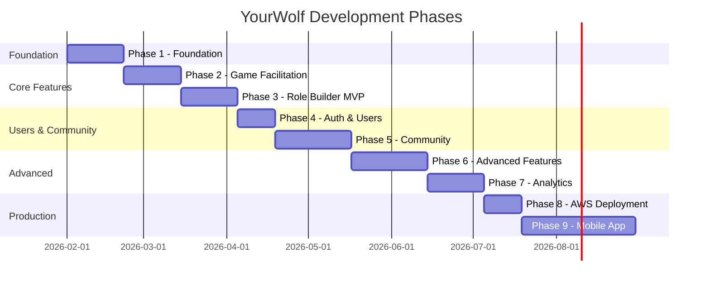
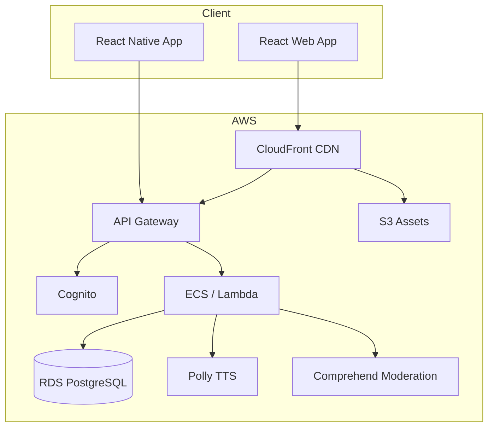

# YourWolf Development Roadmap

> **A customizable One Night Ultimate Werewolf clone with community-driven role creation**

## Project Vision

YourWolf differentiates itself from existing Werewolf apps by allowing users to **create, share, and vote on custom roles**. The app serves as a game facilitator for in-person play, providing narration scripts, timers, and role management.

---

## Repository Structure

The project is split across four repositories:

| Repository | Tech Stack | Purpose |
|------------|------------|---------|
| `yourwolf-backend` | Python 3.12, FastAPI, SQLAlchemy, PostgreSQL | REST API, game logic, ability engine |
| `yourwolf-frontend` | React 18, TypeScript, Vite | Web dashboard, role builder, facilitator UI |
| `yourwolf-mobile` | React Native, TypeScript | iOS/Android mobile app |
| `yourwolf-docs` | Markdown, Mermaid | Planning documents, specifications |

### Development Environment

All local development runs in Docker containers:

```
┌─────────────────────────────────────────────────────────┐
│                    Docker Compose                        │
├─────────────────┬─────────────────┬─────────────────────┤
│   PostgreSQL    │    Backend      │     Frontend        │
│   Port: 5432    │   Port: 8000    │    Port: 3000       │
│                 │   (FastAPI)     │    (Vite dev)       │
└─────────────────┴─────────────────┴─────────────────────┘
```

---

## Phase Overview



---

## Phase Summaries

### Phase 1: Foundation
**Goal**: Establish project infrastructure, data models, and seed 30 base roles.

| Component | Deliverables |
|-----------|--------------|
| Backend | FastAPI app, SQLAlchemy models, Alembic migrations, seed script |
| Frontend | React + Vite setup, routing, layout, dark theme |
| Infrastructure | Docker Compose (PostgreSQL, backend, frontend) |
| Data | Role, Ability, AbilityStep models; 30 seeded roles |

**Milestone**: API returns list of seeded roles; frontend displays them.

---

### Phase 2: Game Facilitation
**Goal**: Run a complete game with facilitator prompts and timer.

| Component | Deliverables |
|-----------|--------------|
| Backend | Game session API, night script generator, wake order engine |
| Frontend | Game setup, role selection, facilitator script view, timer |
| Logic | Ability sequencing with AND/OR/IF conditionals |

**Milestone**: Facilitator can run a full game with 5+ players using base roles.

---

### Phase 2.5: Named Exports Migration
**Goal**: Refactor frontend to use named exports per TypeScript style guide.

| Component | Deliverables |
|-----------|----------|
| Frontend | Migrate 8 files from default to named exports |
| Imports | Update all import statements to named syntax |
| Validation | Build, test suite, manual verification |

**Milestone**: No `export default` in codebase; all tests pass.

---

### Phase 3: Role Builder MVP
**Goal**: Create custom roles by selecting from predefined abilities.

| Component | Deliverables |
|-----------|--------------|
| Backend | Role CRUD API, ability validation, duplicate detection |
| Frontend | Ability wizard, role form, live preview, local draft storage |
| Validation | Team rules, required fields, ability compatibility |

**Milestone**: User creates a custom role that works in a game session.

---

### Phase 4: Auth & Users
**Goal**: User accounts with cloud persistence.

| Component | Deliverables |
|-----------|--------------|
| Backend | Cognito integration, user model, profile API, role ownership |
| Frontend | Login/signup (email + anonymous), profile page, "My Roles" |
| Auth | JWT validation, protected routes, ownership checks |

**Milestone**: User logs in, creates role, logs out, logs back in, sees their role.

---

### Phase 5: Community
**Goal**: Share roles publicly, vote, browse, and create role sets.

| Component | Deliverables |
|-----------|--------------|
| Backend | Public/private flag, voting API, role sets API, search/filter |
| Frontend | Browse roles, vote buttons, role set builder, discovery page |
| Features | Duplicate name prevention, sort by votes/date, role set rules |

**Milestone**: User publishes role; another user finds it, votes, adds to set.

---

### Phase 6: Advanced Features
**Goal**: Complex conditional abilities, moderation, audio narration.

| Component | Deliverables |
|-----------|--------------|
| Backend | Conditional ability builder, AWS Comprehend moderation, game history |
| Frontend | Conditional tree UI, audio player (AWS Polly), history viewer |
| Moderation | Content filter, flag system, mod queue |

**Milestone**: User creates role with IF/THEN logic; audio narration plays.

---

### Phase 7: Analytics
**Goal**: Balance metrics, smart set suggestions, win rate tracking.

| Component | Deliverables |
|-----------|--------------|
| Backend | Balance scoring engine, suggestion algorithm, game result tracking |
| Frontend | Balance indicators on roles, smart suggestions, stats dashboard |
| Analytics | Team distribution analysis, ability power scoring |

**Milestone**: System suggests balanced role set; warns about broken combos.

---

### Phase 8: AWS Deployment
**Goal**: Production-ready cloud infrastructure.

| Component | Deliverables |
|-----------|--------------|
| Database | Amazon RDS (PostgreSQL), backups, read replicas |
| Compute | ECS Fargate or Lambda + API Gateway |
| CDN | CloudFront for frontend, S3 for assets |
| Auth | Cognito production pool with social logins |
| CI/CD | GitHub Actions, staging/production environments |

**Milestone**: App live at yourwolf.com with SSL, auth, and monitoring.

---

### Phase 9: Mobile App
**Goal**: React Native app with offline support.

| Component | Deliverables |
|-----------|--------------|
| Mobile | React Native app, shared component library |
| Offline | Local SQLite, sync queue, conflict resolution |
| Platform | iOS App Store, Google Play Store submissions |

**Milestone**: Mobile app published with feature parity to web.

---

## Architecture Diagram



---

## Key Design Decisions

### 1. Ability System Architecture
Abilities are composed of **atomic primitives** (View, Swap, Copy, etc.) with **sequencing** (order) and **conditionals** (AND/OR/IF). This enables complex role behaviors while keeping the builder UI manageable.

### 2. Wake Order Engine
The night phase is deterministic: roles wake in order, execute ability steps sequentially, and conditionals resolve based on game state. No randomness except where explicitly defined.

### 3. Offline-First (Mobile)
Mobile app stores roles and game state locally, syncing when online. Conflict resolution favors server state for published roles, local state for drafts.

### 4. Community Moderation
Three-layer approach:
1. **Automated**: AWS Comprehend flags inappropriate content
2. **Community**: Users flag roles; highly-flagged roles enter review queue
3. **Manual**: Admin reviews flagged content

### 5. Role Uniqueness
Public roles must have unique names. Users cannot publish a role with the same name as an existing public role (including base game roles).

---

## Success Metrics

| Phase | Key Metric |
|-------|------------|
| 1 | All 30 base roles seeded and retrievable via API |
| 2 | Complete game session runs without errors |
| 3 | Custom role created and used in game |
| 4 | User retention across sessions |
| 5 | Roles shared and voted on by multiple users |
| 6 | Conditional roles working; no inappropriate content published |
| 7 | Balance warnings prevent broken role sets |
| 8 | 99.9% uptime, <200ms API response time |
| 9 | 4+ star app store rating |

---

## Document Index

| Document | Description |
|----------|-------------|
| [ABILITIES.md](ABILITIES.md) | Ability primitive definitions |
| [DATA_MODELS.md](DATA_MODELS.md) | Entity schemas and relationships |
| [SEED_ROLES.md](SEED_ROLES.md) | 30 base role definitions |
| [phases/PHASE_1_FOUNDATION.md](phases/PHASE_1_FOUNDATION.md) | Foundation phase spec |
| [phases/PHASE_2_GAME_FACILITATION.md](phases/PHASE_2_GAME_FACILITATION.md) | Game facilitation spec |
| [phases/PHASE_2.5_NAMED_EXPORTS.md](phases/PHASE_2.5/PHASE_2.5_NAMED_EXPORTS.md) | Named exports migration spec |
| [phases/PHASE_3_ROLE_BUILDER_MVP.md](phases/PHASE_3_ROLE_BUILDER_MVP.md) | Role builder spec |
| [phases/PHASE_4_AUTH_USERS.md](phases/PHASE_4_AUTH_USERS.md) | Auth & users spec |
| [phases/PHASE_5_COMMUNITY.md](phases/PHASE_5_COMMUNITY.md) | Community features spec |
| [phases/PHASE_6_ADVANCED_FEATURES.md](phases/PHASE_6_ADVANCED_FEATURES.md) | Advanced features spec |
| [phases/PHASE_7_ANALYTICS.md](phases/PHASE_7_ANALYTICS.md) | Analytics spec |
| [phases/PHASE_8_AWS_DEPLOYMENT.md](phases/PHASE_8_AWS_DEPLOYMENT.md) | AWS deployment spec |
| [phases/PHASE_9_MOBILE.md](phases/PHASE_9_MOBILE.md) | Mobile app spec |

---

## Getting Started

Once repositories are created:

```bash
# Clone all repos
git clone https://github.com/yourorg/yourwolf-backend
git clone https://github.com/yourorg/yourwolf-frontend
git clone https://github.com/yourorg/yourwolf-docs

# Start development environment
cd yourwolf-backend
docker-compose up -d

# Backend: http://localhost:8000
# Frontend: http://localhost:3000
# API Docs: http://localhost:8000/docs
```

---

*Last updated: January 31, 2026*
